# 02. 质点动力学

## 2.1 力与牛顿定律

---

### 2.1.1 牛顿第一定律

#### 2.1.1.1 基本陈述

**牛顿第一定律（惯性定律）：** 如果一个物体所受的合外力为零（$\sum \vec{F} = 0$），那么：
- 若物体原本静止，则保持静止；
- 若物体原本做匀速直线运动，则继续保持该匀速直线运动状态。

这一定律本质上定义了**惯性**的概念——物体保持其运动状态不变的固有属性。

#### 2.1.1.2 惯性参考系

牛顿第一定律成立的参考系称为**惯性参考系（惯性系）**。

- 惯性系的特点是：物体在其中不受外力时保持静止或匀速直线运动。
- 相对于一个惯性系做匀速直线运动的任何参考系也是惯性系。
- 相对于一个惯性系做**加速运动**的参考系不是惯性系（称为非惯性系）。

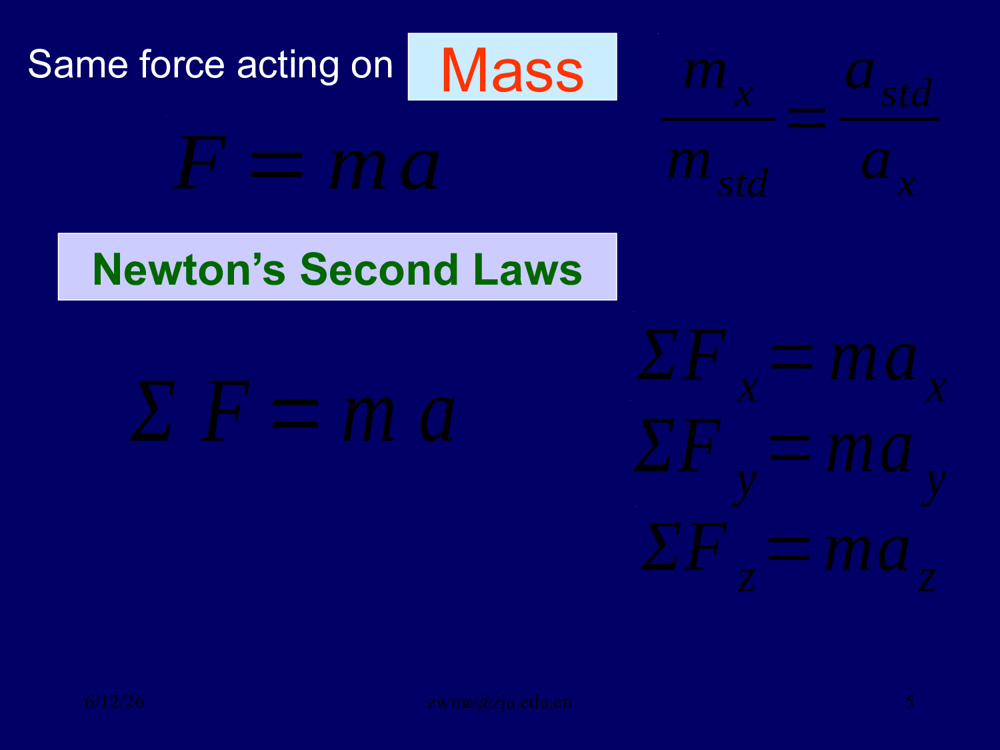

---

### 2.1.2 牛顿第二定律

#### 2.1.2.1 基本陈述

当一个力作用在一个物体上时，物体会产生加速度。加速度的方向与力的方向相同，大小与力的大小成正比，与物体的质量成反比。

**数学表达式：**

$$
\sum \vec{F} = m \vec{a}
$$

其中：
- $\sum \vec{F}$ 是物体所受的合外力（矢量）
- $m$ 是物体的质量（标量）
- $\vec{a}$ 是物体的加速度（矢量）

#### 2.1.2.2 微分形式

牛顿第二定律也可以写成微分形式（更一般的形式）：

$$
\sum \vec{F} = m \frac{d\vec{v}}{dt} = m \frac{d^2\vec{r}}{dt^2}
$$

#### 2.1.2.3 力的单位

$$
1\ \text{N} = 1\ \text{kg} \cdot \text{m/s}^2
$$

量纲：$[F] = \text{MLT}^{-2}$

#### 2.1.2.4 力的矢量性

力是矢量，遵循矢量合成的平行四边形法则。合外力为零时物体处于平衡状态（静止或匀速直线运动）。

---

### 2.1.3 牛顿第三定律

#### 2.1.3.1 基本陈述

对于任意两个相互作用的物体 A 和 B，A 对 B 的作用力 $\vec{F}_{AB}$ 与 B 对 A 的反作用力 $\vec{F}_{BA}$ 大小相等、方向相反，且作用在同一条直线上。

**数学表达式：**

$$
\vec{F}_{AB} = -\vec{F}_{BA}
$$

#### 2.1.3.2 要点说明

- 作用力与反作用力总是**成对出现**，同时存在、同时消失。
- 它们作用在**不同**的物体上，因此不会互相抵消。
- 力是物体与其**环境**之间的相互作用。

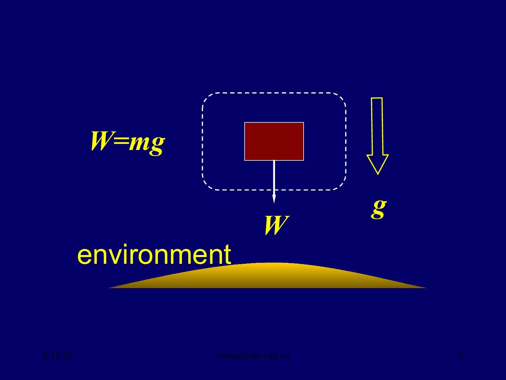

---

### 2.1.4 常见的力

#### 2.1.4.1 重力

$$
\vec{W} = m\vec{g}
$$

其中：
- $m$ 是物体的质量
- $\vec{g}$ 是重力加速度，方向竖直向下
- $\vec{W}$ 是重力，也称为重量

#### 2.1.4.2 万有引力

两个质点之间的万有引力：

$$
F = G \frac{m_1 m_2}{r^2}
$$

其中：
- $G = 6.67 \times 10^{-11}\ \text{N} \cdot \text{m}^2/\text{kg}^2$ 为引力常数
- $r$ 为两质点之间的距离

#### 2.1.4.3 弹簧力

弹簧在弹性限度内，弹力与形变量成正比：

$$
\vec{F} = -k \Delta \vec{x}
$$

其中 $k$ 为弹簧的劲度系数，$\Delta x$ 为弹簧的伸长量或压缩量。

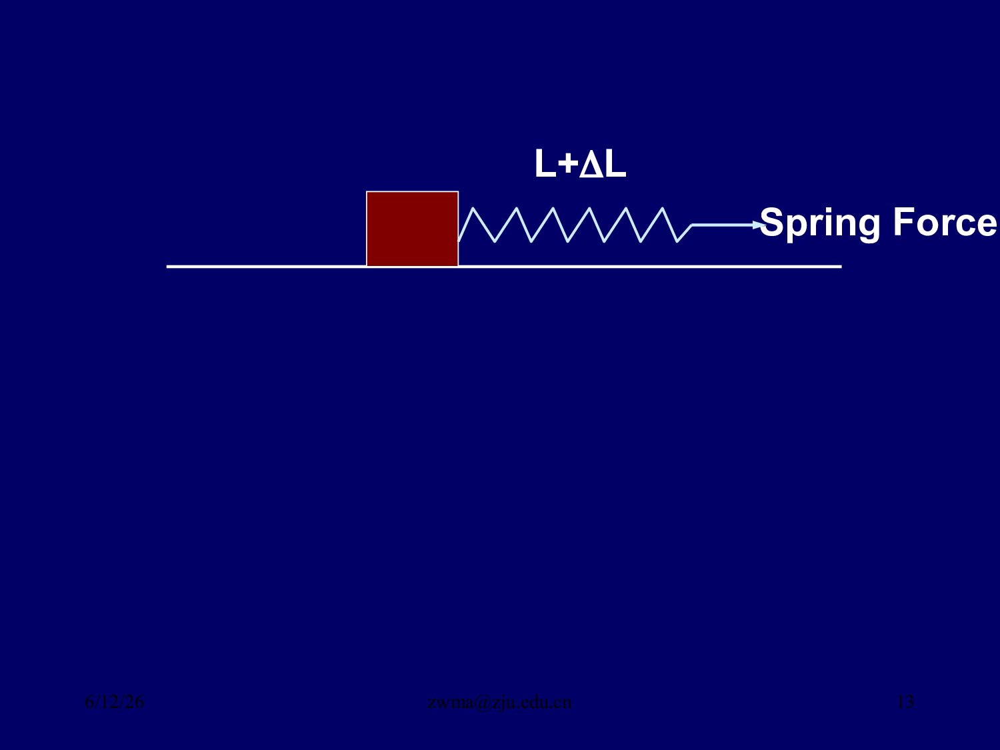

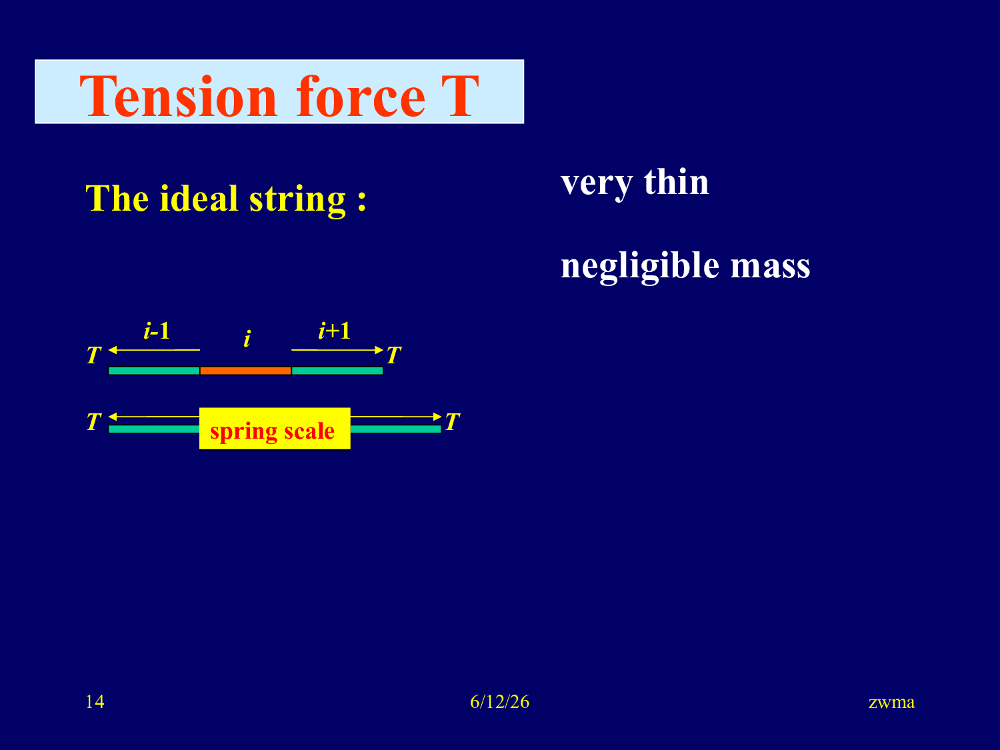

#### 2.1.4.4 张力

张力是绳子、杆等柔体或刚体内部传递的力。

**理想绳模型：**
- 质量忽略不计（$m \to 0$）
- 不可伸长
- 绳内各点的张力大小处处相等

对于无质量且不可伸长的绳（或杆），绳中任意一点都存在一对作用力与反作用力。

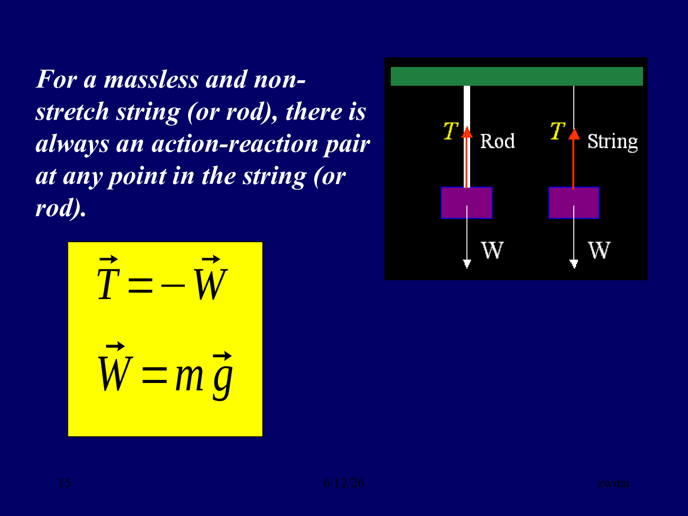

#### 2.1.4.5 法向力/支持力

法向力是接触面作用于物体的垂直于接触面的力。

特点：
- 方向始终垂直于接触面
- 大小由平衡条件或牛顿第二定律决定
- 属于**被动弹性力**，与张力和弹簧力同属弹性力

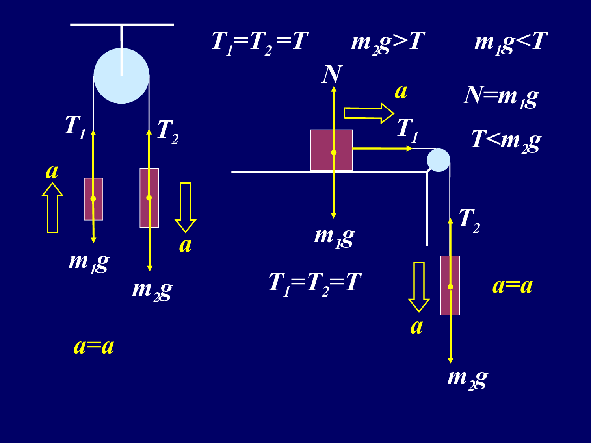

#### 2.1.4.6 摩擦力

##### 2.1.4.6.1 滑动摩擦力

当物体在表面上滑动时：

$$
f_k = \mu_k N
$$

其中 $\mu_k$ 为滑动摩擦系数，$N$ 为正压力。

##### 2.1.4.6.2 静摩擦力

当物体有运动趋势但尚未滑动时，静摩擦力的大小在零到最大值之间自适应：

$$
f_s \le \mu_s N
$$

静摩擦力的大小等于使物体开始运动所需的外力（的平衡力）：

$$
f_s = -\sum \vec{F}_{\text{ext}} \quad (\text{物体静止时})
$$

**重要关系：**

$$
\mu_k < \mu_s
$$

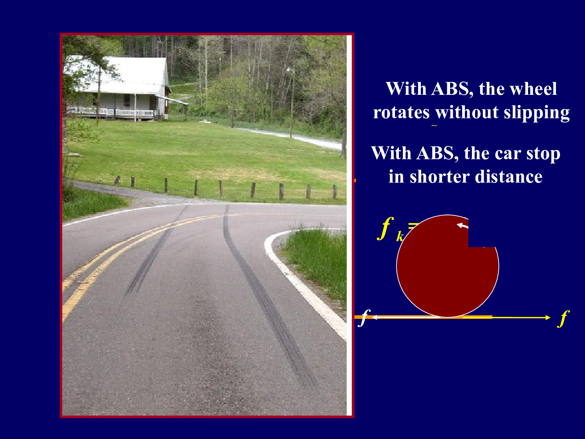

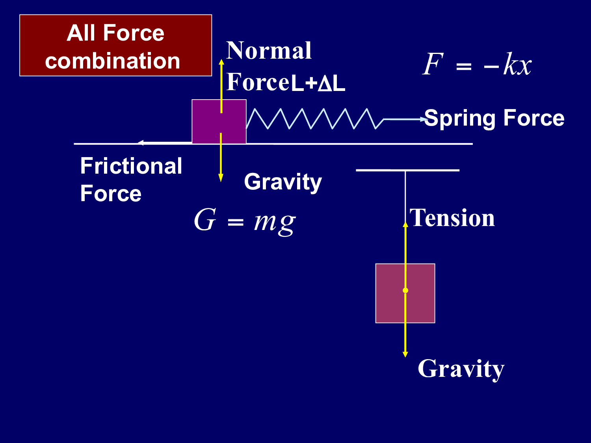

##### 2.1.4.6.3 摩擦力的方向判断

- 滑动摩擦力的方向与**相对运动方向**相反
- 静摩擦力的方向与**相对运动趋势方向**相反

##### 2.1.4.6.4 ABS 防抱死制动系统

ABS 系统保证车轮在制动时保持滚动而不滑动，利用的是静摩擦而非滑动摩擦。由于 $\mu_s > \mu_k$，静摩擦力能提供更大的制动力，因此 ABS 可以使车辆在更短的距离内停下来。

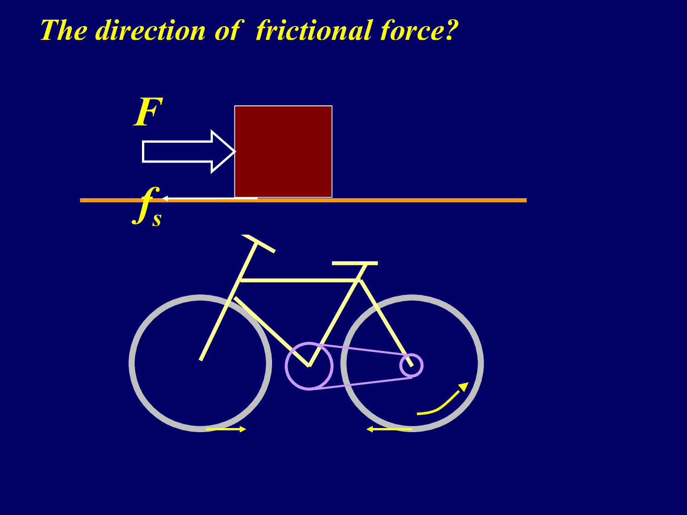

---

### 2.1.5 内力与外力

- **外力 (External Force)**：系统外的物体对系统内物体的作用力，记作 $\vec{F}_{\text{ext}}$
- **内力 (Internal Force)**：系统内物体之间的相互作用力，记作 $\vec{F}_{\text{int}}$

对系统应用牛顿第二定律时，合外力决定系统质心的加速度，内力在系统内部成对抵消（根据牛顿第三定律）。

---

### 2.1.6 力对运动的影响分类

根据力对时间的依赖关系，力可分为以下几种类型：

#### 2.1.6.1 速度依赖的力

阻力通常与速度有关，例如线性阻力：

$$
\vec{D} = b\vec{v}
$$

考虑竖直下落的物体，同时受重力和阻力：

$$
\sum F = mg - bv = ma = m\frac{dv}{dt}
$$

解此微分方程可得速度随时间的变化规律：

$$
v(t) = \frac{mg}{b}\left(1 - e^{-\frac{b}{m}t}\right)
$$

**终端速度 (Terminal Velocity)：** 当 $mg = bv$ 时，加速度为零，物体达到最大速度：

$$
v_T = \frac{mg}{b}
$$

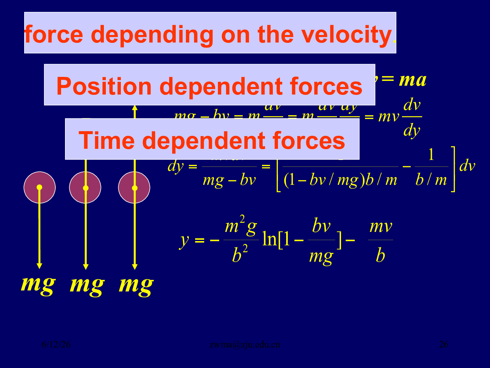

#### 2.1.6.2 位置依赖的力

力是位置的函数：$\vec{F} = \vec{F}(\vec{r})$，从而加速度也是位置的函数：$\vec{a} = \vec{a}(\vec{r})$。

在一维情况下：$a = a(x)$。

对于这类问题，通常利用链式法则变换微分方程：

$$
a = \frac{dv}{dt} = \frac{dv}{dx} \cdot \frac{dx}{dt} = v\frac{dv}{dx}
$$

#### 2.1.6.3 时间依赖的力

力是时间的函数：$\vec{F} = \vec{F}(t)$，从而加速度也是时间的函数：$\vec{a} = \vec{a}(t)$。

对于这类问题，直接对时间积分求解速度和位移：

$$
v(t) = v_0 + \int_0^t a(t') dt'
$$

$$
x(t) = x_0 + \int_0^t v(t') dt'
$$

---

### 2.1.7 例题

#### 例题 2.1.7.1：万有引力作用下的自由落体（位置依赖力）

一个物体从距离地心 $2R$ 的位置由静止开始竖直下落。$R$ 为地球半径。忽略空气阻力和地球自转，求物体到达地球表面时的速度。

**解：**

物体受万有引力作用，力的大小随位置变化：

$$
F = G\frac{Mm}{r^2}
$$

其中 $M$ 为地球质量，$m$ 为物体质量，$r$ 为物体到地心的距离。

由牛顿第二定律：

$$
m\frac{dv}{dt} = -G\frac{Mm}{r^2}
$$

利用 $a = v\frac{dv}{dr}$ 变换：

$$
v\frac{dv}{dr} = -\frac{GM}{r^2}
$$

在地球表面处 $g = \frac{GM}{R^2}$，代入：

$$
v\frac{dv}{dr} = -g\frac{R^2}{r^2}
$$

分离变量并积分（初态：$r=2R$ 时 $v=0$；末态：$r=R$ 时速度 $v$ 待求）：

$$
\int_0^v v\,dv = -gR^2 \int_{2R}^{R} \frac{dr}{r^2}
$$

$$
\frac{1}{2}v^2 = -gR^2\left[-\frac{1}{r}\right]_{2R}^{R} = -gR^2\left(-\frac{1}{R} + \frac{1}{2R}\right)
$$

$$
\frac{1}{2}v^2 = -gR^2\left(-\frac{1}{2R}\right) = \frac{gR}{2}
$$

因此：

$$
v = \sqrt{gR}
$$

即物体到达地表时的速度为 $\sqrt{gR}$。

---

#### 例题 2.1.7.2：随时间变化的减速运动（时间依赖力）

一辆汽车以初速度 $v_0$ 沿 $x$ 轴运动。若加速度 $a(t) = -ct$（其中 $c>0$ 为常数），求汽车停下来所需的时间以及在这段时间内行驶的距离。

**解：**

由加速度定义：

$$
a(t) = \frac{dv}{dt} = -ct
$$

积分求速度：

$$
v(t) = v_0 + \int_0^t (-ct')\,dt' = v_0 - \frac{1}{2}ct^2
$$

汽车停止时 $v(t)=0$：

$$
v_0 - \frac{1}{2}ct_s^2 = 0 \quad\Rightarrow\quad t_s = \sqrt{\frac{2v_0}{c}}
$$

积分求位置：

$$
x(t) = x_0 + \int_0^t v(t')\,dt' = x_0 + \int_0^t \left(v_0 - \frac{1}{2}ct'^2\right)dt'
$$

$$
x(t) = x_0 + v_0t - \frac{1}{6}ct^3
$$

停止时行驶的距离（设 $x_0 = 0$）：

$$
\Delta x = x(t_s) = v_0\sqrt{\frac{2v_0}{c}} - \frac{1}{6}c\left(\frac{2v_0}{c}\right)^{3/2}
$$

$$
\Delta x = v_0\sqrt{\frac{2v_0}{c}} - \frac{1}{6}c \cdot \frac{2\sqrt{2}v_0^{3/2}}{c^{3/2}}
$$

$$
\Delta x = \sqrt{\frac{2v_0}{c}} \left(v_0 - \frac{1}{3}v_0\right) = \frac{2}{3}v_0\sqrt{\frac{2v_0}{c}}
$$

---

#### 例题 2.1.7.3：旋转杆中的张力分布

一质量为 $m$、长度为 $L$ 的均匀细杆，垂直于转轴固定。当杆以角速度 $\omega$ 旋转时，忽略重力，求杆内各点的张力。

**解：**

取杆上距离转轴为 $r$ 处的一小段 $dr$，该小段的质量为：

$$
dm = \frac{m}{L}dr
$$

该小段做圆周运动所需的向心力由杆内部的张力差提供。设 $T(r)$ 为 $r$ 处的张力，$T(r+dr)$ 为 $r+dr$ 处的张力，则：

$$
T(r) - T(r+dr) = dm \cdot \omega^2 r
$$

即：

$$
-dT = \frac{m}{L} \omega^2 r\,dr
$$

对杆的自由端（$r=L$ 处 $T=0$）积分：

$$
\int_{T(r)}^{0} dT' = -\frac{m\omega^2}{L} \int_{r}^{L} r'\,dr'
$$

$$
T(r) = \frac{m\omega^2}{L} \cdot \frac{L^2 - r^2}{2}
$$

**答案：**

$$
T(r) = \frac{m\omega^2}{2L}(L^2 - r^2)
$$

在转轴处（$r=0$）张力最大：$T(0) = \frac{1}{2}m\omega^2 L$；在自由端（$r=L$）张力为零。

## 2.2 二维与三维运动

---

### 2.2.1 抛体运动

#### 2.2.1.1 基本描述

抛体运动是二维匀加速运动的典型例子。在忽略空气阻力的情况下，物体只受重力作用，加速度恒为 $\vec{g}$（竖直向下）。

#### 2.2.1.2 运动方程

设初速度为 $v_0$，抛射角为 $\theta_0$，则：

$$
\begin{cases}
v_{0x} = v_0 \cos\theta_0 \\
v_{0y} = v_0 \sin\theta_0
\end{cases}
$$

运动方程：

$$
\begin{cases}
x(t) = v_0\cos\theta_0 \cdot t \\
y(t) = v_0\sin\theta_0 \cdot t - \frac{1}{2}gt^2
\end{cases}
$$

速度分量：

$$
\begin{cases}
v_x(t) = v_0\cos\theta_0 \\
v_y(t) = v_0\sin\theta_0 - gt
\end{cases}
$$

#### 2.2.1.3 轨迹方程

从运动方程中消去 $t$ 得到抛物线轨迹：

$$
y = x\tan\theta_0 - \frac{g}{2v_0^2\cos^2\theta_0} x^2
$$

#### 2.2.1.4 水平射程

当物体落回与抛出点同一高度时（$y=0$），水平射程为：

$$
R = \frac{v_0^2\sin 2\theta_0}{g}
$$

当 $\theta_0 = 45^\circ$ 时射程最大：$R_{\max} = \frac{v_0^2}{g}$。

---

### 2.2.2 匀速圆周运动

#### 2.2.2.1 匀速圆周运动描述

质点以恒定速率 $v$ 沿半径为 $r$ 的圆周运动。速度方向不断变化，因此存在加速度。

#### 2.2.2.2 向心加速度

向心加速度的大小为：

$$
a_c = \frac{v^2}{r} = \omega^2 r
$$

其中 $\omega$ 为角速度。方向始终指向圆心。

**推导要点（几何方法）：**
- 在 $\Delta t$ 时间内，速度矢量转过角度 $\Delta\theta$
- $\Delta v = v\Delta\theta$（对小的 $\Delta\theta$）
- $a_c = \frac{\Delta v}{\Delta t} = v\frac{\Delta\theta}{\Delta t} = v\omega = \frac{v^2}{r}$

#### 2.2.2.3 切向加速度

对于匀速圆周运动，速率恒定：

$$
a_t = \frac{dv}{dt} = 0
$$

对于非匀速圆周运动：

$$
a_t = \frac{dv}{dt} \neq 0
$$

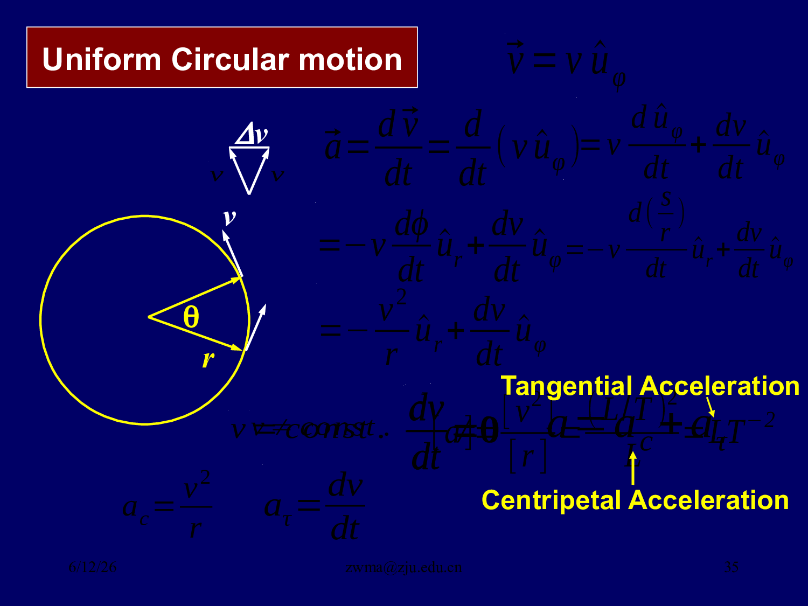

#### 2.2.2.4 自然坐标系下的加速度

在自然坐标系（切向和法向）中，加速度可分解为：

$$
\vec{a} = \frac{dv}{dt}\hat{t} + \frac{v^2}{r}\hat{n}
$$

其中 $\hat{t}$ 为切向单位矢量，$\hat{n}$ 为法向单位矢量（指向曲率中心）。

---

### 2.2.3 匀速圆周运动的动力学

做圆周运动的物体需要**向心力**来维持其运动。根据牛顿第二定律：

$$
\sum F_c = m a_c = m\frac{v^2}{r} = m\omega^2 r
$$

向心力不是一种独立的力类型，而是提供向心加速效果的各种力的合力（或分力），例如张力、法向力、摩擦力或万有引力等。

#### 2.2.3.1 常见圆周运动实例

##### 2.2.3.1.1 单摆

摆球在最低点时，沿径向方向：

$$
T - mg = m\frac{v^2}{r}
$$

其中 $T$ 为绳的张力。

##### 2.2.3.1.2 倾斜弯道

汽车在倾斜公路上转弯时，由法向力的水平分量提供向心力：

$$
N\sin\theta = m\frac{v^2}{r}
$$

竖直方向平衡：

$$
N\cos\theta = mg
$$

联立得：

$$
\tan\theta = \frac{v^2}{rg}
$$

其中 $\theta$ 为路面倾角。

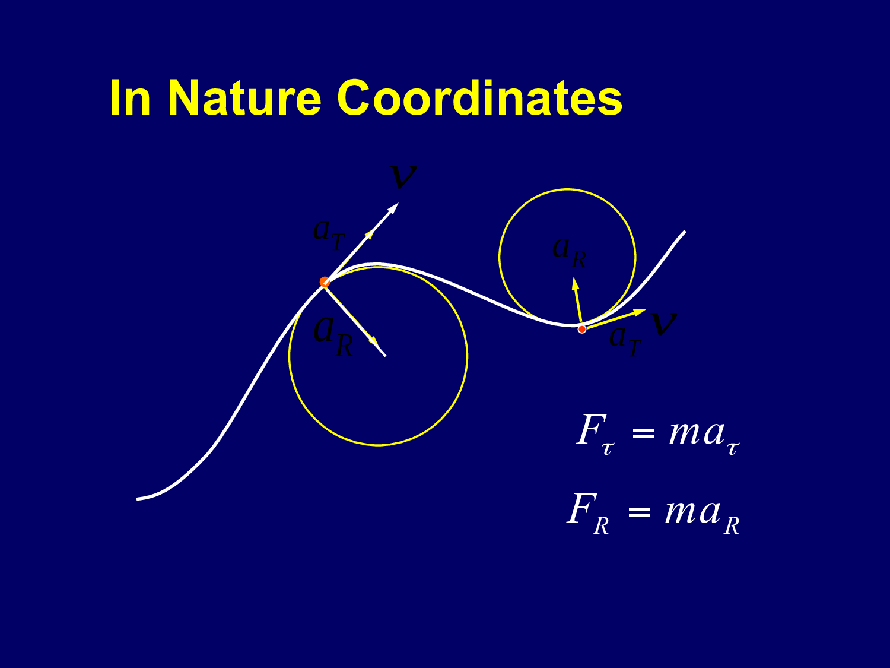

---

### 2.2.4 相对运动

#### 2.2.4.1 基本概念

相对运动研究的是在不同参考系中对同一物体运动的描述之间的关系。

#### 2.2.4.2 相对位置

设质点 $P$ 在 $S$ 系和 $S'$ 系中的位置矢量分别为 $\vec{r}_s$ 和 $\vec{r}_{s'}$，$S'$ 系的原点在 $S$ 系中的位置为 $\vec{r}_{ss'}$，则：

$$
\vec{r}_s = \vec{r}_{ss'} + \vec{r}_{s'}
$$

或者简写为：

$$
\vec{r}_{PA} = \vec{r}_{PB} + \vec{r}_{BA}
$$

（$P$ 相对于 $A$ 的位置 = $P$ 相对于 $B$ 的位置 + $B$ 相对于 $A$ 的位置）

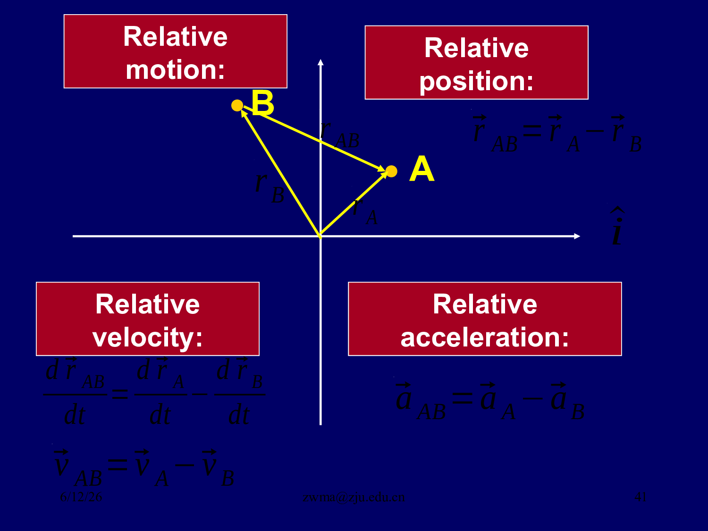

#### 2.2.4.3 相对速度

对时间求导：

$$
\vec{v}_s = \vec{v}_{ss'} + \vec{v}_{s'}
$$

或写为：

$$
\vec{v}_{PA} = \vec{v}_{PB} + \vec{v}_{BA}
$$

#### 2.2.4.4 相对加速度

再对时间求导：

$$
\vec{a}_s = \vec{a}_{ss'} + \vec{a}_{s'}
$$

或写为：

$$
\vec{a}_{PA} = \vec{a}_{PB} + \vec{a}_{BA}
$$

**重要结论：** 如果 $S'$ 系相对于 $S$ 系做匀速直线运动（$\vec{a}_{ss'} = 0$），则 $\vec{a}_s = \vec{a}_{s'}$，即两个惯性系中观测到的加速度相同，牛顿定律在两者中形式不变。

---

### 2.2.5 例题

#### 例题 2.2.5.1：抛体运动中切向与法向加速度

已知一质点的位置矢量为 $\vec{r}(t)$，求 $t=0$ 时的切向加速度和法向加速度。

（提示：总加速度大小 $a = \sqrt{a_t^2 + a_n^2}$，其中 $a_t = \frac{dv}{dt}$，$a_n = \frac{v^2}{\rho}$，$\rho$ 为曲率半径。）

**解的一般思路：**
1. 求速度 $\vec{v}(t) = \frac{d\vec{r}}{dt}$，得到速率 $v(t) = |\vec{v}(t)|$
2. 求加速度 $\vec{a}(t) = \frac{d\vec{v}}{dt}$
3. 切向加速度 $a_t = \frac{dv}{dt}$
4. 法向加速度 $a_n = \sqrt{|\vec{a}|^2 - a_t^2}$

---

#### 例题 2.2.5.2：河流中的船（相对运动综合问题）

一条宽为 $l$ 的河流，水流速度与距河岸的距离呈线性关系，最大流速为 $v_0$。一艘速度为 $v$ 的船从一岸出发（方向垂直于河岸），当船到达距出发岸 $l/4$ 的位置时，燃料不足无法到达对岸。于是船以速度 $v/2$ 返回出发岸，航行方向始终垂直于水流方向。求船返回到达出发岸时，与出发点的距离。

**解：**

**第一阶段（从出发到距岸 $l/4$ 处，顺流上行）：**

设 $x$ 方向为沿河方向（顺流为正），$y$ 方向为垂直河岸方向（从出发岸指向对岸）。

水流速度分布（距出发岸 $y$ 处）：

$$
u(y) = \begin{cases}
\frac{2v_0}{l}y, & 0 \le y \le \frac{l}{2} \\
v_0\left(2 - \frac{2}{l}y\right), & \frac{l}{2} \le y \le l
\end{cases}
$$

（这是一个线性分布，从河岸为 0 到河中心为 $v_0$）

船的速度分量：

$$
\begin{cases}
v_x = u(y) = \frac{2v_0}{l}y \\
v_y = v
\end{cases}
$$

由 $v_y = \frac{dy}{dt} = v$，得 $y = vt$，代入 $x$ 方向：

$$
\frac{dx}{dt} = \frac{2v_0}{l}vt
$$

积分得轨迹：

$$
x = \frac{v_0 v}{l} t^2 = \frac{v_0}{vl} y^2
$$

即船在第一阶段的轨迹为抛物线。

当 $y = \frac{l}{4}$ 时：

$$
x_1 = \frac{v_0}{vl} \left(\frac{l}{4}\right)^2 = \frac{v_0 l}{16v}
$$

**第二阶段（从距岸 $l/4$ 处返回出发岸）：**

船以 $v/2$ 的速度返回，方向垂直于河岸（指向出发岸）。

船的速度分量：

$$
\begin{cases}
v_x = u(y) = \frac{2v_0}{l}y \\
v_y = -\frac{v}{2}
\end{cases}
$$

由 $v_y = \frac{dy}{dt} = -\frac{v}{2}$，从 $y_0 = l/4$ 积分：

$$
y = \frac{l}{4} - \frac{v}{2}t
$$

$x$ 方向：

$$
\frac{dx}{dt} = \frac{2v_0}{l}y = \frac{2v_0}{l}\left(\frac{l}{4} - \frac{v}{2}t\right) = \frac{v_0}{2} - \frac{v_0 v}{l}t
$$

积分得：

$$
x(t) = x_1 + \int_0^t \left(\frac{v_0}{2} - \frac{v_0 v}{l}t'\right) dt' = \frac{v_0 l}{16v} + \frac{v_0}{2}t - \frac{v_0 v}{2l}t^2
$$

返回到达出发岸时 $y=0$，即 $\frac{l}{4} - \frac{v}{2}t = 0$，解得 $t = \frac{l}{2v}$。

代入得：

$$
x_2 = \frac{v_0 l}{16v} + \frac{v_0}{2} \cdot \frac{l}{2v} - \frac{v_0 v}{2l} \cdot \left(\frac{l}{2v}\right)^2
$$

$$
x_2 = \frac{v_0 l}{16v} + \frac{v_0 l}{4v} - \frac{v_0 l}{8v}
$$

$$
x_2 = \frac{v_0 l}{16v} + \frac{v_0 l}{8v} = \frac{3v_0 l}{16v}
$$

**答案：** 船到达出发岸时，与出发点的距离为 $\frac{3v_0 l}{16v}$。

## 2.3 牛顿定律的应用

---

### 2.3.1 牛顿定律的局限性

牛顿力学并非普适真理，有其适用范围：

| 条件 | 要求 | 超出范围后的理论 |
|------|------|------------------|
| 速度 | $v \ll c$（远小于光速） | 狭义相对论 |
| 尺度 | 宏观尺度（远大于原子尺度） | 量子力学 |
| 参考系 | 惯性参考系 | 需引入惯性力 |

**总结：** 牛顿定律适用于**低速、宏观、惯性系**中的力学问题。

---

### 2.3.2 非惯性参考系与惯性力

#### 2.3.2.1 问题的提出

如果一个参考系 $S'$ 相对于惯性系 $S$ 做加速运动，则 $S'$ 系是非惯性系。

在非惯性系 $S'$ 中，牛顿第二定律 $\vec{F} = m\vec{a}'$ 不成立，因为 $\vec{a}'$ 不是相对于惯性系的加速度。

#### 2.3.2.2 惯性力/伪力

为了在非惯性系中沿用牛顿第二定律的形式，需要引入一个假想的力——**惯性力（伪力）**：

$$
\vec{F}_p = -m\vec{a}_0
$$

其中 $\vec{a}_0$ 是非惯性系相对于惯性系的加速度。

于是，在非惯性系中修正后的牛顿第二定律为：

$$
\vec{F} + \vec{F}_p = m\vec{a}'
$$

其中 $\vec{a}'$ 是物体在非惯性系中的加速度。

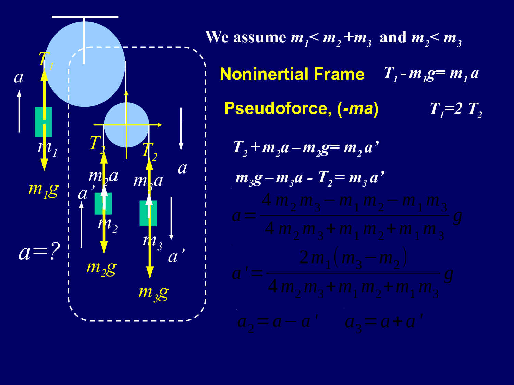

#### 2.3.2.3 例题：非惯性系中的滑轮系统

**系统描述：** 三个质量 $m_1$、$m_2$、$m_3$ 通过滑轮连接，其中 $m_1 < m_2 + m_3$ 且 $m_2 < m_3$。整个系统在拉力作用下以加速度 $a$ 向上运动。

**在惯性系中（地面参考系）：**

对 $m_1$：

$$
T_1 - m_1g = m_1a
$$

其中 $T_1 = 2T_2$（理想滑轮，绳子各处张力关系）。

**在非惯性系中（随系统加速上升的参考系）：**

引入向下的惯性力 $-m_i a$（$i=1,2,3$）。

对 $m_2$（在非惯性系中以 $a'$ 相对于系统运动）：

$$
T_2 + m_2a - m_2g = m_2a'
$$

对 $m_3$（在非惯性系中以 $a'$ 相对于系统运动）：

$$
m_3g - m_3a - T_2 = m_3a'
$$

通过联立这些方程可以解出 $a$ 和 $a'$。

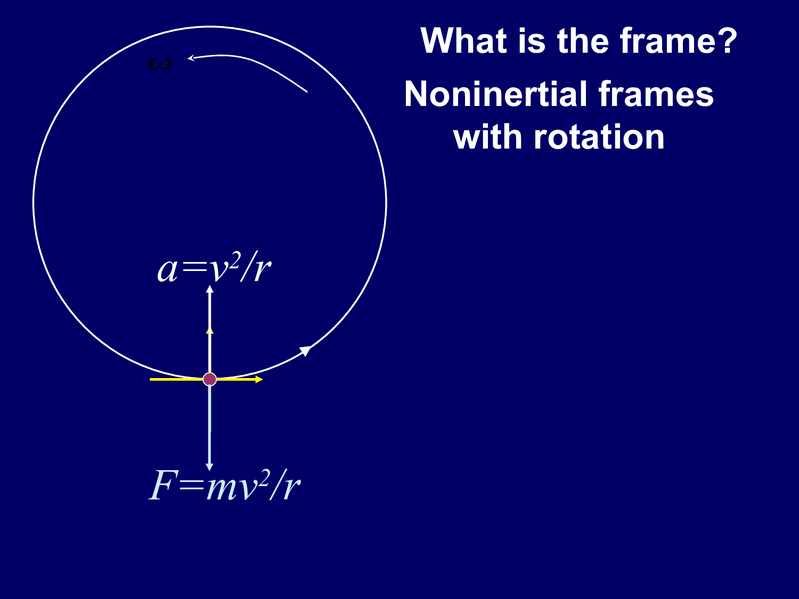

---

### 2.3.3 转动非惯性系

#### 2.3.3.1 离心力

在匀速转动的参考系中观察，静止在转动系中的物体会受到一个"向外"的力。

从惯性系看：物体需要向心力 $mv^2/r$ 来维持圆周运动。

在转动系（非惯性系）中：为了平衡，引入"离心力"（伪力）：

$$
F_{\text{cf}} = m\omega^2 r = m\frac{v^2}{r}
$$

方向沿径向向外。

#### 2.3.3.2 科里奥利力

当物体在转动参考系中**运动**时，除了离心力外，还会受到科里奥利力。

**科里奥利加速度的推导：**

考虑一个在半径为 $r$ 处以径向速度 $v'$ 运动的物体。在 $\Delta t$ 时间内，速度变化有两个贡献：

**贡献 1：** 物体从 $r$ 运动到 $r'$（径向移动 $v'\Delta t$）。由于转动，不同半径处的切向速度不同（$r\omega$ 和 $r'\omega$），切向速度大小因此变化：

$$
\Delta v_1 = r\omega - r'\omega = (r - r')\omega = -v'\Delta t \cdot \omega
$$

其大小为 $v'\omega\Delta t$。

**贡献 2：** 径向速度 $\vec{v}'$ 的方向随参考系转动。在 $\Delta t$ 时间内，转动参考系转过角度 $\Delta\theta = \omega\Delta t$，径向速度的方向变化导致产生一个额外的切向速度分量：

$$
\Delta v_2 = v'\Delta\theta = v'\Delta t \cdot \omega
$$

总速度变化量的大小为两贡献之和：

$$
\Delta v = \Delta v_1 + \Delta v_2 = 2v'\omega\Delta t
$$

因此科里奥利加速度大小为：

$$
a_{\text{cor}} = \frac{\Delta v}{\Delta t} = 2 v' \omega
$$

**科里奥利力：**

在转动非惯性系中，科里奥利力为：

$$
\vec{F}_{\text{cor}} = -2m\vec{\omega} \times \vec{v}'
$$

其中 $\vec{v}'$ 是物体在转动系中的速度。

**特性：**
- 方向垂直于 $\vec{\omega}$ 和 $\vec{v}'$ 所确定的平面（右手定则加负号）
- 只对在转动系中**运动**的物体产生作用
- 地球上的大气环流、洋流、傅科摆等现象都涉及科里奥利力

#### 2.3.3.3 科里奥利力的方向判断

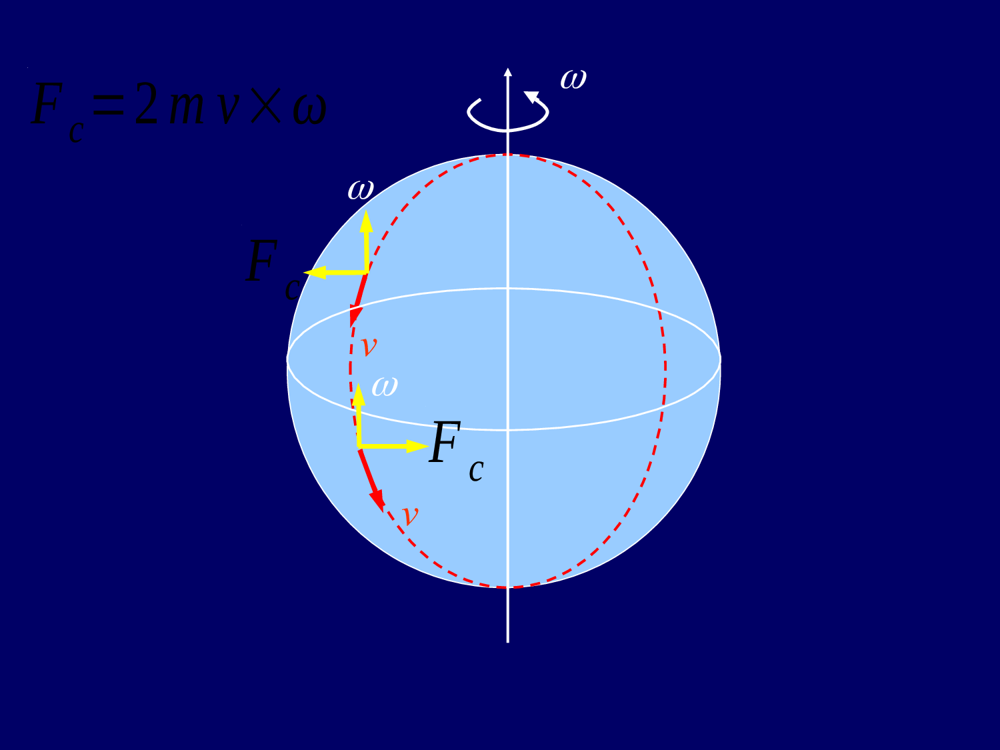

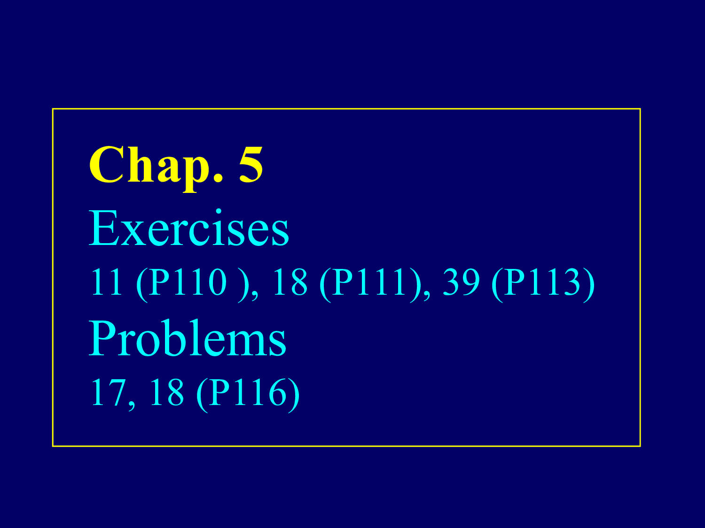

---

### 2.3.4 习题参考

#### 2.3.4.1 第3章（对应教材 P63, P86, P87）
- P63: 7, 9
- P86: 15, 18, 20
- P87: 23

#### 2.3.4.2 第5章（对应教材 P110, P111, P113, P116）
- 习题: 11 (P110), 18 (P111), 39 (P113)
- 问题: 17, 18 (P116)

---

### 2.3.5 附录：核心公式速查

| 物理量/定律 | 公式 | 说明 |
|------------|------|------|
| 牛顿第一定律 | $\sum \vec{F} = 0 \Rightarrow \Delta \vec{v}=0$ | 惯性定律 |
| 牛顿第二定律 | $\sum \vec{F} = m\vec{a} = m\frac{d\vec{v}}{dt}$ | 动力学基本方程 |
| 牛顿第三定律 | $\vec{F}_{AB} = -\vec{F}_{BA}$ | 作用力与反作用力 |
| 重力 | $\vec{W} = m\vec{g}$ | 方向竖直向下 |
| 万有引力 | $F = G\frac{m_1 m_2}{r^2}$ | $G=6.67\times10^{-11}\ \text{N}\cdot\text{m}^2/\text{kg}^2$ |
| 弹簧力 | $\vec{F} = -k\Delta\vec{x}$ | 胡克定律 |
| 滑动摩擦力 | $f_k = \mu_k N$ | 方向与相对运动相反 |
| 静摩擦力 | $f_s \le \mu_s N$ | $\mu_s > \mu_k$ |
| 向心加速度 | $a_c = \frac{v^2}{r} = \omega^2 r$ | 方向指向圆心 |
| 向心力 | $F_c = m\frac{v^2}{r}$ | 由各力合力提供 |
| 抛体轨迹 | $y = x\tan\theta_0 - \frac{g}{2v_0^2\cos^2\theta_0}x^2$ | 抛物线 |
| 水平射程 | $R = \frac{v_0^2\sin 2\theta_0}{g}$ | 最大射程时 $\theta_0=45^\circ$ |
| 切向加速度 | $a_t = \frac{dv}{dt}$ | 沿切线方向 |
| 法向加速度 | $a_n = \frac{v^2}{\rho}$ | $\rho$ 为曲率半径 |
| 相对速度 | $\vec{v}_{PA} = \vec{v}_{PB} + \vec{v}_{BA}$ | 伽利略速度变换 |
| 惯性力(伪力) | $\vec{F}_p = -m\vec{a}_0$ | 非惯性系中使用 |
| 离心力 | $F_{\text{cf}} = m\omega^2 r$ | 转动非惯性系中 |
| 科里奥利力 | $\vec{F}_{\text{cor}} = -2m\vec{\omega} \times \vec{v}'$ | 转动系中运动物体 |
| 终端速度 | $v_T = \frac{mg}{b}$ | 线性阻力 $D=bv$ 下 |
