# 04. 刚体力学

涵盖章节：
- **第8章 转动运动学 (Rotational Kinematics)**
- **第9章 转动动力学 (Rotational Dynamics)**
- **第10章 角动量 (Angular Momentum)**

## 4.1 转动运动学

### 4.1.1 质心

**多粒子系统的质心**定义为质点系中一个特殊点，其运动代表了系统的整体平动。质心位置矢量为：

$$
\mathbf{R}_{\text{cm}} = \frac{\sum_i m_i \mathbf{r}_i}{\sum_i m_i} = \frac{\sum_i m_i \mathbf{r}_i}{M}
$$

其中 $M = \sum_i m_i$ 为系统总质量。

### 4.1.2 实验室参考系与质心参考系

- **实验室参考系 (Lab Frame)**：通常固定在地面的惯性参考系。
- **质心参考系 (CM Frame)**：原点固定在质心上的参考系。

在质心参考系中，系统的总动量为零：

$$
\sum_i m_i \mathbf{v}_i' = 0
$$

因此质心参考系也被称为**零动量参考系 (zero momentum reference frame)**。

### 4.1.3 刚体运动的分解

刚体的运动可以分解为两部分：

1. **质心的平动 (Translation of mass center)**
2. **绕质心的转动 (Rotation about mass center)**

研究绕质心转动的方法是引入转动运动学。

### 4.1.4 转动运动学物理量

刚体绕固定轴转动时，刚体上每个点都具有相同的角位移、角速度和角加速度，但线速度和线加速度不同。

#### 4.1.4.1 角位移

刚体绕轴转过的角度。

#### 4.1.4.2 角速度

- **平均角速度**：$\bar{\omega} = \frac{\Delta \varphi}{\Delta t}$
- **瞬时角速度**：$\omega = \lim_{\Delta t \to 0} \frac{\Delta \varphi}{\Delta t} = \frac{d\varphi}{dt}$

#### 4.1.4.3 角加速度

- **平均角加速度**：$\bar{\alpha} = \frac{\Delta \omega}{\Delta t}$
- **瞬时角加速度**：$\alpha = \lim_{\Delta t \to 0} \frac{\Delta \omega}{\Delta t} = \frac{d\omega}{dt} = \frac{d^2\varphi}{dt^2}$

**重要概念**：刚体上不同位置的点（如 $p$、$p'$、$p''$）具有不同的线速度和线加速度（方向与大小都不同），但它们的**转动运动学量完全一致**（相同的 $\omega$、$\alpha$）。

### 4.1.5 线运动与转动运动的对比

| 线运动 (Linear Motion) | 转动运动 (Rotational Motion) |
|:---|:---|
| 位移 $x$ | 角位移 $\varphi$ |
| 速度 $v = \frac{dx}{dt}$ | 角速度 $\omega = \frac{d\varphi}{dt}$ |
| 加速度 $a = \frac{dv}{dt}$ | 角加速度 $\alpha = \frac{d\omega}{dt}$ |

### 4.1.6 匀角加速度转动

当角加速度 $\alpha$ 为常量时，公式与匀加速直线运动完全对应：

| 匀加速直线运动 | 匀角加速度转动 |
|:---|:---|
| $v = v_0 + at$ | $\omega = \omega_0 + \alpha t$ |
| $x = x_0 + v_0 t + \frac{1}{2}at^2$ | $\varphi = \varphi_0 + \omega_0 t + \frac{1}{2}\alpha t^2$ |
| $v^2 = v_0^2 + 2a(x - x_0)$ | $\omega^2 = \omega_0^2 + 2\alpha(\varphi - \varphi_0)$ |

### 4.1.7 线量与角量的关系

考虑刚体上一点距离转轴 $r$：

- **弧长**：$S = r\varphi$（对应于角位移 $\varphi$）
- **线速度**：$v = \omega r$（方向沿切线方向）
- **切向加速度**：$a_t = \alpha r$
- **法向加速度（向心加速度）**：$a_R = \omega^2 r = \frac{v^2}{r}$

### 4.1.8 转动量作为矢量

角速度 $\omega$ 和角加速度 $\alpha$ 是矢量，方向由**右手定则**确定：右手四指弯曲方向指向旋转方向，拇指指向即为角速度矢量方向。

#### 4.1.8.1 有限角位移 vs 无限小角位移

- **有限角位移 $\Delta \varphi$ 不是矢量**：因为有限角位移的加法不满足交换律，$\Delta \varphi_1 + \Delta \varphi_2 \neq \Delta \varphi_2 + \Delta \varphi_1$。
- **无限小角位移 $\delta \varphi$ 是矢量**：无限小角位移的加法满足交换律，$\delta \varphi_1 + \delta \varphi_2 = \delta \varphi_2 + \delta \varphi_1$。

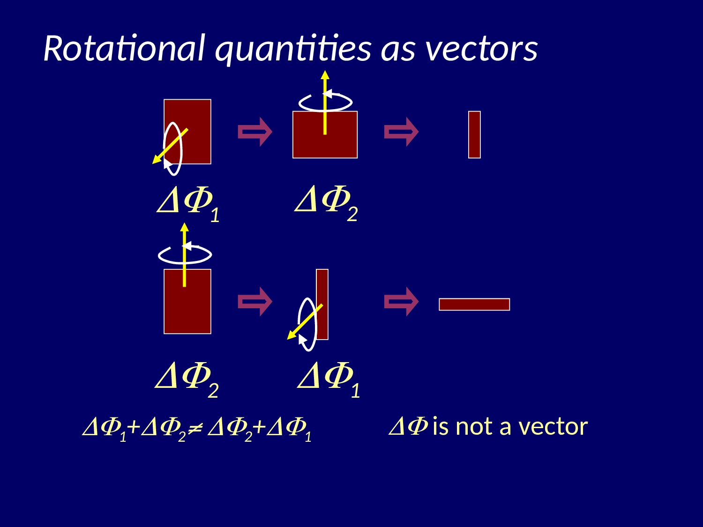

#### 4.1.8.2 线量与角量的矢量关系

$$
\mathbf{v} = \boldsymbol{\omega} \times \mathbf{r}
$$

$$
\mathbf{a}_t = \boldsymbol{\alpha} \times \mathbf{r}
$$

$$
\mathbf{a}_R = -\omega^2 \mathbf{r}
$$

### 4.1.9 平面极坐标

在平面极坐标系中，位置矢量 $\mathbf{r}$ 由径向距离 $r$ 和极角 $\varphi$ 表示。

### 4.1.10 力与转动

正如力是引起平动加速度的原因，**力矩**是引起转动角加速度的原因。这自然引入了第9章的转动动力学。

## 4.2 转动动力学

### 4.2.1 力矩

力矩是力对转动效果的度量。

**定义**：$\boldsymbol{\tau} = \mathbf{r} \times \mathbf{F}$

大小：$\tau = rF\sin\theta = r_\perp F = rF_\perp$

其中：
- $\mathbf{r}$ 是从转轴（或参考点）到力作用点的位置矢量
- $\theta$ 是 $\mathbf{r}$ 与 $\mathbf{F}$ 之间的夹角
- $r_\perp = r\sin\theta$ 是力臂
- $F_\perp = F\sin\theta$ 是力的切向分量

**方向**：由右手定则确定，垂直于 $\mathbf{r}$ 和 $\mathbf{F}$ 所在平面。

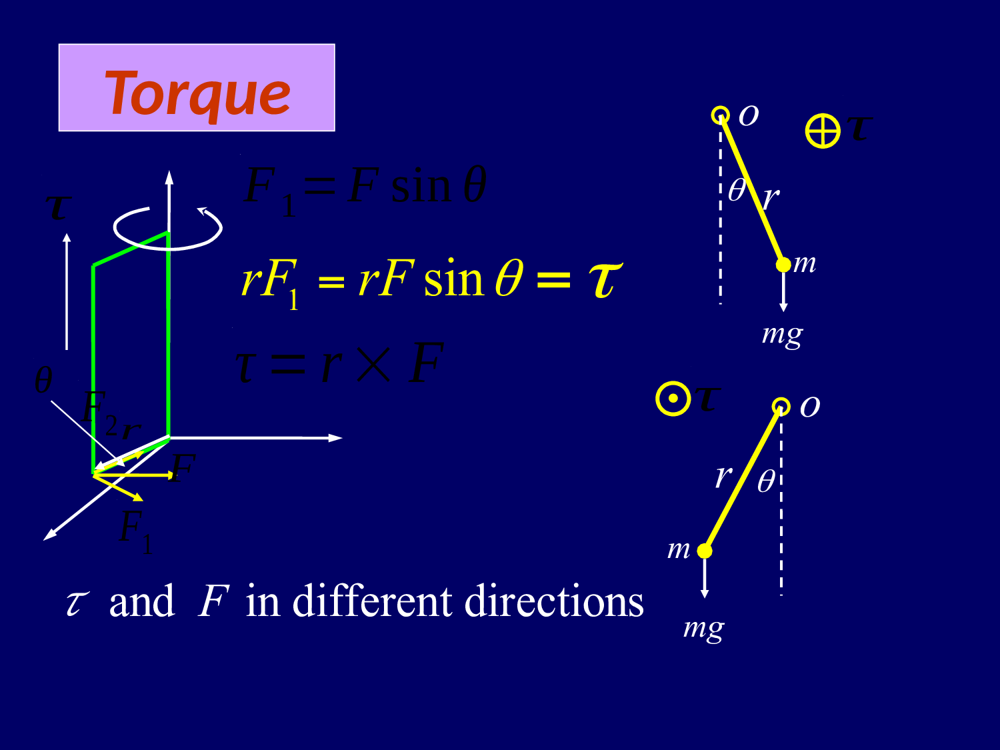

### 4.2.2 转动惯量

转动惯量是刚体转动惯性的量度。

#### 4.2.2.1 单个质点

对于距离转轴为 $r$ 的质点 $m$：

$$
I = mr^2
$$

转动中的牛顿第二定律（单质点）：

$$
\tau = I\alpha
$$

对应关系：**力** $\to$ 产生 **线加速度**；**力矩** $\to$ 产生 **角加速度**。

| 线运动 | 转动运动 |
|:---|:---|
| 质量 $m$（惯性度量） | 转动惯量 $I$（转动惯性度量） |
| 力 $F$ | 力矩 $\tau$ |
| $F = ma$ | $\tau = I\alpha$ |

**转动惯量取决于**：
1. 质点的质量
2. 质点到转轴的垂直距离

#### 4.2.2.2 多质点系统

$$
I = \sum_i m_i r_i^2
$$

其中 $r_i$ 是第 $i$ 个质点到转轴的垂直距离。

#### 4.2.2.3 连续体（刚体）

对于质量连续分布的刚体：

$$
I = \int r^2 \, dm
$$

其中 $dm$ 是质量微元，$r$ 是质量微元到转轴的垂直距离。

### 4.2.3 常见刚体的转动惯量

#### 4.2.3.1 细杆绕通过质心的垂直轴

质量为 $M$，长度为 $L$，线密度 $\lambda = M/L$，绕通过质心垂直于杆的轴转动：

$$
I_{\text{cm}} = \frac{1}{12}ML^2
$$

取微元 $dx$，质量 $dm = \lambda dx$，
$$
I = \int_{-L/2}^{L/2} x^2 \lambda dx = \frac{1}{12}ML^2
$$

#### 4.2.3.2 细杆绕通过端点的垂直轴

$$
I = \frac{1}{3}ML^2
$$

质量微元 $dm$ 在 $x$ 处，
$$
I = \int_0^L x^2 \lambda dx = \frac{1}{3}ML^2
$$

#### 4.2.3.3 圆环绕垂直轴

质量为 $M$，半径为 $R$，绕通过圆心垂直于环面的轴：

$$
I = MR^2
$$

$$
I = \int R^2 dm = R^2 \int dm = MR^2
$$

#### 4.2.3.4 圆盘/圆柱绕中心轴

质量为 $M$，半径为 $R$，绕通过圆心垂直于盘面的轴：

$$
I = \frac{1}{2}MR^2
$$

面积密度 $\sigma = M/(\pi R^2)$，质量微元 $dm = \sigma \cdot 2\pi r dr$，
$$
I = \int_0^R r^2 \cdot \sigma \cdot 2\pi r dr = \frac{1}{2}MR^2
$$

#### 4.2.3.5 薄球壳绕直径

质量为 $M$，半径为 $R$：

$$
I = \frac{2}{3}MR^2
$$

从极角 $\theta$ 到 $\theta + d\theta$，环带半径为 $R\sin\theta$，
$$
dm = \sigma \cdot 2\pi R^2 \sin\theta d\theta
$$

#### 4.2.3.6 实心球绕直径

质量为 $M$，半径为 $R$：

$$
I = \frac{2}{5}MR^2
$$

将球分为薄球壳层（半径 $r$ 到 $r+dr$）或盘状切片。

#### 4.2.3.7 常用转动惯量汇总表

| 刚体形状 | 转轴位置 | 转动惯量 |
|:---|:---|:---|
| 细杆 (rod) | 通过质心垂直于杆 | $\frac{1}{12}ML^2$ |
| 细杆 (rod) | 通过端点垂直于杆 | $\frac{1}{3}ML^2$ |
| 圆环 (ring) | 通过圆心垂直于环面 | $MR^2$ |
| 圆盘/圆柱 (disk/cylinder) | 通过中心垂直于盘面 | $\frac{1}{2}MR^2$ |
| 薄球壳 (thin spherical shell) | 直径 | $\frac{2}{3}MR^2$ |
| 实心球 (solid sphere) | 直径 | $\frac{2}{5}MR^2$ |

### 4.2.4 平行轴定理

如果刚体对通过质心的转轴的转动惯量为 $I_{\text{cm}}$，那么对任何与此轴平行的转轴的转动惯量为：

$$
I = I_{\text{cm}} + Mh^2
$$

其中 $h$ 是两平行轴之间的垂直距离，$M$ 是刚体的总质量。

其中 $y$ 轴通过质心 $C$，$y'$ 轴为另一平行轴，相距为 $R$（图中的 $h$）。质点 $M_n$ 到 $y'$ 轴的距离为 $r_n$，到 $y$ 轴的距离为 $r_n'$，满足 $r_n^2 = r_n'^2 + R^2 + 2\mathbf{R} \cdot \mathbf{r}_n'$，对全系统求和后交叉项为零，得 $I = MR^2 + I_{\text{cm}}$。

**应用示例**：细杆绕端点的转动惯量：

$$
I = I_{\text{cm}} + M\left(\frac{L}{2}\right)^2 = \frac{1}{12}ML^2 + \frac{1}{4}ML^2 = \frac{1}{3}ML^2
$$

### 4.2.5 垂直轴定理

对于薄板状（平面分布）的刚体，若 $x$、$y$ 轴在板面内，$z$ 轴垂直于板面，则：

$$
I_z = I_x + I_y
$$

其中 $I_z$ 是绕 $z$ 轴的转动惯量，$I_x$、$I_y$ 分别是绕 $x$、$y$ 轴的转动惯量。

**推导**：$I_z = \sum (x_n^2 + y_n^2)m_n = \sum x_n^2 m_n + \sum y_n^2 m_n = I_y + I_x$

### 4.2.6 多粒子系统的转动动力学

对于绕固定轴转动的刚体系统，考虑第 $i$ 个粒子：

- 受到**外力** $\mathbf{F}_i$ 和**内力** $\mathbf{f}_i$
- 到转轴的垂直距离为 $r_i$

对粒子 $i$：

$$
\tau_i = r_i(F_i\sin\theta_i + f_i\sin\phi_i) = I_i\alpha
$$

对所有粒子求和：

$$
\sum_i \tau_{i,\text{ext}} + \sum_i \tau_{i,\text{int}} = \left(\sum_i I_i\right)\alpha
$$

由于**内力的力矩之和为零**（内力成对出现且作用线相同、方向相反）：

$$
\sum_i \tau_{i,\text{int}} = 0
$$

因此：

$$
\sum \tau_{\text{ext}} = I\alpha
$$

其中 $I = \sum_i I_i = \sum_i m_i r_i^2$ 是系统的总转动惯量。

### 4.2.7 牛顿第二定律的转动形式

$$
\boxed{\sum \tau_{\text{ext}} = I\alpha}
$$

其中 $\sum \tau_{\text{ext}}$ 是作用于刚体的所有外力对转轴的力矩之和，$I$ 是刚体对该轴的转动惯量，$\alpha$ 是角加速度。

### 4.2.8 重力力矩

重力作用于刚体时的总力矩相当于将全部重力集中在质心处所产生的力矩。

**重要推论**：重力对质心的力矩为零。

$$
\sum \tau_{\text{gravity, cm}} = 0
$$

### 4.2.9 惯性力力矩

在非惯性系中，惯性力产生的力矩与重力力矩类似。惯性力的"中心"与质心重合：

$$
\text{惯性力的中心 = 质心位置}
$$

### 4.2.10 平衡条件

刚体处于静平衡的条件：

1. **力的平衡**（质心无平动加速度）：
   $$
   \sum \mathbf{F}_{\text{ext}} = 0
   $$

2. **力矩的平衡**（刚体无角加速度）：
   $$
   \sum \tau_{\text{ext}} = 0
   $$

### 4.2.11 平动与转动的结合

刚体的一般平面运动由质心平动和绕质心转动组成。

**基本方程**：

$$
\begin{cases}
\sum \mathbf{F}_{\text{ext}} = M\mathbf{a}_{\text{cm}} & \text{（质心运动定理）} \\
\sum \tau_{\text{ext}} = I_{\text{cm}}\alpha & \text{（绕质心转动方程）}
\end{cases}
$$

其中 $\mathbf{a}_{\text{cm}}$ 是质心加速度，$I_{\text{cm}}$ 是绕质心的转动惯量。

刚体上任意一点的速度：$\mathbf{v}_i = \mathbf{v}_{\text{cm}} + \boldsymbol{\omega} \times \mathbf{r}_i'$，其中 $\mathbf{r}_i'$ 是该点相对于质心的位置矢量。

### 4.2.12 平面平行运动

满足以下两个条件的合运动称为平面平行运动：
1. 转轴通过质心
2. 转轴方向在空间中保持不变

### 4.2.13 纯滚动

纯滚动是无滑动的滚动，满足接触点无相对运动的条件。

#### 4.2.13.1 纯滚动的条件

$$
v_{\text{cm}} = \omega R
$$

即质心的平动速度等于转动角速度乘以半径。

#### 4.2.13.2 纯滚动的加速度关系

$$
a_{\text{cm}} = \alpha R
$$

#### 4.2.13.3 接触点的速度

在纯滚动中，接触点（与地面的接触点）的瞬时速度为零。

#### 4.2.13.4 瞬时轴

纯滚动时，可以认为刚体绕接触点 $B$（瞬时轴）做纯转动。此时：

- 轮子上各点的速度可视为绕 $B$ 点的纯转动
- 用绕 $B$ 点的转动方程 $\sum \tau_B = I_B\alpha$ 可以求解问题

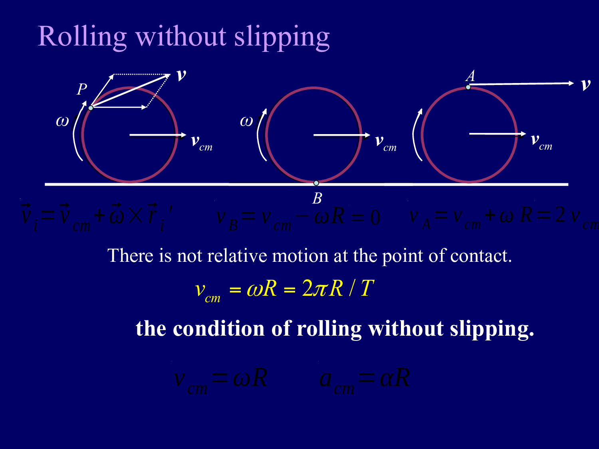

#### 4.2.13.5 纯滚动问题的求解方法

**方法一——绕质心 $C$**：

$$
\begin{cases}
\sum F_{\text{ext}} = Ma_{\text{cm}} \\
\sum \tau_{\text{cm}} = I_{\text{cm}}\alpha \\
a_{\text{cm}} = \alpha R \quad (\text{纯滚动条件})
\end{cases}
$$

**方法二——绕接触点 $B$（瞬时轴）**：

$$
\sum \tau_B = I_B\alpha
$$

其中 $I_B = I_{\text{cm}} + MR^2$（平行轴定理），再加上 $a_{\text{cm}} = \alpha R$。

### 4.2.14 滚动中的摩擦力方向

在纯滚动中，静摩擦力的方向取决于使轮子滚动的外力情况：
- 如果是主动力（如牵引力）驱动轮子转动，静摩擦力向前
- 如果是从动轮，静摩擦力向后

在有滑滚动中，滑动摩擦力的方向与接触点的相对滑动方向相反。

---

### 4.2.15 例题

#### 例题 4.2.1：阿特伍德机与滑轮

**题目描述**：一个质量为 $m$、半径为 $R$ 的圆盘形滑轮，用轻绳悬挂两个质量分别为 $m_1$ 和 $m_2$ 的物体（$m_2 > m_1$），绳子与滑轮间无滑动。求物体的加速度 $a$、绳中张力 $T_1$ 和 $T_2$、以及滑轮的角加速度 $\alpha$。

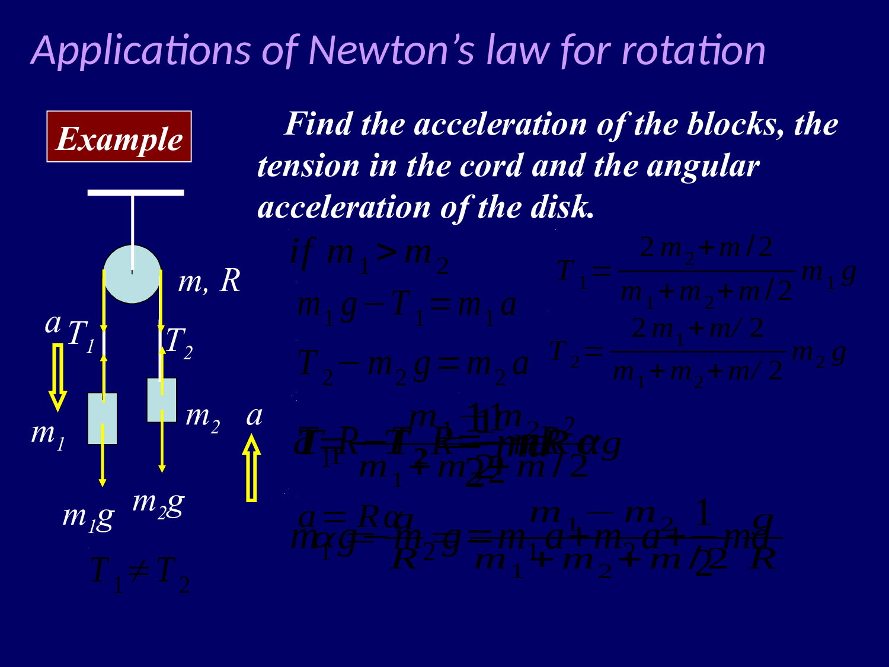

**解**：

对 $m_1$（向上为正）：
$$
T_1 - m_1g = m_1a
$$

对 $m_2$（向下为正）：
$$
m_2g - T_2 = m_2a
$$

对滑轮（取顺时针为正）：
$$
T_2R - T_1R = I\alpha = \frac{1}{2}mR^2 \cdot \alpha
$$

纯滚动（无滑动）条件：$a = \alpha R$

联立求解：
$$
\begin{aligned}
a &= \frac{(m_2 - m_1)g}{m_1 + m_2 + \frac{1}{2}m} \\
\alpha &= \frac{a}{R} = \frac{(m_2 - m_1)g}{(m_1 + m_2 + \frac{1}{2}m)R} \\
T_1 &= m_1(g + a), \quad T_2 = m_2(g - a)
\end{aligned}
$$

---

#### 例题 4.2.2：绕一端转动的细杆

**题目描述**：质量为 $m$、长度为 $l$ 的均匀细杆，可绕端点 $o$ 在竖直平面内自由转动。杆从水平位置由静止释放，当杆与水平方向夹角为 $\theta$ 时，求：
1. 角加速度 $\alpha$
2. 角速度 $\omega$
3. 质心加速度 $\mathbf{a}_{\text{cm}}$
4. 端点 $o$ 处的约束力 $N_x$、$N_y$

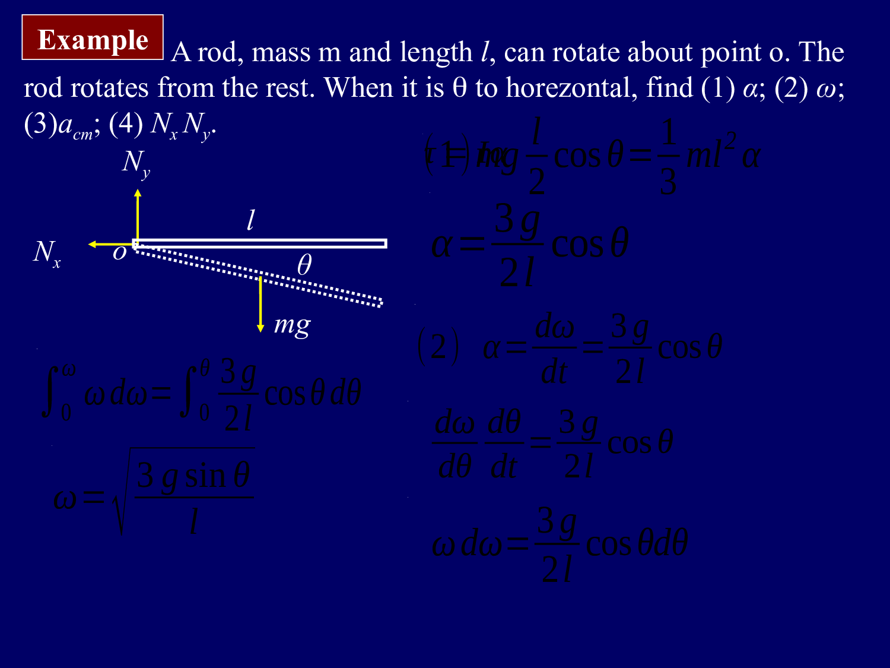

**解**：

**(1) 求角加速度 $\alpha$**

杆对 $o$ 点的转动惯量：$I_o = \frac{1}{3}ml^2$

对 $o$ 点取力矩：
$$
\sum \tau_o = mg \cdot \frac{l}{2}\cos\theta
$$

由转动定律：
$$
mg \cdot \frac{l}{2}\cos\theta = I_o\alpha = \frac{1}{3}ml^2 \cdot \alpha
$$

解得：
$$
\alpha = \frac{3g\cos\theta}{2l}
$$

**(2) 求角速度 $\omega$**

由动能定理或转动中的能量守恒（用 $\omega d\omega = \alpha d\theta$ 积分）：

$$
\int_0^\omega \omega \, d\omega = \int_0^\theta \alpha \, d\theta = \int_0^\theta \frac{3g\cos\theta}{2l} \, d\theta
$$

$$
\frac{\omega^2}{2} = \frac{3g\sin\theta}{2l}
$$

$$
\omega = \sqrt{\frac{3g\sin\theta}{l}}
$$

**(3) 求质心加速度 $\mathbf{a}_{\text{cm}}$**

质心做圆周运动，其加速度有切向和法向分量：

- 切向加速度：$a_t = \alpha \cdot \frac{l}{2} = \frac{3g\cos\theta}{4}$
- 法向加速度：$a_n = \omega^2 \cdot \frac{l}{2} = \frac{3g\sin\theta}{2}$

当 $\theta = 0^\circ$（水平位置）时：
- $\alpha = \frac{3g}{2l}$，$\omega = 0$
- $a_t = \frac{3g}{4}$，$a_n = 0$

当 $\theta = 90^\circ$（竖直位置）时：
- $\alpha = 0$，$\omega = \sqrt{\frac{3g}{l}}$
- $a_t = 0$，$a_n = \frac{3g}{2}$

**(4) 求约束力 $N_x$、$N_y$**

由质心运动定理：

水平方向：$N_x = ma_{c,x} = m(-a_t\cos\theta + a_n\sin\theta)$

竖直方向：$N_y - mg = ma_{c,y} = m(-a_t\sin\theta - a_n\cos\theta)$

代入 $a_t$、$a_n$ 解得：
$$
\begin{aligned}
N_x &= \frac{3}{4}mg\sin\theta\cos\theta - \frac{3}{2}mg\sin\theta\cos\theta = -\frac{3}{4}mg\sin2\theta \\
N_y &= mg - \frac{3}{4}mg\cos^2\theta - \frac{3}{2}mg\sin^2\theta
\end{aligned}
$$

---

#### 例题 4.2.3：圆柱体沿斜面纯滚动

**题目描述**：质量为 $m$、半径为 $R$ 的均匀实心圆柱体，从倾角为 $\theta$ 的斜面上无滑动地滚下。求质心加速度 $a_{\text{cm}}$ 和静摩擦力 $f$。

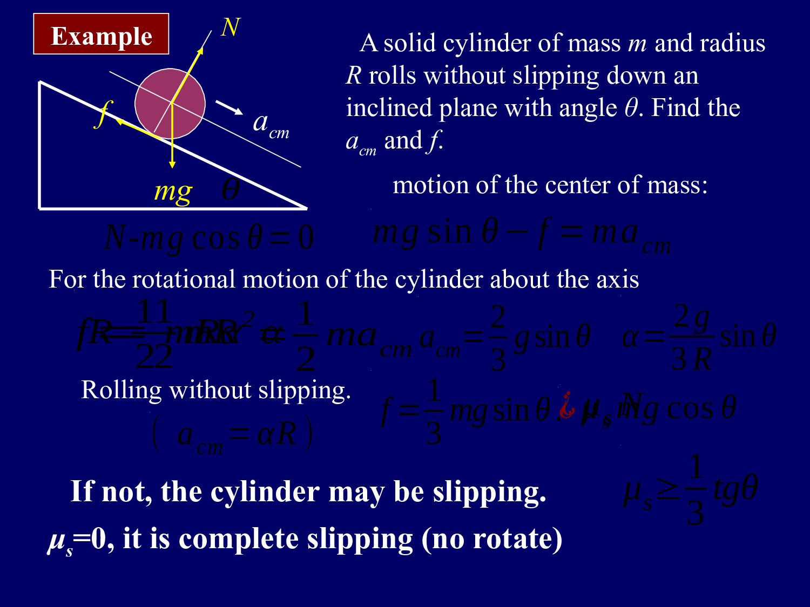

**解**：

**方法一——绕质心 $C$：**

沿斜面方向（向下为正）：
$$
mg\sin\theta - f = ma_{\text{cm}} \tag{1}
$$

绕质心的转动（顺时针为正）：
$$
f \cdot R = I_{\text{cm}}\alpha = \frac{1}{2}mR^2 \cdot \alpha \tag{2}
$$

纯滚动条件：
$$
a_{\text{cm}} = \alpha R \tag{3}
$$

由 (2)(3) 得：$f = \frac{1}{2}ma_{\text{cm}}$

代入 (1)：
$$
mg\sin\theta - \frac{1}{2}ma_{\text{cm}} = ma_{\text{cm}}
$$

解得：
$$
a_{\text{cm}} = \frac{2}{3}g\sin\theta, \quad f = \frac{1}{3}mg\sin\theta
$$

**方法二——绕接触点 $B$（瞬时轴）：**

对 $B$ 点的转动惯量（平行轴定理）：
$$
I_B = I_{\text{cm}} + mR^2 = \frac{1}{2}mR^2 + mR^2 = \frac{3}{2}mR^2
$$

对 $B$ 点的力矩（只有重力有贡献）：
$$
mgR\sin\theta = I_B\alpha = \frac{3}{2}mR^2 \cdot \alpha
$$

解得：$\alpha = \frac{2g\sin\theta}{3R}$

则 $a_{\text{cm}} = \alpha R = \frac{2}{3}g\sin\theta$

若 $\mu_s = 0$（无摩擦），则为完全滑动（无转动，仅有平动下滑）。
若滚动条件不满足，圆柱体会发生滑滚混合运动。

---

#### 例题 4.2.4：实心球沿斜面纯滚动

**题目描述**：质量为 $m$、半径为 $R$ 的均匀实心球，从倾角为 $\theta$ 的斜面上无滑动地滚下。求质心加速度 $a_{\text{cm}}$ 和静摩擦力 $f$。

**解**：

实心球的转动惯量：$I_{\text{cm}} = \frac{2}{5}mR^2$

由平动方程：
$$
mg\sin\theta - f = ma_{\text{cm}}
$$

由转动方程：
$$
fR = I_{\text{cm}}\alpha = \frac{2}{5}mR^2 \cdot \alpha
$$

纯滚动条件：$a_{\text{cm}} = \alpha R$

解得：
$$
a_{\text{cm}} = \frac{5}{7}g\sin\theta, \quad f = \frac{2}{7}mg\sin\theta
$$

> 比较：圆柱($\frac{2}{3}g\sin\theta$) vs 实心球($\frac{5}{7}g\sin\theta$)，球的加速度更大，因为其转动惯量占质量的比重更小。

---

#### 例题 4.2.5：圆柱体沿斜面纯滚上滑

**题目描述**：质量为 $m$、半径为 $R$ 的均匀实心圆柱体，以初速度 $v$ 沿倾角为 $\theta$ 的斜面纯滚上滑，求能到达的最大高度。

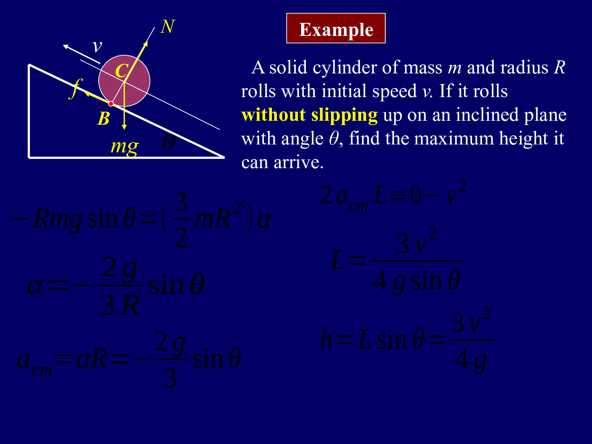

**解**：

由机械能守恒（纯滚动无滑动摩擦做功）：

初始总动能：
$$
K = \frac{1}{2}mv^2 + \frac{1}{2}I_{\text{cm}}\omega^2 = \frac{1}{2}mv^2 + \frac{1}{2} \cdot \frac{1}{2}mR^2 \cdot \frac{v^2}{R^2} = \frac{3}{4}mv^2
$$

最高点处动能全部转化为势能：
$$
\frac{3}{4}mv^2 = mgh
$$

$$
h = \frac{3v^2}{4g}
$$

---

#### 例题 4.2.6：圆柱体从滑动到纯滚动的过渡

**题目描述**：质量为 $M$、半径为 $R$ 的均匀实心圆柱体，初始时以顺时针角速度 $\omega_0$ 被放置在水平粗糙表面上（质心初速度为零），表面与圆柱间的动摩擦因数为 $\mu_k$。圆柱先滑动后纯滚动。求开始纯滚动时质心的速度 $v_{\text{cm}}$ 和经过的时间 $t$。

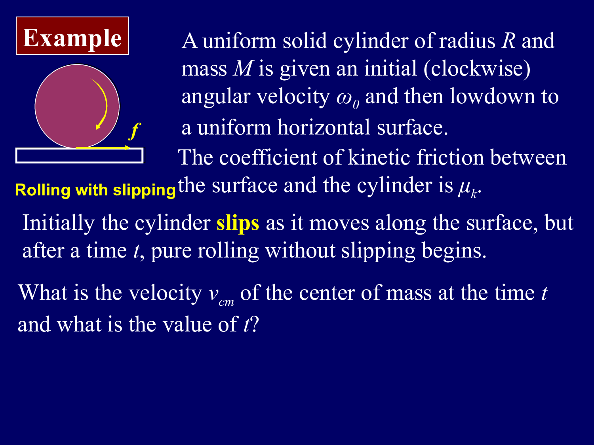

**解**：

在滑动阶段，圆柱受到水平向右的动摩擦力：
$$
f = \mu_k Mg
$$

质心平动（向右为正）：
$$
f = Ma_{\text{cm}} \Rightarrow a_{\text{cm}} = \mu_k g
$$

绕质心转动（取顺时针为正，摩擦力矩使 $\omega$ 减小）：
$$
-fR = I\alpha \Rightarrow -\mu_k Mg R = \frac{1}{2}MR^2 \alpha \Rightarrow \alpha = -\frac{2\mu_k g}{R}
$$

$t$ 时刻质心速度和角速度：
$$
v_{\text{cm}} = a_{\text{cm}}t = \mu_k g t
$$
$$
\omega = \omega_0 + \alpha t = \omega_0 - \frac{2\mu_k g}{R}t
$$

纯滚动条件：$v_{\text{cm}} = \omega R$

代入得：
$$
\mu_k g t = \left(\omega_0 - \frac{2\mu_k g}{R}t\right)R = \omega_0 R - 2\mu_k g t
$$

解得：
$$
t = \frac{\omega_0 R}{3\mu_k g}, \quad v_{\text{cm}} = \mu_k g \cdot \frac{\omega_0 R}{3\mu_k g} = \frac{\omega_0 R}{3}
$$

**变式**：若初始时圆柱既有初速度 $v_0$ 又有初始角速度 $\omega_0$，同样可用上述方法，根据纯滚动条件 $v_{\text{cm}} = \omega R$ 求解过渡时间。

#### 例题 4.2.7：水平力作用下的滚动

**题目描述**：一圆柱体受水平力 $F$ 作用，$F$ 的作用点距离圆柱中心 $R/4$，圆柱在地面上无滑动地滚动。求静摩擦力 $f$ 的方向和大小。

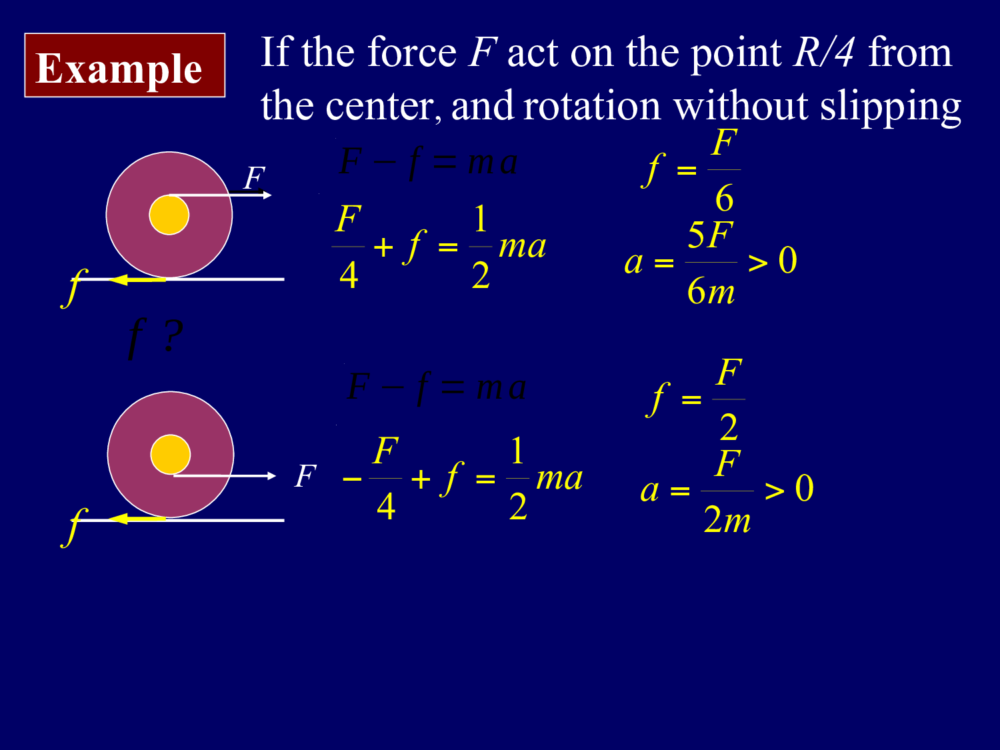

**解**：

设圆柱半径为 $R$，$F$ 水平向右作用于 $R/4$ 处（中心上方）。

平动方程：$F + f = ma_{\text{cm}}$

转动方程（绕质心，取顺时针为正）：
$F \cdot \frac{R}{4} - fR = I_{\text{cm}}\alpha = \frac{1}{2}mR^2\alpha$

纯滚动条件：$a_{\text{cm}} = \alpha R$

联立解得：
$$
a_{\text{cm}} = \frac{5F}{6m}, \quad f = -\frac{F}{6}
$$

负号表示 $f$ 方向向左（与 $F$ 相反）。

> 摩擦力方向与 $F$ 的作用点有关：当力作用点高于某临界高度时，摩擦力与 $F$ 同向；低于临界高度时，摩擦力与 $F$ 反向。

## 4.3 角动量

### 4.3.1 质点的角动量

**定义**：质点 $m$ 相对于参考点 $O$ 的角动量为：

$$
\boxed{\mathbf{L} = \mathbf{r} \times \mathbf{p} = \mathbf{r} \times (m\mathbf{v})}
$$

其中 $\mathbf{r}$ 是从参考点 $O$ 到质点的位置矢量，$\mathbf{p} = m\mathbf{v}$ 是质点的线动量。

**大小**：$L = rmv\sin\theta = rp_\perp = r_\perp p$

**方向**：由右手定则确定，垂直于 $\mathbf{r}$ 和 $\mathbf{p}$ 所在平面。

### 4.3.2 力矩与角动量的关系

$$
\boldsymbol{\tau} = \frac{d\mathbf{L}}{dt}
$$

即质点所受合外力矩等于其角动量对时间的变化率。证明：
$$
\boldsymbol{\tau} = \mathbf{r} \times \mathbf{F} = \mathbf{r} \times \frac{d\mathbf{p}}{dt} = \frac{d}{dt}(\mathbf{r} \times \mathbf{p}) = \frac{d\mathbf{L}}{dt}
$$

**重要说明**：$\boldsymbol{\tau}$ 和 $\mathbf{L}$ 必须相对于**同一个参考点**才有上述关系。

### 4.3.3 角冲量与角动量定理

**角冲量 (Angular Impulse)**：
$$
\int_{t_i}^{t_f} \boldsymbol{\tau} \, dt = \mathbf{L}_f - \mathbf{L}_i = \Delta \mathbf{L}
$$

即合外力矩的时间累积效应等于角动量的变化。这就是**角动量定理**。

### 4.3.4 角动量守恒定律

如果质点所受的**合外力矩为零**（$\sum \boldsymbol{\tau} = 0$），则质点的角动量保持不变：

$$
\boxed{\sum \boldsymbol{\tau} = 0 \quad \Rightarrow \quad \mathbf{L} = \text{常量}}
$$

即：
$$
\mathbf{L}_f = \mathbf{L}_i
$$

这是角动量守恒定律。

### 4.3.5 $\boldsymbol{\tau}$ 和 $\mathbf{L}$ 依赖于参考点

角动量和力矩的大小和方向都依赖于参考点的选择。选择不同的参考点，同一运动可能对应不同的角动量和力矩。

### 4.3.6 角动量与角速度的关系

#### 4.3.6.1 单质点绕轴转动

质量为 $m$ 的质点以角速度 $\omega$ 绕 $z$ 轴转动。

质点的角动量 $\mathbf{L} = \mathbf{r} \times (m\mathbf{v})$ 的方向**一般不与 $\omega$ 方向相同**。

但角动量沿 $z$ 轴的分量 $L_z$ 与 $\omega$ 方向相同：
$$
L_z = I\omega
$$

其中 $I = mr'^2$ 是质点对 $z$ 轴的转动惯量。

#### 4.3.6.2 多质点系统——对称体

如果刚体关于转轴对称，则各质点的角动量垂直于转轴的分量相互抵消：

$$
\mathbf{L} = \sum_i \mathbf{L}_i = \sum_i (L_{i,\parallel} + L_{i,\perp}) = \left(\sum_i I_i\right) \boldsymbol{\omega} = I\boldsymbol{\omega}
$$

此时 $\mathbf{L} \parallel \boldsymbol{\omega}$。

#### 4.3.6.3 多质点系统——非对称体

如果刚体关于转轴**不对称**，则角动量 $\mathbf{L}$ 与角速度 $\boldsymbol{\omega}$ 方向不同。此时垂直于转轴的角动量分量 $L_\perp$ 不会完全抵消，导致转轴上承受额外的力矩。

### 4.3.7 力矩与角动量方向的进一步分析

对于不对称体，$\mathbf{L}$ 的垂直分量 $L_\perp$ 随时间旋转：

$$
\frac{d\mathbf{L}_\perp}{dt} \neq 0 \quad \Rightarrow \quad \boldsymbol{\tau} = \frac{d\mathbf{L}}{dt} \neq 0
$$

这意味着转轴必须提供力矩来维持转动，否则系统会进动。

### 4.3.8 质点系的角动量

质点系的总角动量等于各质点角动量的矢量和：

$$
\mathbf{L} = \sum_i \mathbf{L}_i = \sum_i \mathbf{r}_i \times \mathbf{p}_i
$$

质点系的角动量定理：
$$
\sum \boldsymbol{\tau}_{\text{ext}} = \frac{d\mathbf{L}}{dt}
$$

即系统所受合外力矩等于系统总角动量对时间的变化率（**内力矩之和为零**）。

### 4.3.9 刚体绕定轴转动的角动量

对于绕固定轴 $z$ 转动的刚体：

$$
L_z = I_z\omega
$$

其中 $I_z$ 是刚体对 $z$ 轴的转动惯量。

角动量定理沿 $z$ 轴的分量形式：
$$
\tau_z = \frac{dL_z}{dt} = I_z\alpha
$$

### 4.3.10 刚体角动量守恒

如果作用于刚体的**外力对 $z$ 轴的力矩之和为零**（$\tau_z = 0$），则刚体对 $z$ 轴的角动量守恒：

$$
L_z = I_z\omega = \text{常量}
$$

这意味着：
- 如果转动惯量 $I$ 增大，角速度 $\omega$ 会减小
- 如果转动惯量 $I$ 减小，角速度 $\omega$ 会增大

**典型例子**：花样滑冰运动员旋转时收拢手臂（减小 $I$），角速度增大；展开手臂（增大 $I$），角速度减小。

### 4.3.11 陀螺——进动

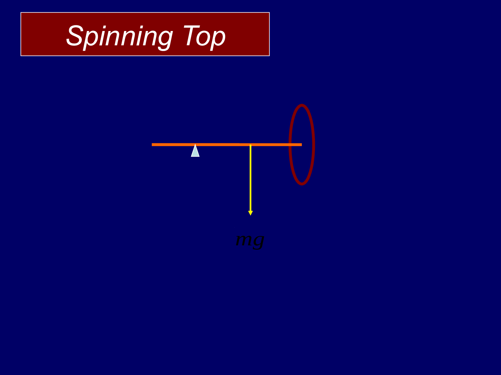

进动的角速度（进动角速度）：
$$
\Omega = \frac{\tau}{L} = \frac{Mgh}{I\omega}
$$

其中 $M$ 是陀螺质量，$h$ 是质心到支点的距离，$I$ 是绕自转轴的转动惯量，$\omega$ 是自转角速度。

### 4.3.12 转动动力学对照表

#### 4.3.12.1 线运动与转动运动的量对比

| 线运动量 (Translational Quantity) | 转动运动量 (Rotational Quantity) |
|:---|:---|
| 质量 $m$ | 转动惯量 $I$ |
| 力 $\mathbf{F}$ | 力矩 $\boldsymbol{\tau}$ |
| 速度 $\mathbf{v}$ | 角速度 $\boldsymbol{\omega}$ |
| 加速度 $\mathbf{a}$ | 角加速度 $\boldsymbol{\alpha}$ |
| 动量 $\mathbf{p} = m\mathbf{v}$ | 角动量 $\mathbf{L} = I\boldsymbol{\omega}$ |
| 系统动量 $\mathbf{P} = \sum \mathbf{p}_i$ | 系统角动量 $\mathbf{L} = \sum \mathbf{L}_i$ |
| 牛顿第二定律 $\mathbf{F} = m\mathbf{a}$ | 转动定律 $\boldsymbol{\tau} = I\boldsymbol{\alpha}$ |
| 动量定理 $\mathbf{F} = d\mathbf{p}/dt$ | 角动量定理 $\boldsymbol{\tau} = d\mathbf{L}/dt$ |
| 平衡条件 $\sum \mathbf{F} = 0$ | 平衡条件 $\sum \boldsymbol{\tau} = 0$ |
| 冲量 $\int \mathbf{F}\,dt$ | 角冲量 $\int \boldsymbol{\tau}\,dt$ |
| 动量守恒 ($\sum \mathbf{F}=0$) | 角动量守恒 ($\sum \boldsymbol{\tau}=0$) |

### 4.3.13 转动运动分类总结

| 运动类型 | 特征 | 基本方程 |
|:---|:---|:---|
| 绕固定轴转动 | 轴固定不动 | $\tau = I\alpha$ |
| 平动 | 各点速度相同 | $F = ma$ |
| 纯滚动 | $v_{\text{cm}} = \omega R$ | 平动方程 + 转动方程 + 纯滚动条件 |
| 绕瞬时轴(纯滚动) | 关于接触点 $B$ 转动 | $\sum \tau_B = I_B\alpha$ |
| 有滑滚动 | 接触点有相对运动 | 平动方程 + 转动方程（无 $v=\omega R$ 约束）|
| 陀螺进动 | 自转轴绕竖直轴旋转 | $\Omega = Mgh/(I\omega)$ |
| 绕点转动（定点转动） | 转轴方向变化 | $\tau = dL/dt$ |

---

### 4.3.14 例题

#### 例题 4.3.1：圆锥摆的角动量

**题目描述**：一个质量为 $m$ 的小球用长为 $r$ 的轻绳悬挂于 $O$ 点，在水平面内做匀速圆周运动（圆锥摆），绳与竖直方向的夹角为 $\theta$。分别求相对于悬挂点 $O$ 和圆心 $A$（水平面内圆周运动的中心）的力矩和角动量。

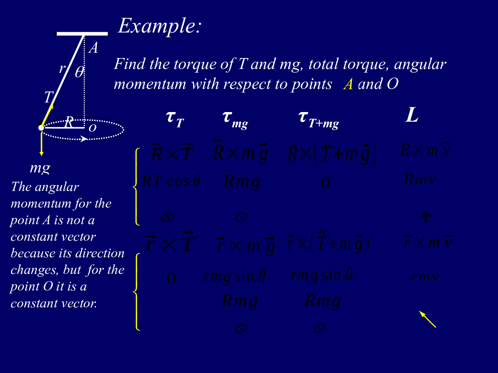

**解**：

**相对于悬挂点 $O$：**
- 张力 $T$ 的力矩：$\boldsymbol{\tau}_T = \mathbf{r} \times \mathbf{T} = 0$（因为 $\mathbf{r}$ 和 $\mathbf{T}$ 共线，方向沿绳）
- 重力 $mg$ 的力矩：$\boldsymbol{\tau}_{mg} = \mathbf{r} \times (m\mathbf{g})$，大小 $\tau_{mg} = mgr\sin\theta$
- 总力矩：$\boldsymbol{\tau} = \boldsymbol{\tau}_{mg}$（方向垂直于纸面向外/向内，取决于旋转方向）
- 角动量 $\mathbf{L} = \mathbf{r} \times (m\mathbf{v})$，大小 $L = mvr\sin\theta$，方向随时间变化
- 对于 $O$ 点，$\mathbf{L}$ 的方向不断变化（$\mathbf{L}$ 绕竖直轴旋转），因此 $d\mathbf{L}/dt \neq 0$

**相对于圆心 $A$：**
- 张力 $T$ 和重力 $mg$ 都对 $A$ 有力矩
- 总力矩：对 $A$ 点的合外力矩为零，因此角动量守恒（$\mathbf{L}_A = \text{常矢量}$）

**关键结论**：
- 对于 $O$ 点，角动量不是常矢量（方向不断变化）
- 对于 $A$ 点，角动量是常矢量（大小和方向都不变）
- $\boldsymbol{\tau}$ 和 $\mathbf{L}$ 依赖于参考点的选择，必须对同一参考点讨论

---

#### 例题 4.3.2：滑块与杆的角动量守恒

**题目描述**：如图所示，一质量为 $m$ 的滑块以速度 $v$ 沿水平方向运动，撞击一质量为 $M$、长度为 $l$ 的静止细杆的一端，并嵌入杆中。杆可绕中心 $O$ 在水平面内自由转动。求碰撞后系统的角速度。

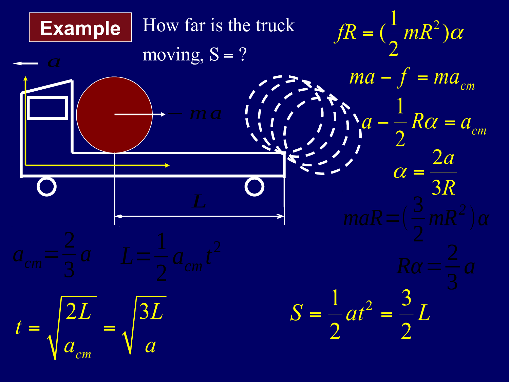

**解**：

对 $O$ 点，碰撞过程中合外力矩为零，角动量守恒。

碰撞前角动量（只有滑块）：
$$
L_i = mv \cdot \frac{l}{2}
$$

碰撞后角动量（杆 + 滑块）：
$$
L_f = I_{\text{total}}\omega
$$

总转动惯量：
$$
I_{\text{total}} = I_{\text{杆}} + I_{\text{滑块}} = \frac{1}{12}Ml^2 + m\left(\frac{l}{2}\right)^2
$$

由角动量守恒：
$$
mv \cdot \frac{l}{2} = \left(\frac{1}{12}Ml^2 + \frac{1}{4}ml^2\right)\omega
$$

解得：
$$
\omega = \frac{mv \cdot \frac{l}{2}}{\frac{1}{12}Ml^2 + \frac{1}{4}ml^2} = \frac{6mv}{(M + 3m)l}
$$

---

#### 例题 4.3.3：哑铃式系统的角动量守恒

**题目描述**：两个人质量均为 $m$，坐在绕竖直轴自由旋转的转台两端，两者相距 $2l$。系统初始以角速度 $\omega_0$ 旋转。两人同时向中心移动，直到距离变为 $l$。忽略转台质量和摩擦，求系统最终角速度。

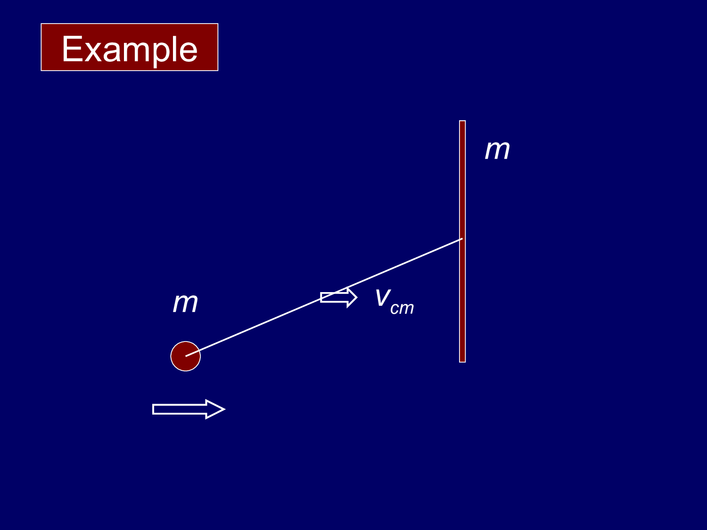

**解**：

对转轴，合外力矩为零，角动量守恒。

初始转动惯量：
$$
I_i = ml^2 + ml^2 = 2ml^2
$$

初始角动量：
$$
L_i = I_i\omega_0 = 2ml^2\omega_0
$$

最终转动惯量（每人距中心 $l/2$）：
$$
I_f = m\left(\frac{l}{2}\right)^2 + m\left(\frac{l}{2}\right)^2 = \frac{1}{2}ml^2
$$

由角动量守恒：
$$
I_i\omega_0 = I_f\omega_f
$$

$$
\omega_f = \frac{I_i}{I_f}\omega_0 = \frac{2ml^2}{\frac{1}{2}ml^2}\omega_0 = 4\omega_0
$$

系统最终角速度变为初始的 4 倍。

---

#### 例题 4.3.4：完全非弹性碰撞中的角动量守恒

**题目描述**：两块质量均为 $m$ 的油灰同时以相同速度 $v$ 从两侧撞击静止杆的两端，并粘在杆上。杆的质量为 $M$、长度为 $l$，可绕中心 $O$ 自由转动。求碰撞后系统的角速度。

**解**：

对 $O$ 点，碰撞过程中合外力矩为零，角动量守恒。

碰撞前角动量：
- 左边油灰对 $O$ 的角动量：$L_1 = mv \cdot \frac{l}{2}$（方向进入纸面）
- 右边油灰对 $O$ 的角动量：$L_2 = mv \cdot \frac{l}{2}$（方向离开纸面）
- 总角动量：$L_i = L_1 - L_2 = 0$

因此碰撞后角动量也为零，系统静止：
$$
\omega = 0
$$

> 如果两块油灰速度大小不等或非同侧撞击，则会有净角动量输入。

---

#### 例题 4.3.5：固体球沿斜面纯滚动（用角动量方法）

**题目描述**：质量为 $m$、半径为 $r$ 的均匀实心小球沿倾角为 $\theta$ 的斜面纯滚而下（$r \ll R$，即可视为点质量，但在考虑转动时需使用球的转动惯量），求质心加速度。

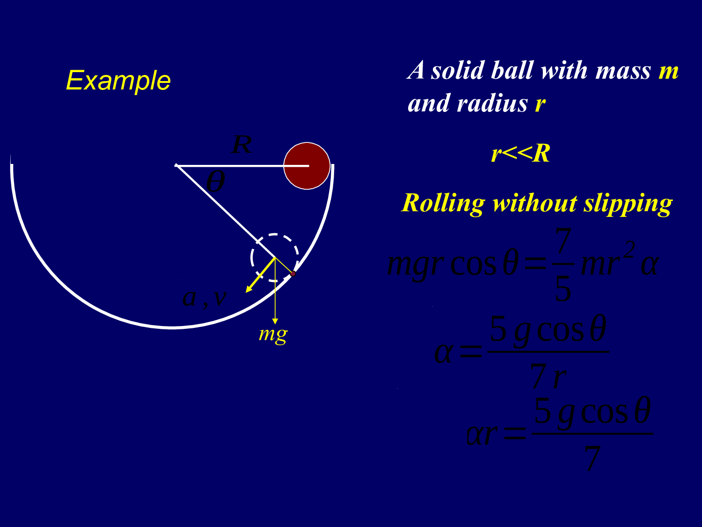

**解**：

方法同例题 9-4，但这里也可以使用角动量定理来求解。

对接触点 $B$ 应用角动量定理：
- 外力对 $B$ 点的力矩：$\tau_B = mgr\sin\theta$（只有重力有贡献，$N$ 和 $f$ 都通过 $B$ 点力矩为零）
- 系统对 $B$ 点的角动量：$L_B = I_B\omega = (I_{\text{cm}} + mr^2)\omega$

由 $\tau_B = dL_B/dt$：
$$
mgr\sin\theta = (I_{\text{cm}} + mr^2)\alpha
$$

其中 $I_{\text{cm}} = \frac{2}{5}mr^2$，代入得：
$$
\alpha = \frac{mgr\sin\theta}{\frac{2}{5}mr^2 + mr^2} = \frac{5g\sin\theta}{7r}
$$

因此：
$$
a_{\text{cm}} = \alpha r = \frac{5}{7}g\sin\theta
$$

与之前结果一致。

---

#### 例题 4.3.6：冲量和角冲量综合问题

**题目描述**：一质量为 $m$ 的实心球从光滑水平面上方某高度处以水平速度 $v_0$ 运动，与水平面发生碰撞，已知碰撞过程中球与地面的动摩擦因数为 $\mu_k$。碰撞后球最终达到纯滚动，求最终质心速度。

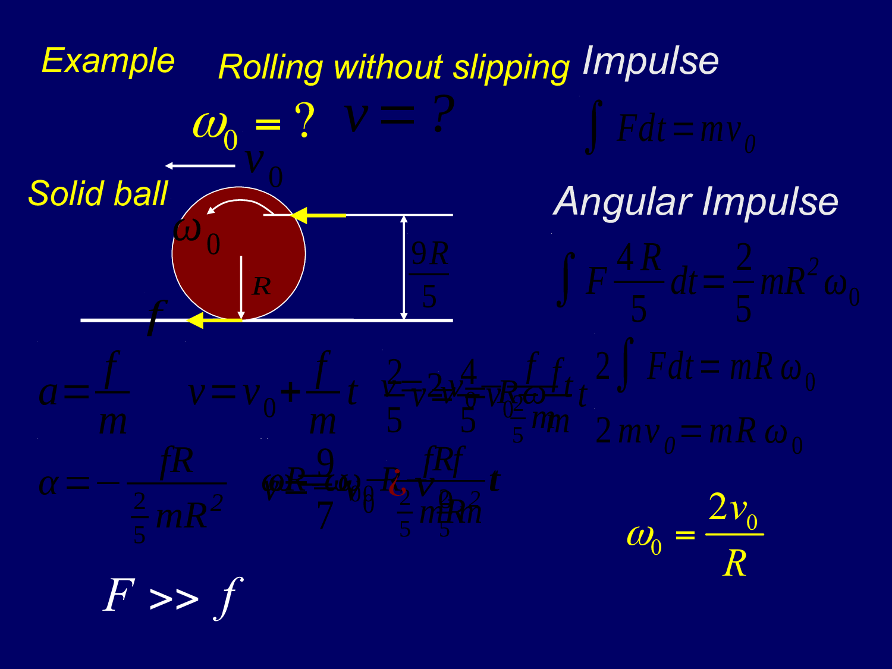

**解**：

碰撞过程：
- 法向：冲量 $J_y$ 使竖直速度变为零
- 切向：摩擦力冲量 $J_x = \int f\,dt$ 改变水平速度
- 同时摩擦力矩的角冲量 $\int fR\,dt = \mu_k mgR \cdot \Delta t$ 改变角速度

在碰撞瞬间，水平方向动量变化：
$$
mv_{\text{cm},f} - mv_0 = -J_x = -\int \mu_k mg\, dt
$$

角动量变化（绕质心）：
$$
I\omega_f - 0 = \int fR\, dt = R \cdot J_x
$$

其中 $I = \frac{2}{5}mR^2$。

从以上方程结合碰撞后达到纯滚动的条件（$v_{\text{cm},f} = \omega_f R$），可解出 $v_{\text{cm},f}$。

## 附录：公式速查

### 转动运动学

| 公式 | 说明 |
|:---|:---|
| $\omega = \frac{d\varphi}{dt}$ | 角速度定义 |
| $\alpha = \frac{d\omega}{dt} = \frac{d^2\varphi}{dt^2}$ | 角加速度定义 |
| $\omega = \omega_0 + \alpha t$ | 匀角加速度 |
| $\varphi = \varphi_0 + \omega_0 t + \frac{1}{2}\alpha t^2$ | 匀角加速度 |
| $\omega^2 = \omega_0^2 + 2\alpha(\varphi - \varphi_0)$ | 匀角加速度 |
| $S = r\varphi$ | 弧长—角位移 |
| $v = \omega r$ | 线速度—角速度 |
| $a_t = \alpha r$ | 切向加速度 |
| $a_R = \omega^2 r = v^2/r$ | 法向加速度 |

### 转动动力学

| 公式 | 说明 |
|:---|:---|
| $\boldsymbol{\tau} = \mathbf{r} \times \mathbf{F}$ | 力矩定义 |
| $\tau = rF\sin\theta$ | 力矩大小 |
| $I = \sum_i m_i r_i^2$ | 转动惯量（离散） |
| $I = \int r^2 dm$ | 转动惯量（连续） |
| $\sum \tau_{\text{ext}} = I\alpha$ | 转动定律 |
| $I = I_{\text{cm}} + Mh^2$ | 平行轴定理 |
| $I_z = I_x + I_y$ | 垂直轴定理 |
| $\sum \mathbf{F}_{\text{ext}} = M\mathbf{a}_{\text{cm}}$ | 质心运动定理 |
| 纯滚动 $v_{\text{cm}} = \omega R$ | 无滑滚动条件 |

### 角动量

| 公式 | 说明 |
|:---|:---|
| $\mathbf{L} = \mathbf{r} \times \mathbf{p}$ | 质点角动量 |
| $\boldsymbol{\tau} = \frac{d\mathbf{L}}{dt}$ | 力矩—角动量关系 |
| $\mathbf{L}_f - \mathbf{L}_i = \int \boldsymbol{\tau}\,dt$ | 角冲量—角动量定理 |
| $\sum \boldsymbol{\tau} = 0 \Rightarrow \mathbf{L} = \text{常量}$ | 角动量守恒 |
| $L_z = I\omega$ | 刚体绕定轴角动量 |

### 常见转动惯量

| 刚体 | 转轴 | $I$ |
|:---|:---|:---|
| 细杆（质心） | 垂直杆 | $\frac{1}{12}ML^2$ |
| 细杆（端点） | 垂直杆 | $\frac{1}{3}ML^2$ |
| 圆环 | 中心垂直轴 | $MR^2$ |
| 圆盘 | 中心垂直轴 | $\frac{1}{2}MR^2$ |
| 实心圆柱 | 中心轴 | $\frac{1}{2}MR^2$ |
| 薄球壳 | 直径 | $\frac{2}{3}MR^2$ |
| 实心球 | 直径 | $\frac{2}{5}MR^2$ |

## 附录：课后习题

### 第8章习题
- 练习题（Exercises, P171）: 3, 30, 32
- 问题（Problems, P173）: 6, 7

### 第9章习题
- 练习题（Exercises, P200）: 13, 14, 17, 19, 21, 33, 38, 41, 42, 43
- 问题（Problems, P206）: 21, 22, 24

### 第10章习题
- 练习题（Exercises, P224）: 1, 3, 4, 9, 15, 20, 21
