# 05. 功能量与引力

> 对应章节：Ch11 功与动能、Ch12 势能、Ch13 能量守恒、Ch14 万有引力

## 5.1 功与动能

---

### 5.1.1 恒力做功

当物体在恒力 $\vec{F}$ 的作用下发生位移 $\vec{d}$ 时，力对物体所做的功定义为：

$$
W = \vec{F} \cdot \vec{d} = F d \cos\theta
$$

其中 $\theta$ 是力 $\vec{F}$ 与位移 $\vec{d}$ 之间的夹角。

**讨论：**
- 当 $0^\circ \le \theta < 90^\circ$ 时，$W > 0$，力对物体做正功；
- 当 $\theta = 90^\circ$ 时，$W = 0$，力不做功（如向心力、匀速圆周运动中绳子拉力）；
- 当 $90^\circ < \theta \le 180^\circ$ 时，$W < 0$，力对物体做负功（或说物体克服该力做功）。

**功的单位：** 焦耳 (Joule, J)，$1\ \text{J} = 1\ \text{N} \cdot 1\ \text{m}$。

---

### 5.1.2 功率

功率定义为力做功的速率：

$$
P = \frac{dW}{dt}
$$

对于恒力 $\vec{F}$ 作用下的物体以速度 $\vec{v}$ 运动：

$$
P = \vec{F} \cdot \vec{v} = F v \cos\theta
$$

**功率的单位：** 瓦特 (Watt, W)，$1\ \text{W} = 1\ \text{J/s}$。

---

### 5.1.3 变力做功 — 一维情形

当力随位置变化时，即 $F = F(x)$，力从 $x_i$ 到 $x_f$ 所做的功为：

$$
W = \int_{x_i}^{x_f} F(x) \, dx
$$

**几何意义：** 功等于 $F(x)$ 曲线下从 $x_i$ 到 $x_f$ 的面积。

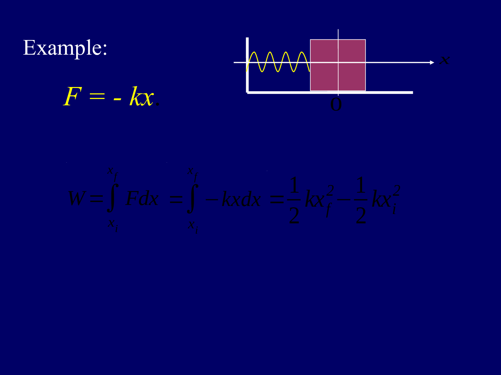

当 $N \to \infty$，$\delta x_n \to 0$ 时，求和变为积分：

$$
W = \lim_{N \to \infty} \sum_{n=1}^{N} F(x_n) \Delta x_n = \int_{x_i}^{x_f} F(x) \, dx
$$

---

#### 例题 5.1.1：弹簧力做功

弹簧力满足胡克定律：$F = -kx$（$k$ 为劲度系数，$x$ 为偏离平衡位置的位移）。

将弹簧从 $x_i$ 拉伸到 $x_f$，弹簧力所做的功为：

$$
W = \int_{x_i}^{x_f} (-kx) \, dx = -\frac{1}{2}k (x_f^2 - x_i^2)
$$

若从平衡位置 $x_i = 0$ 拉伸到 $x_f = x$：

$$
W = -\frac{1}{2} k x^2
$$

（负号表示弹簧力做负功，即外力克服弹簧力做正功 $W_{\text{ext}} = \frac{1}{2} k x^2$。）

---

### 5.1.4 变力做功 — 二维情形

在二维空间中，力 $\vec{F}$ 沿路径从点 $i$ 到点 $f$ 所做的功为线积分：

$$
W = \int_{i}^{f} \vec{F} \cdot d\vec{r} = \int_{i}^{f} (F_x \, dx + F_y \, dy)
$$

其中 $d\vec{r} = dx\,\hat{i} + dy\,\hat{j}$ 是微元位移矢量。

---

### 5.1.5 动能与功能原理

**动能定义：** 物体由于运动而具有的能量：

$$
K = \frac{1}{2} m v^2
$$

**功能原理（动能定理）：** 合力对物体所做的功等于物体动能的变化量：

$$
W_{\text{net}} = \Delta K = K_f - K_i = \frac{1}{2} m v_f^2 - \frac{1}{2} m v_i^2
$$

**推导**（一维情况）：

$$
W = \int_{x_i}^{x_f} F \, dx = \int_{x_i}^{x_f} m \frac{dv}{dt} \, dx
= \int_{v_i}^{v_f} m v \, dv = \frac{1}{2} m v_f^2 - \frac{1}{2} m v_i^2
$$

动能与功具有相同的单位（焦耳）。

---

### 5.1.6 碰撞中的动能

#### 5.1.6.1 弹性碰撞

- **动量和动能均守恒。**
- 碰撞前后系统的总动能不变。

$$
\frac{1}{2} m_1 v_{1i}^2 + \frac{1}{2} m_2 v_{2i}^2 = \frac{1}{2} m_1 v_{1f}^2 + \frac{1}{2} m_2 v_{2f}^2
$$

同时动量守恒也成立：

$$
m_1 \vec{v}_{1i} + m_2 \vec{v}_{2i} = m_1 \vec{v}_{1f} + m_2 \vec{v}_{2f}
$$

#### 5.1.6.2 非弹性碰撞

- **动量守恒，但动能不守恒。**
- 一部分动能转化为内能（热能等）。
- **完全非弹性碰撞：** 碰撞后两物体粘在一起以共同速度运动，动能损失最大。

#### 5.1.6.3 爆炸

- **动量守恒，但动能不守恒。**
- 系统内部能量转化为动能，动能增加。
- 爆炸可以看作是"反过来的完全非弹性碰撞"。

---

### 5.1.7 转动中的功与动能

#### 5.1.7.1 转动做功

当力矩 $\tau$ 作用于刚体使其转过角度 $\theta$ 时，力矩所做的功为：

$$
W = \int_{\theta_i}^{\theta_f} \tau \, d\theta
$$

对于恒力矩：$W = \tau \Delta \theta$。

#### 5.1.7.2 转动功率

$$
P = \frac{dW}{dt} = \tau \omega
$$

#### 5.1.7.3 转动动能

刚体绕固定轴转动的动能为：

$$
K_{\text{rot}} = \frac{1}{2} I \omega^2
$$

其中 $I$ 为转动惯量，$\omega$ 为角速度。

#### 5.1.7.4 平动与转动的对应关系

| 平动量 | 转动量 |
|-------|-------|
| 位移 $x$ | 角位移 $\theta$ |
| 速度 $v$ | 角速度 $\omega$ |
| 加速度 $a$ | 角加速度 $\alpha$ |
| 质量 $m$ | 转动惯量 $I$ |
| 力 $F$ | 力矩 $\tau$ |
| 牛顿第二定律 $F = ma$ | $\tau = I\alpha$ |
| 功 $W = \int F\,dx$ | $W = \int \tau\,d\theta$ |
| 功率 $P = Fv$ | $P = \tau\omega$ |
| 动能 $K = \frac{1}{2}mv^2$ | $K = \frac{1}{2}I\omega^2$ |

---

### 5.1.8 滚动问题中的动能

物体无滑滚动时，总动能为平动动能与转动动能之和：

$$
K = \frac{1}{2} m v_{\text{cm}}^2 + \frac{1}{2} I \omega^2
$$

无滑滚动条件：$v_{\text{cm}} = \omega R$。

---

#### 例题 5.1.2：实心圆柱无滑滚下斜面

一个质量为 $m$、半径为 $R$ 的实心圆柱从高度 $H$ 的斜面上无滑滚下。求其到达底部的动能。

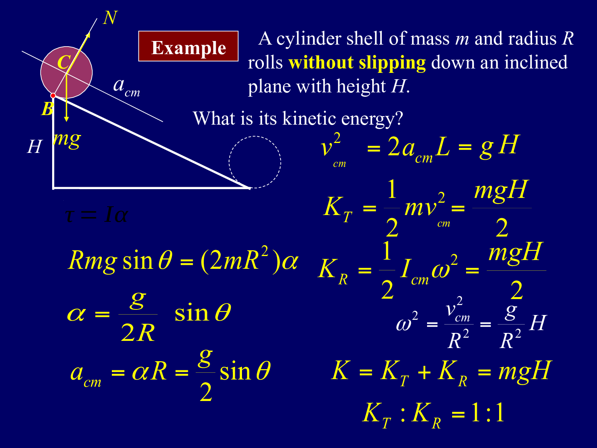

**分析：** 实心圆柱的转动惯量 $I = \frac{1}{2} m R^2$。

由机械能守恒（无滑滚动时静摩擦力不做功）或功能原理：

$$
mgH = \frac{1}{2} m v^2 + \frac{1}{2} I \omega^2
$$

代入 $I = \frac{1}{2} m R^2$ 和 $\omega = v/R$：

$$
mgH = \frac{1}{2} m v^2 + \frac{1}{2} \cdot \frac{1}{2} m R^2 \cdot \frac{v^2}{R^2}
= \frac{1}{2} m v^2 + \frac{1}{4} m v^2 = \frac{3}{4} m v^2
$$

所以：

$$
v = \sqrt{\frac{4}{3} gH}
$$

总动能 $K = mgH$，其中平动动能占 $\frac{2}{3} mgH$，转动动能占 $\frac{1}{3} mgH$。

---

#### 例题 5.1.3：薄壳圆柱无滑滚下斜面

一个质量为 $m$、半径为 $R$ 的薄壳圆柱（圆筒壳）从高度 $H$ 的斜面上无滑滚下。

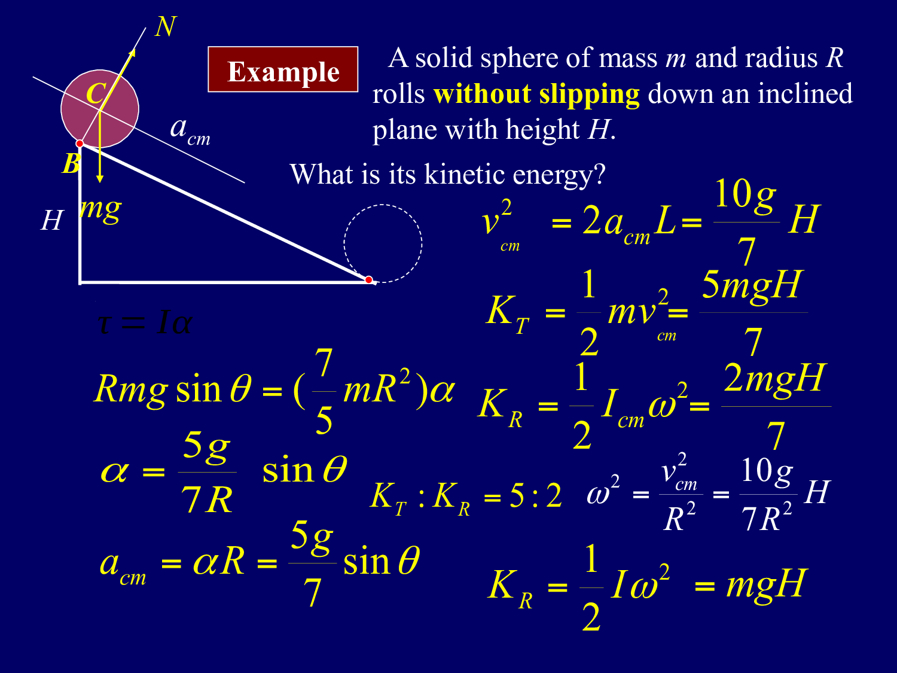

**分析：** 薄壳圆柱的转动惯量 $I = m R^2$。

$$
mgH = \frac{1}{2} m v^2 + \frac{1}{2} I \omega^2
= \frac{1}{2} m v^2 + \frac{1}{2} \cdot m R^2 \cdot \frac{v^2}{R^2}
= \frac{1}{2} m v^2 + \frac{1}{2} m v^2 = m v^2
$$

所以：

$$
v = \sqrt{gH}
$$

---

#### 例题 5.1.4：实心球无滑滚下斜面

一个质量为 $m$、半径为 $R$ 的实心球从高度 $H$ 的斜面上无滑滚下。

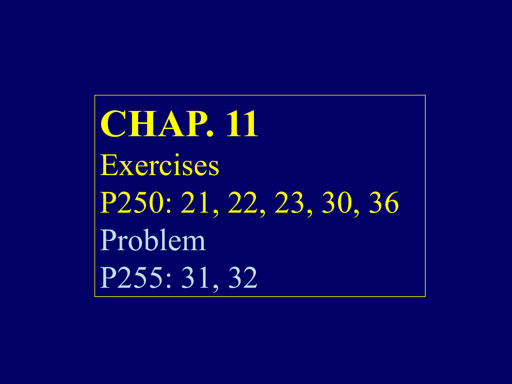

**分析：** 实心球的转动惯量 $I = \frac{2}{5} m R^2$。

$$
mgH = \frac{1}{2} m v^2 + \frac{1}{2} I \omega^2
= \frac{1}{2} m v^2 + \frac{1}{2} \cdot \frac{2}{5} m R^2 \cdot \frac{v^2}{R^2}
= \frac{1}{2} m v^2 + \frac{1}{5} m v^2 = \frac{7}{10} m v^2
$$

所以：

$$
v = \sqrt{\frac{10}{7} gH}
$$

**比较：** 对于相同高度 $H$，无滑滚下斜面底部速度大小关系为：

$$
v_{\text{球}} > v_{\text{实心圆柱}} > v_{\text{薄壳圆柱}}
$$

即转动惯量越小的物体滚得越快。

## 5.2 势能

---

### 5.2.1 保守力

#### 5.2.1.1 定义

如果一个力对沿任意闭合路径运动一周所做的总功为零，则该力为**保守力**：

$$
\oint \vec{F} \cdot d\vec{r} = 0
$$

**等价表述：** 如果力所做的功与路径无关，仅与起点和终点的位置有关，则该力为保守力。

#### 5.2.1.2 常见的保守力

1. **弹簧力（弹性力）：** $\vec{F} = -k\vec{x}$
2. **重力（均匀重力场）：** $\vec{F} = -mg\,\hat{j}$
3. **万有引力：** $\vec{F} = -G\frac{Mm}{r^2}\,\hat{r}$

**非保守力（耗散力）的例子：** 摩擦力、空气阻力等。非保守力做功与路径有关，且通常做负功。

---

### 5.2.2 势能

#### 5.2.2.1 定义

对于保守力，可以引入势能 $U$。保守力所做的功等于势能减少量：

$$
W_{\text{conservative}} = -\Delta U = -(U_f - U_i) = U_i - U_f
$$

或者写为：

$$
\Delta U = U_f - U_i = -W_{\text{conservative}}
$$

势能是位置（位形）的函数，其**绝对值没有物理意义**，只有**势能的变化**才有物理意义。我们可以任意选择参考点（零势能点）。

#### 5.2.2.2 一维情形

对于一维保守力 $F(x)$：

$$
U(x) - U(x_0) = -\int_{x_0}^{x} F(x') \, dx'
$$

其中 $U(x_0)$ 是参考点 $x_0$ 处的势能值（可任意选取）。

---

### 5.2.3 常见保守力的势能

#### 5.2.3.1 弹簧弹性势能

$F(x) = -kx$，选取平衡位置 $x_0 = 0$ 为参考点（$U(0) = 0$）：

$$
U(x) = -\int_{0}^{x} (-kx') \, dx' = \frac{1}{2} k x^2
$$

#### 5.2.3.2 重力势能（地面附近）

$F(z) = -mg$，选取地面 $z_0 = 0$ 为参考点（$U(0) = 0$）：

$$
U(z) = -\int_{0}^{z} (-mg) \, dz' = mgz
$$

#### 5.2.3.3 万有引力势能

$F(r) = -G\frac{Mm}{r^2}$，选取无穷远处 $r_0 \to \infty$ 为参考点（$U(\infty) = 0$）：

$$
U(r) = -\int_{\infty}^{r} \left(-G\frac{Mm}{r'^2}\right) dr' = -G\frac{Mm}{r'}
\Big|_{\infty}^{r} = -G\frac{Mm}{r}
$$

---

### 5.2.4 力与势能的关系

#### 5.2.4.1 一维情形

保守力 $F(x)$ 与势能 $U(x)$ 的关系为：

$$
F(x) = -\frac{dU(x)}{dx}
$$

即保守力等于势能函数的负导数（负梯度）。

#### 5.2.4.2 三维情形

在三维空间中：

$$
\vec{F} = -\nabla U = -\left( \frac{\partial U}{\partial x} \hat{i} + \frac{\partial U}{\partial y} \hat{j} + \frac{\partial U}{\partial z} \hat{k} \right)
$$

即保守力 $\vec{F}$ 是势能 $U(x,y,z)$ 的负梯度。

**验证：** 对于弹簧势能 $U = \frac{1}{2}kx^2$，
$F = -\frac{dU}{dx} = -kx$，与胡克定律一致。

---

### 5.2.5 机械能守恒

对于**孤立系统**（不受外力作用），且内部力均为保守力：

由动能定理：$W = \Delta K$
由势能定义：$W = -\Delta U$

因此：

$$
\Delta K = -\Delta U
$$

$$
\Delta K + \Delta U = 0
$$

$$
\Delta (K + U) = 0
$$

即：

$$
K + U = E = \text{constant}
$$

其中 $E$ 称为系统的**机械能**。

**机械能守恒定律：** 在只有保守力做功的孤立系统中，系统的机械能（动能 + 势能）保持恒定。

从 $x_0$ 到 $x$ 运动，速度从 $v_0$ 到 $v$：

$$
\frac{1}{2} m v^2 + U(x) = \frac{1}{2} m v_0^2 + U(x_0) = \text{constant}
$$

---

### 5.2.6 平衡点与势能曲线

在一维保守系统中，由 $F(x) = -dU/dx$ 可知：

- **平衡点：** $F(x) = 0$，即 $dU/dx = 0$，势能曲线在该点斜率为零。

平衡点的稳定性由势能曲线的二阶导数决定：

| 类型 | 条件 | 图示特征 | 物理图像 |
|------|------|---------|---------|
| **稳定平衡** | $\frac{d^2U}{dx^2} > 0$ | 势能曲线局部极小值 | 小球在谷底，微扰后会返回 |
| **不稳定平衡** | $\frac{d^2U}{dx^2} < 0$ | 势能曲线局部极大值 | 小球在峰顶，微扰后会离开 |
| **随遇平衡** | $\frac{d^2U}{dx^2} = 0$ | 势能曲线水平段 | 小球在平面上，微扰后停在新的位置 |

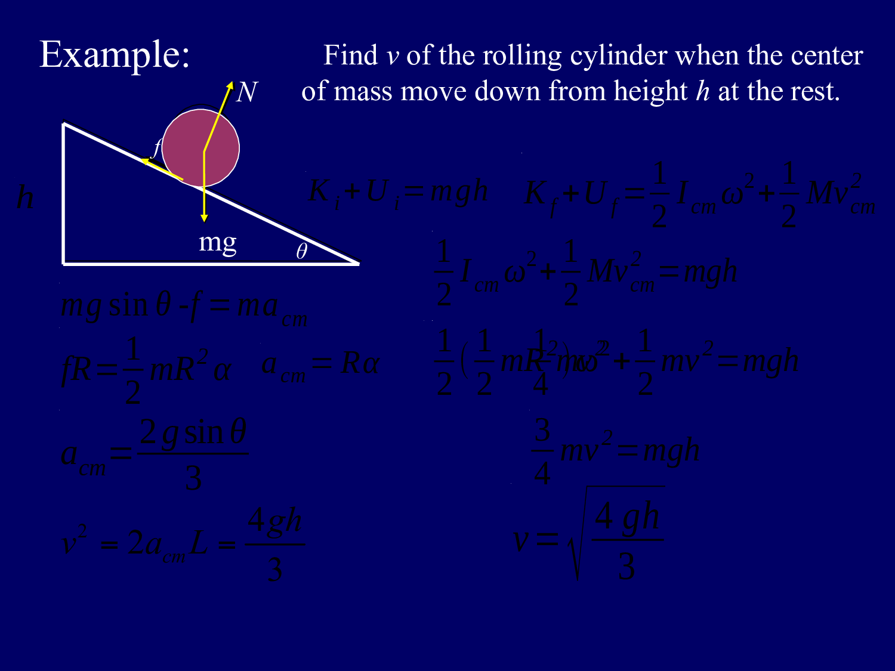

---

### 5.2.7 例题

#### 例题 5.2.1：滚动圆柱体的速度

一圆柱体从静止开始从高度 $h$ 处无滑滚下斜面（倾角 $\theta$），求质心的速度 $v$。

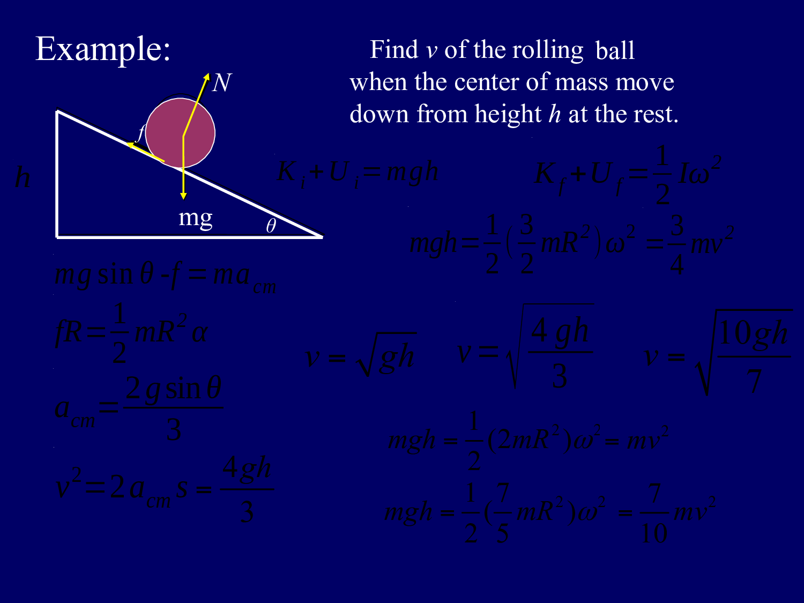

**分析：** 系统机械能守恒。初始只有重力势能，最终为平动动能和转动动能之和。

$$
mgh = \frac{1}{2} m v^2 + \frac{1}{2} I \omega^2
$$

利用无滑条件 $v = \omega R$：

- **实心圆柱** $(I = \frac{1}{2} m R^2)$：

  $$
  mgh = \frac{1}{2} m v^2 + \frac{1}{2} \cdot \frac{1}{2} m R^2 \cdot \frac{v^2}{R^2}
  = \frac{3}{4} m v^2 \quad \Rightarrow \quad v = \sqrt{\frac{4}{3} gh}
  $$

- **薄壳圆柱** $(I = m R^2)$：

  $$
  mgh = \frac{1}{2} m v^2 + \frac{1}{2} \cdot m R^2 \cdot \frac{v^2}{R^2}
  = m v^2 \quad \Rightarrow \quad v = \sqrt{gh}
  $$

- **实心球** $(I = \frac{2}{5} m R^2)$：

  $$
  mgh = \frac{1}{2} m v^2 + \frac{1}{2} \cdot \frac{2}{5} m R^2 \cdot \frac{v^2}{R^2}
  = \frac{7}{10} m v^2 \quad \Rightarrow \quad v = \sqrt{\frac{10}{7} gh}
  $$

---

#### 例题 5.2.2：实心球在碗中滚动

一个质量为 $m$、半径为 $r$ 的实心球在大碗（半径 $R$，$r \ll R$）中无滑滚动。分析其运动。

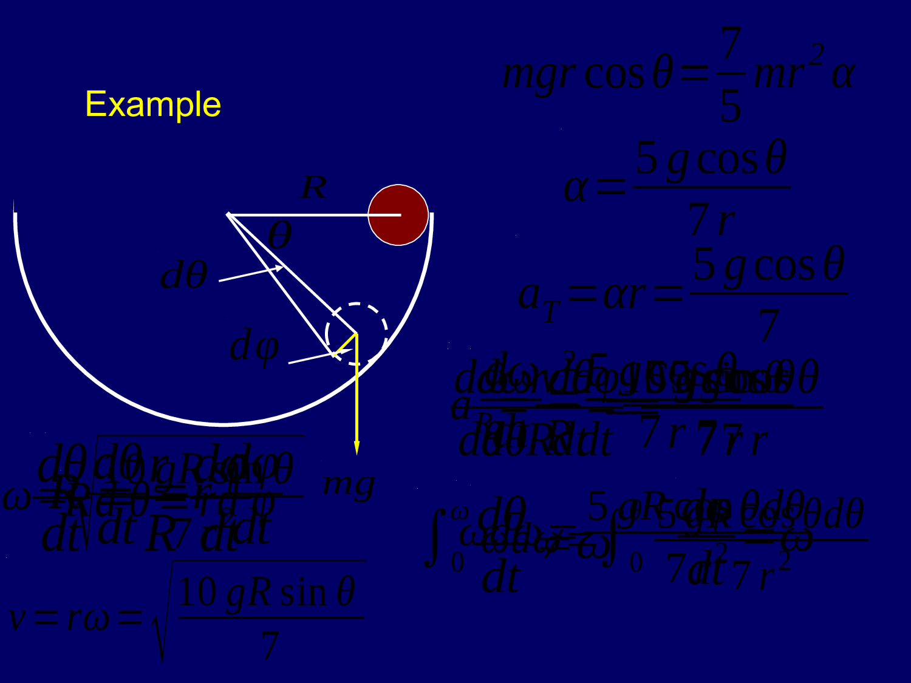

**分析：** 由于 $r \ll R$，球的质心近似沿半径为 $R$ 的圆弧运动。系统机械能守恒。

设球偏离最低点的角度为 $\theta$，质心高度变化为 $h = R(1-\cos\theta) \approx \frac{1}{2} R \theta^2$（小角度近似）。

由机械能守恒可推导出球的运动类似于简谐振动。

---

#### 例题 5.2.3：旋转圆柱的滚动

一圆柱以初始角速度 $\omega_0$ 在水平面上运动，最终达到无滑滚动。求质心的加速度 $a$。

**分析：** 初始时圆柱可能有滑动，摩擦力做负功，直到达到无滑条件 $v = \omega R$。应用动能定理或角动量定理可求解。

---

#### 例题 5.2.4：绕轴摆动的杆

一根质量为 $m$、长度为 $L$ 的均匀细杆，一端固定，从水平位置释放。

**分析：** 杆绕固定端转动，转动惯量 $I = \frac{1}{3} m L^2$。

由机械能守恒，杆从水平位置转到竖直位置：

$$
mg \cdot \frac{L}{2} = \frac{1}{2} I \omega^2 = \frac{1}{2} \cdot \frac{1}{3} m L^2 \cdot \omega^2
$$

解得：

$$
\omega = \sqrt{\frac{3g}{L}}
$$

杆端点的线速度：$v = \omega L = \sqrt{3gL}$。

---

#### 例题 5.2.5：双原子分子势能

双原子分子中两原子间相互作用势能可近似表示为：

$$
U(x) = \frac{A}{x^{12}} - \frac{B}{x^6}
$$

其中 $x$ 为原子间距，$A$、$B$ 为正的常数。

求：(1) 原子间的作用力；(2) 平衡间距；(3) 使分子离解所需的最小能量。

**解 (1)：** 由 $F = -dU/dx$：

$$
F(x) = -\frac{dU}{dx} = -\frac{d}{dx}\left(\frac{A}{x^{12}} - \frac{B}{x^6}\right)
= -\left(-\frac{12A}{x^{13}} + \frac{6B}{x^7}\right)
= \frac{12A}{x^{13}} - \frac{6B}{x^7}
$$

**解 (2)：** 平衡时 $F(x_0) = 0$：

$$
\frac{12A}{x_0^{13}} - \frac{6B}{x_0^7} = 0
\quad\Rightarrow\quad \frac{12A}{x_0^{13}} = \frac{6B}{x_0^7}
\quad\Rightarrow\quad x_0^6 = \frac{2A}{B}
\quad\Rightarrow\quad x_0 = \left(\frac{2A}{B}\right)^{1/6}
$$

**解 (3)：** 离解能等于将原子从平衡位置移到无穷远处所需的最小能量（势能差）：

$$
E_{\text{min}} = U(\infty) - U(x_0) = 0 - U(x_0)
= -\left(\frac{A}{x_0^{12}} - \frac{B}{x_0^6}\right)
= -\left(\frac{A}{(2A/B)^2} - \frac{B}{(2A/B)}\right)
= -\left(\frac{A \cdot B^2}{4A^2} - \frac{B \cdot B}{2A}\right)
= -\left(\frac{B^2}{4A} - \frac{B^2}{2A}\right)
= \frac{B^2}{4A}
$$

## 5.3 能量守恒

---

### 5.3.1 能量守恒定律

**自然界中最普遍、最基本的定律之一：** 在一个孤立系统中，能量既不能被创造也不能被消灭，只能从一种形式转化为另一种形式，或从一个物体转移到另一个物体，但系统的总能量保持不变。

$$
E_{\text{总}} = \text{constant}
$$

---

### 5.3.2 系统与外力的功

当我们考虑一个**非孤立系统**（有外力做功）时：

$$
W_{\text{ext}} = \Delta E_{\text{system}}
$$

其中 $W_{\text{ext}}$ 是外力对系统做的功，$\Delta E_{\text{system}}$ 是系统总能量的变化。

---

### 5.3.3 内力的分类

系统内部各物体之间的力可分为：

1. **内部保守力：** 如弹簧力、重力、万有引力。它们做功可以改变系统动能和势能的分配，但不改变系统的总机械能（在无其他力时）。
2. **内部非保守力（耗散力）：** 如摩擦力、空气阻力。它们做功会将机械能转化为内能（热能），使系统的机械能不守恒，但总能量守恒。

---

### 5.3.4 包含非保守力时的功能关系

当系统受到外力作用，且内部存在非保守力时，功能关系为：

$$
W_{\text{ext}} = \Delta K + \Delta U + \Delta E_{\text{int}}
$$

其中 $\Delta E_{\text{int}}$ 是系统内能的增量（如摩擦生热）。

或者写为：

$$
W_{\text{ext}} = \Delta E_{\text{mech}} + \Delta E_{\text{th}} + \cdots
$$

---

### 5.3.5 质心能量

系统的总动能可以分解为两部分：

1. **质心平动动能：** 系统全部质量集中于质心时的动能 $\frac{1}{2} M v_{\text{cm}}^2$
2. **相对于质心的动能：** 各质点相对于质心运动所具有的动能

$$
K = \frac{1}{2} M v_{\text{cm}}^2 + K_{\text{rel}}
$$

其中 $M$ 为系统总质量，$v_{\text{cm}}$ 为质心速度。

**质心能量方程 (COM Energy Equation)：**

$$
W_{\text{ext}} + W_{\text{int,nc}} = \Delta \left( \frac{1}{2} M v_{\text{cm}}^2 \right) + \Delta U + \Delta K_{\text{rel}}
$$

---

### 5.3.6 摩擦力做功

在包含摩擦的实际问题中，摩擦力做功将机械能转化为内能（热能）。

#### 5.3.6.1 无滑滚动

- 接触点瞬时静止，静摩擦力不做功。
- 若只有保守力做功，则机械能守恒。

#### 5.3.6.2 有滑滚动

- 滑动摩擦力做负功，一部分机械能转化为内能。
- 系统总能量守恒，但机械能不守恒。

---

### 5.3.7 热力学第一定律简介

热力学第一定律是能量守恒定律在热学中的具体表述：

$$
\Delta E_{\text{int}} = Q + W
$$

其中：
- $\Delta E_{\text{int}}$ 是系统内能的变化
- $Q$ 是系统吸收的热量
- $W$ 是外界对系统做的功

> 注：在热力学中，$W$ 的符号约定因教材而异。这里采用外界对系统做功为正。

---

### 5.3.8 综合例题

#### 例题 5.3.1：滑块在粗糙斜面上滑动

一个质量为 $m$ 的滑块以初速 $v$ 冲上倾角为 $30^\circ$ 的粗糙斜面，滑行距离 $d$ 后速度减为零。

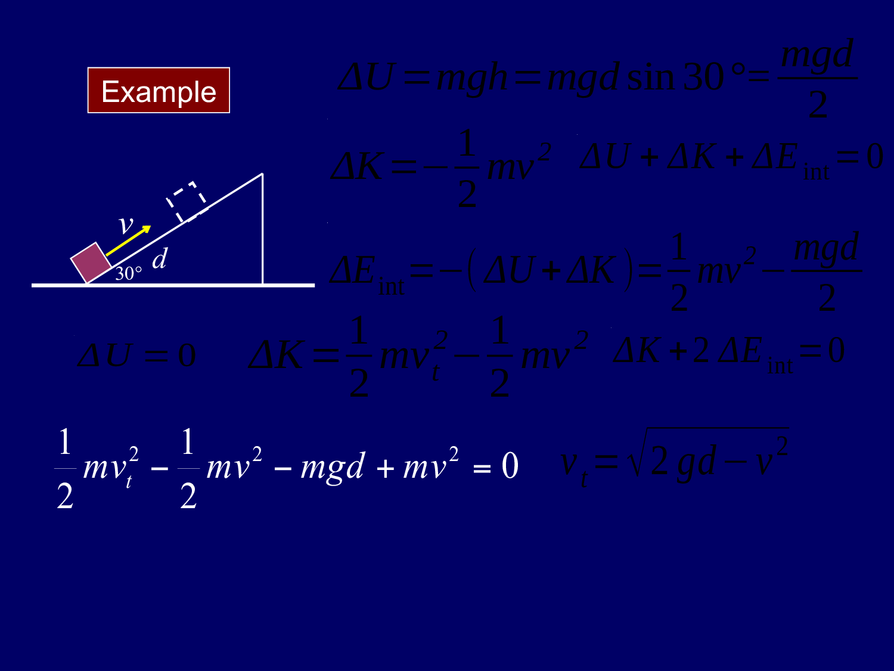

求：(1) 系统（滑块 + 桌面 + 地球）由于摩擦产生的内能增量 $\Delta E_{\text{int}}$；
(2) 若滑块从静止沿斜面滑回，求回到出发点时的速度。

**分析 (1)：** 系统初始能量（动能 + 势能）与最终能量（势能）之差等于摩擦产生的内能。

初始能量（以出发点为势能零点）：
- 动能：$\frac{1}{2} m v^2$
- 势能：$0$

最终能量（在最高点）：
- 动能：$0$
- 势能：$mgd\sin 30^\circ = \frac{1}{2} mgd$

由能量守恒：

$$
\Delta E_{\text{int}} = \frac{1}{2} m v^2 - \frac{1}{2} mgd
$$

**分析 (2)：** 滑块从静止滑回出发点时，摩擦力做功与上滑过程相同。

设回到出发点时的速度为 $v'$：

$$
\frac{1}{2} mgd - \Delta E_{\text{int}} = \frac{1}{2} m v'^2
$$

由 (1) 代入 $\Delta E_{\text{int}}$：

$$
\frac{1}{2} mgd - \left(\frac{1}{2} m v^2 - \frac{1}{2} mgd\right) = \frac{1}{2} m v'^2
$$

$$
mgd - \frac{1}{2} m v^2 = \frac{1}{2} m v'^2
$$

$$
v' = \sqrt{2gd - v^2}
$$

---

#### 例题 5.3.2：圆柱体在粗糙斜面上的无滑滚动

一个质量为 $m$ 的圆柱体以初速 $v$ 沿倾角为 $30^\circ$ 的斜面滚上（无滑滚动），滑行距离 $d$ 后速度减为零。

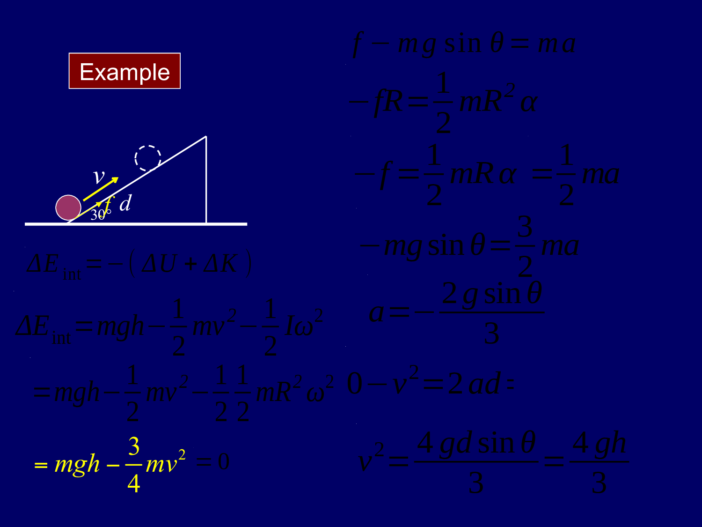

求：(1) 系统内能增量 $\Delta E_{\text{int}}$；(2) 若圆柱体从静止沿斜面滚回，求回到出发点时的速度。

**分析 (1)：** 无滑滚动时静摩擦力不做功，机械能守恒（如果斜面是光滑的）。实际上这里斜面可能是粗糙的但静摩擦力不做功。内能增量为零（无滑滚动下没有滑动摩擦生热）。

**分析 (2)：** 对于无滑滚动，机械能守恒。回到出发点时速度大小等于初速 $v$。

但如果问题中涉及滑动摩擦（有滑滚动），则需要考虑内能增量。

---

#### 例题 5.3.3：有初角速度的圆柱体达到无滑滚动

一圆柱体以初始角速度 $\omega_0$ 在水平面上运动，初始质心速度为零。由于摩擦力作用，经过一段时间后达到无滑滚动状态。求质心加速度 $a$。

**分析：** 初始时存在滑动，摩擦力做功。应用角动量定理和动量定理可以求解。

设摩擦力为 $f$，则：
- 质心运动方程：$f = ma$
- 转动方程（绕质心）：$-fR = I\alpha$

达到无滑时：$v = \omega R$

---

#### 例题 5.3.4：复合系统 — 子弹射入杆

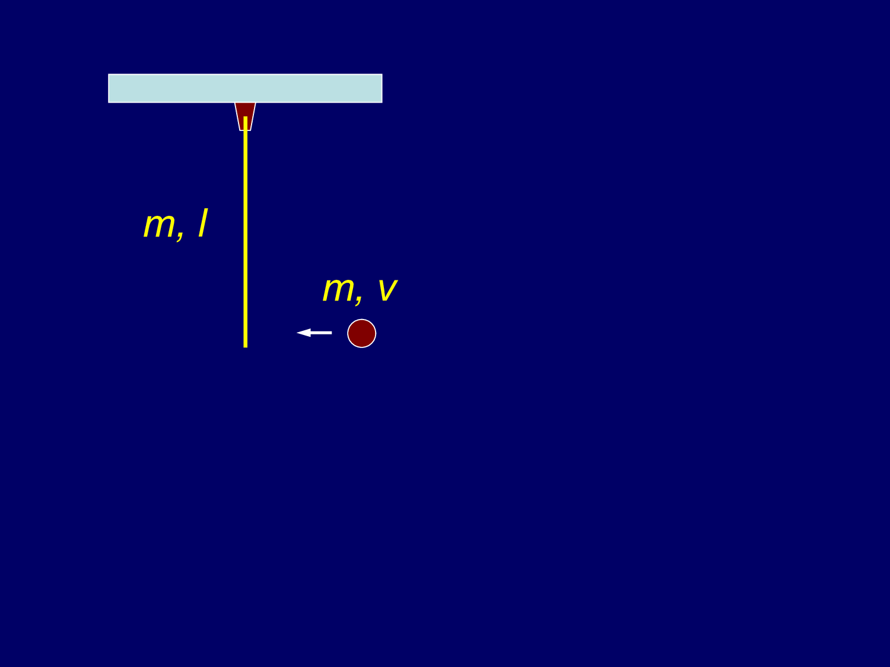

**情形一：** 一质量为 $m$、长度为 $L$ 的杆可绕一端自由转动，初始静止。一质量为 $m$ 的子弹以速度 $v$ 水平射入杆的自由端。

求碰撞后杆的角速度。

**分析：** 碰撞过程中角动量守恒（对转轴），但机械能不守恒（完全非弹性碰撞）。

碰撞前角动量：
- 子弹：$m v L$

碰撞后角动量：
- 杆 + 子弹组合体绕固定端的转动惯量 $I = \frac{1}{3} m L^2 + m L^2 = \frac{4}{3} m L^2$
- 角动量：$I \omega = \frac{4}{3} m L^2 \omega$

由角动量守恒：

$$
m v L = \frac{4}{3} m L^2 \omega \quad\Rightarrow\quad \omega = \frac{3v}{4L}
$$

**情形二：** 杆竖直悬挂，子弹水平射入杆底端。

**情形三：** 杆水平放置，子弹竖直射入杆的一端。

---

#### 例题 5.3.5：碰撞中的能量分析

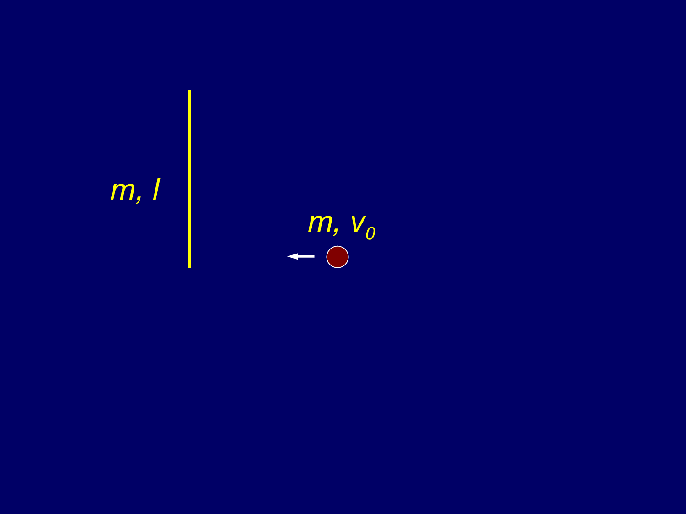

**弹性碰撞：** 两物体碰撞后可以上升到一定高度。

**分析：** 在弹性碰撞中，机械能守恒。可以利用机械能守恒和动量守恒联立求解。

**非弹性碰撞：** 碰撞后粘在一起，动能损失转化为内能。

**分析：** 碰撞中动量守恒，但动能不守恒。损失的动能：

$$
\Delta K = \frac{1}{2} m_1 v_0^2 - \frac{1}{2} (m_1 + m_2) v_f^2
$$

其中 $v_f = \frac{m_1}{m_1 + m_2} v_0$（由动量守恒得出）。

## 5.4 万有引力

---

### 5.4.1 万有引力定律

任何两个质点之间都存在相互吸引力，引力的大小与两质点质量的乘积成正比，与它们之间距离的平方成反比，方向沿两质点的连线：

$$
\vec{F} = -G \frac{m_1 m_2}{r^2} \hat{r}
$$

或写为标量形式：

$$
F = G \frac{m_1 m_2}{r^2}
$$

其中：
- $G = 6.67 \times 10^{-11}\ \text{N}\cdot\text{m}^2/\text{kg}^2$，为万有引力常量
- $\hat{r}$ 是从施力物体指向受力物体的单位矢量（负号表示引力）

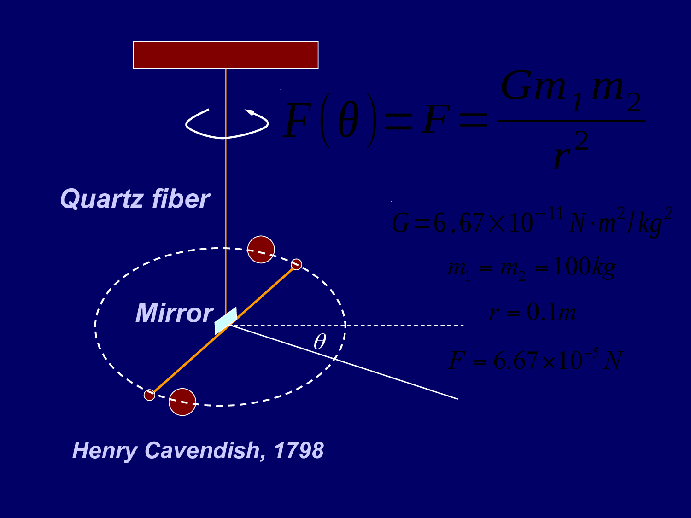

---

### 5.4.2 卡文迪什实验

**实验者：** 亨利·卡文迪什 (Henry Cavendish)

**实验目的：** 首次在实验室中测量万有引力常量 $G$ 的值。

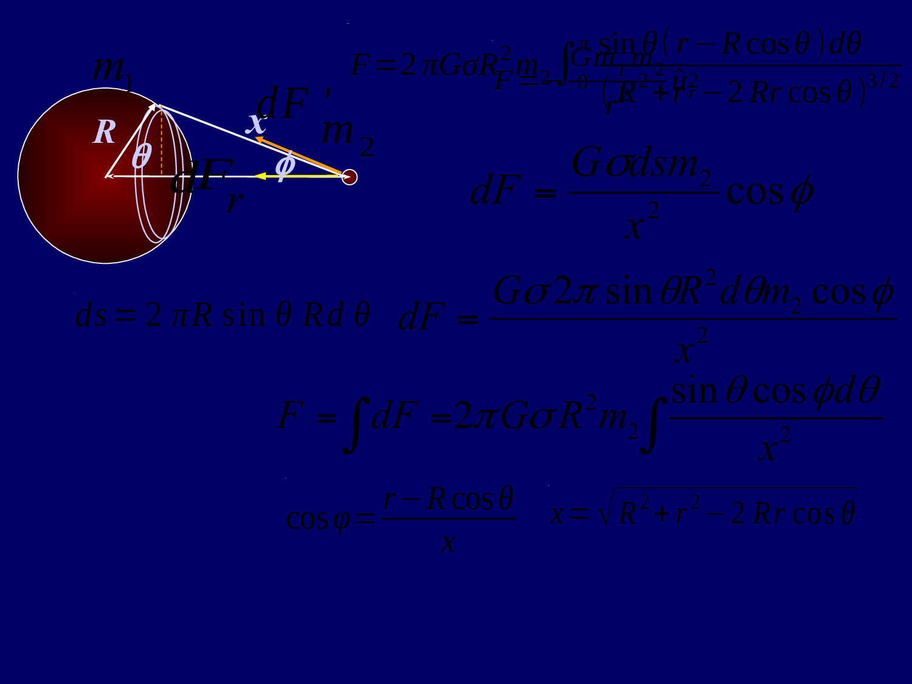

**原理：** 通过测量扭转角度 $\theta$，可以计算出扭丝的恢复力矩，进而得到万有引力的大小，从而计算出 $G$。

**意义：** 卡文迪什实验验证了万有引力定律的正确性，并首次测定了 $G$ 的值，使万有引力定律从比例关系变为可以定量计算的精确公式。

---

### 5.4.3 球体的万有引力

#### 5.4.3.1 均匀球壳对球壳外质点的引力

一个质量为 $M$、半径为 $R$ 的均匀球壳对球壳外距离球心为 $r$ ($r > R$) 的质点 $m$ 的引力，等同于将球壳的全部质量集中于球心时的引力：

$$
F = G \frac{M m}{r^2}
$$

#### 5.4.3.2 均匀球壳对球壳内质点的引力

若质点 $m$ 在球壳内部 ($r < R$)，则球壳对该质点的引力为零：

$$
F = 0 \quad (r < R)
$$

#### 5.4.3.3 均匀实心球体内外的引力

对于均匀实心球体（质量 $M$，半径 $R$）：

- **球体外** ($r > R$)：相当于全部质量集中于球心：

  $$
  F = G \frac{M m}{r^2}
  $$

- **球体内** ($r < R$)：只有半径 $r$ 以内的球体部分对质点有引力：

  $$
  F = G \frac{M_{\text{内}} m}{r^2} = G \frac{M (r^3 / R^3) m}{r^2} = G \frac{M m}{R^3} r
  $$

  其中 $M_{\text{内}} = M \cdot \frac{r^3}{R^3}$ 是半径为 $r$ 的球体内的质量。

- **球面上** ($r = R$)：$F = G \frac{M m}{R^2}$

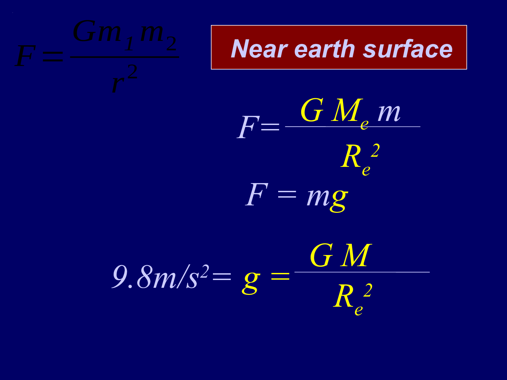

---

### 5.4.4 地球表面附近的重力加速度

在地球表面附近，万有引力近似等于重力：

$$
F = G \frac{M_e m}{R_e^2} = mg
$$

所以：

$$
g = \frac{G M_e}{R_e^2} \approx 9.8\ \text{m/s}^2
$$

其中 $M_e \approx 5.98 \times 10^{24}\ \text{kg}$，$R_e \approx 6.37 \times 10^6\ \text{m}$。

**验证：** $G M_e / R_e^2 = (6.67 \times 10^{-11})(5.98 \times 10^{24}) / (6.37 \times 10^6)^2 \approx 9.8\ \text{m/s}^2$

---

### 5.4.5 万有引力做功与势能

万有引力是保守力，其做功与路径无关。

**万有引力做的功**（将质点 $m$ 从 $r_i$ 移动到 $r_f$）：

$$
W = \int_{r_i}^{r_f} \vec{F} \cdot d\vec{r} = \int_{r_i}^{r_f} \left(-G \frac{M m}{r^2}\right) dr
= G M m \left( \frac{1}{r_f} - \frac{1}{r_i} \right)
$$

**万有引力势能**（选取无穷远处为零势能点，$U(\infty) = 0$）：

$$
U(r) = -\int_{\infty}^{r} \left(-G \frac{M m}{r'^2}\right) dr' = -G \frac{M m}{r}
$$

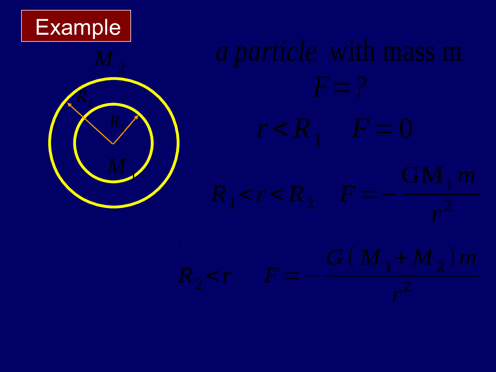

---

### 5.4.6 惯性质量与引力质量

- **惯性质量 ($m_i$)：** 反映物体抵抗加速度的能力，出现在牛顿第二定律 $F = m_i a$ 中。
- **引力质量 ($m_g$)：** 反映物体产生和感受引力的能力，出现在万有引力定律 $F = G m_{g1} m_{g2} / r^2$ 中。

**等效原理 (Principle of Equivalence)：** 惯性质量与引力质量严格相等（在数值上相等）。

$$
m_i = m_g
$$

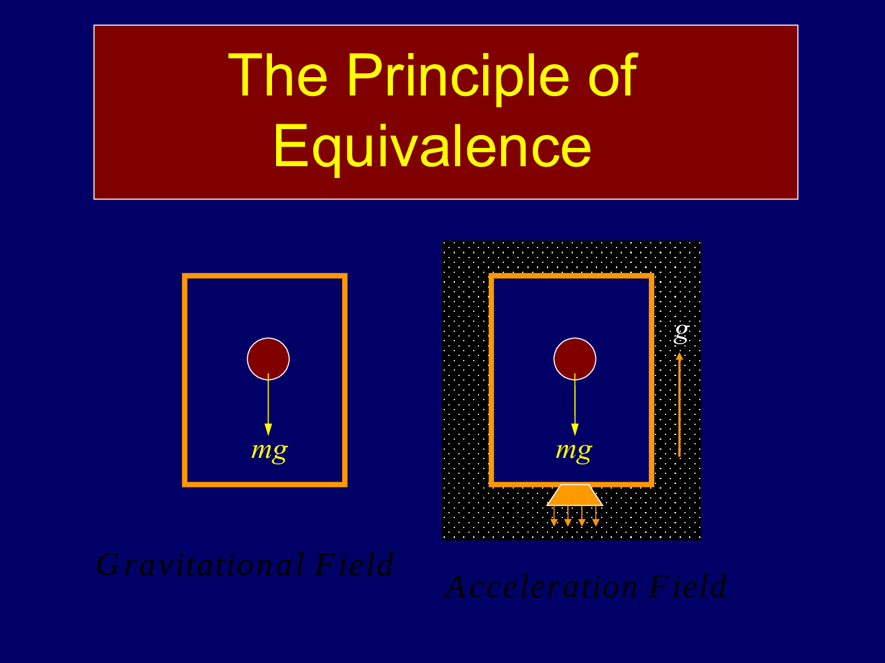
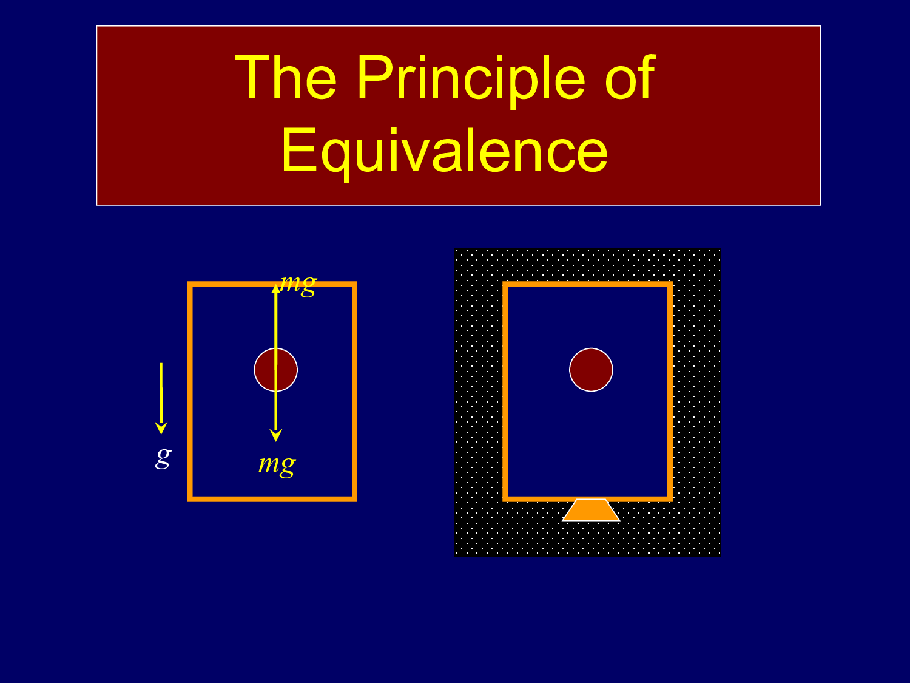
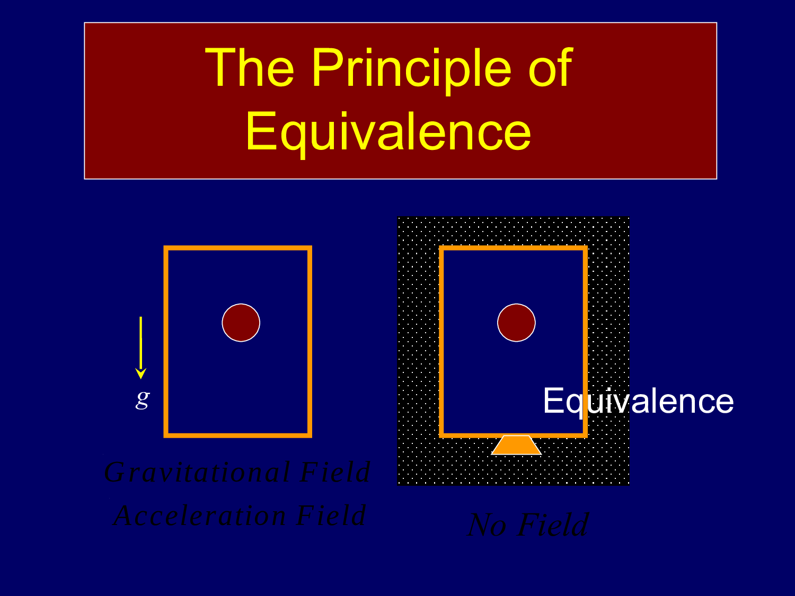
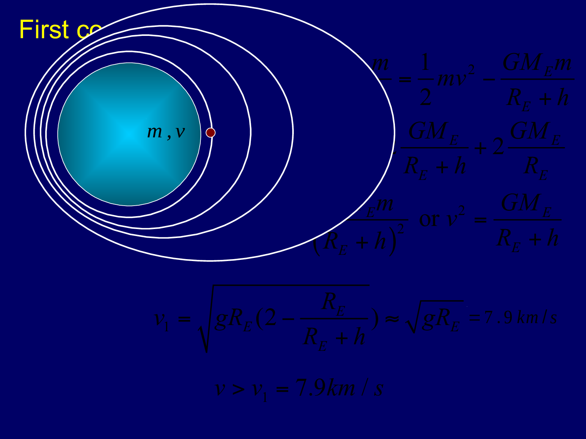

**实验验证：** 厄缶实验 (Eotvos experiment) 等精密实验证实了惯性质量与引力质量的等价性，精度达到 $10^{-12}$ 量级。

---

### 5.4.7 宇宙速度

#### 5.4.7.1 第一宇宙速度

物体在地球表面附近环绕地球做圆周运动所需的最小速度。

由万有引力提供向心力：

$$
G \frac{M_e m}{R_e^2} = m \frac{v^2}{R_e}
$$

解得：

$$
v_1 = \sqrt{\frac{G M_e}{R_e}} = \sqrt{g R_e}
\approx \sqrt{9.8 \times 6.37 \times 10^6} \approx 7.9 \times 10^3\ \text{m/s} \approx 7.9\ \text{km/s}
$$

#### 5.4.7.2 第二宇宙速度

物体从地球表面出发，脱离地球引力束缚所需的最小速度。

由机械能守恒（无穷远处动能为零、势能为零）：

$$
\frac{1}{2} m v_2^2 - G \frac{M_e m}{R_e} = 0
$$

解得：

$$
v_2 = \sqrt{\frac{2 G M_e}{R_e}} = \sqrt{2 g R_e} = \sqrt{2} \, v_1
\approx 11.2 \times 10^3\ \text{m/s} \approx 11.2\ \text{km/s}
$$

#### 5.4.7.3 第三宇宙速度

物体从地球表面出发，脱离太阳引力束缚所需的最小速度（需要考虑地球公转速度等因素）。

$$
v_3 \approx 16.7\ \text{km/s}
$$

**三种参考系下的分析：**
- **地球参考系 (Earth's frame)：** 考虑地球引力和地球公转速度
- **太阳参考系 (Sun's frame)：** 考虑太阳引力
- 第三宇宙速度的计算需要在这两种参考系之间进行速度变换

---

### 5.4.8 行星与卫星的运动

#### 5.4.8.1 开普勒三定律

**第一定律（椭圆轨道定律）：** 每一行星沿椭圆轨道绕太阳运行，太阳位于椭圆的一个焦点上。

**第二定律（面积速度定律）：** 对任意一个行星，它与太阳的连线在相等的时间内扫过相等的面积。即面积速度守恒：

$$
\frac{dA}{dt} = \frac{1}{2} r^2 \frac{d\theta}{dt} = \frac{L}{2m} = \text{constant}
$$

其中 $L$ 为行星的角动量。

**第三定律（周期定律）：** 行星绕太阳公转周期的平方与轨道半长轴的立方成正比：

$$
T^2 = \frac{4\pi^2}{G M_{\text{太阳}}} a^3
$$

对于圆轨道（$a = r$）：

$$
T^2 = \frac{4\pi^2}{G M_{\text{太阳}}} r^3
$$

---

### 5.4.9 行星与卫星的能量

对于绕中心天体（质量 $M$）做圆轨道运动的天体（质量 $m$）：

**总机械能：**

$$
E = K + U = \frac{1}{2} m v^2 - G \frac{M m}{r}
$$

由圆周运动条件 $G \frac{M m}{r^2} = m \frac{v^2}{r}$，代入得 $v^2 = \frac{G M}{r}$：

$$
K = \frac{1}{2} m \cdot \frac{G M}{r} = \frac{G M m}{2r}
$$

所以：

$$
E = \frac{G M m}{2r} - \frac{G M m}{r} = -\frac{G M m}{2r}
$$

**结论：** 圆轨道上卫星的总机械能为负值（束缚态），且 $E = -K = \frac{1}{2} U$。

**对于椭圆轨道：** 总机械能仍为负值，大小取决于半长轴 $a$：

$$
E = -\frac{G M m}{2a}
$$

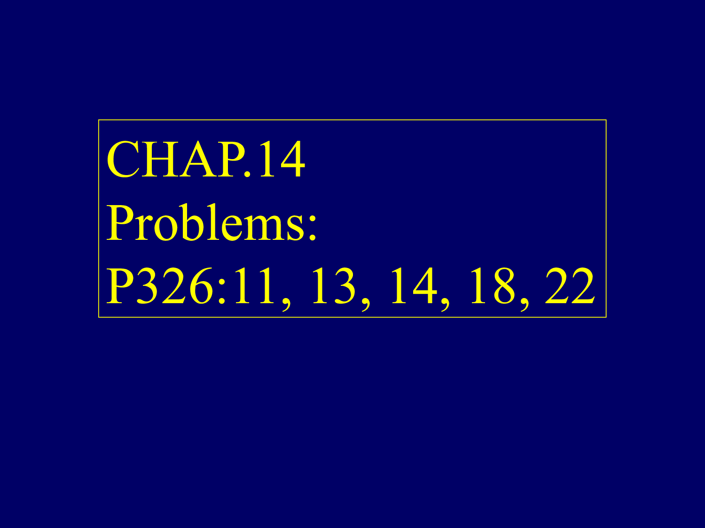

---

### 5.4.10 例题

#### 例题 5.4.1：卫星轨道计算

已知地球质量 $M_e$、半径 $R_e$、引力常量 $G$，求近地卫星的周期。

**解：** 近地卫星轨道半径近似为 $R_e$，由万有引力提供向心力：

$$
G \frac{M_e m}{R_e^2} = m \frac{v^2}{R_e}
$$

周期：

$$
T = \frac{2\pi R_e}{v} = 2\pi \sqrt{\frac{R_e^3}{G M_e}} = 2\pi \sqrt{\frac{R_e}{g}}
$$

代入 $g = 9.8\ \text{m/s}^2$，$R_e = 6.37 \times 10^6\ \text{m}$：

$$
T \approx 2\pi \sqrt{\frac{6.37 \times 10^6}{9.8}} \approx 5070\ \text{s} \approx 84.5\ \text{min}
$$

## 附录：公式速查

### 核心公式

| 概念 | 公式 |
|------|------|
| 恒力做功 | $W = \vec{F} \cdot \vec{d} = F d \cos\theta$ |
| 变力做功（一维） | $W = \int_{x_i}^{x_f} F(x)\,dx$ |
| 变力做功（二维） | $W = \int \vec{F} \cdot d\vec{r}$ |
| 功率 | $P = \frac{dW}{dt} = \vec{F} \cdot \vec{v}$ |
| 动能 | $K = \frac{1}{2} m v^2$ |
| 功能原理 | $W_{\text{net}} = \Delta K$ |
| 转动动能 | $K_{\text{rot}} = \frac{1}{2} I \omega^2$ |
| 转动功 | $W = \int \tau \, d\theta$ |
| 保守力定义 | $\oint \vec{F} \cdot d\vec{r} = 0$ |
| 势能定义 | $\Delta U = -W_{\text{cons}}$ |
| 力与势能关系 | $F = -\frac{dU}{dx}$（一维）；$\vec{F} = -\nabla U$（三维） |
| 弹簧势能 | $U = \frac{1}{2} k x^2$ |
| 重力势能（近地） | $U = mgh$ |
| 万有引力势能 | $U = -G \frac{M m}{r}$ |
| 机械能守恒 | $K + U = \text{constant}$（仅保守力） |
| 万有引力定律 | $F = G \frac{m_1 m_2}{r^2}$ |
| 表面重力加速度 | $g = \frac{G M_e}{R_e^2}$ |
| 第一宇宙速度 | $v_1 = \sqrt{g R_e} \approx 7.9\ \text{km/s}$ |
| 第二宇宙速度 | $v_2 = \sqrt{2g R_e} \approx 11.2\ \text{km/s}$ |
| 开普勒第三定律 | $T^2 = \frac{4\pi^2}{GM} a^3$ |
| 圆轨道卫星总能量 | $E = -\frac{G M m}{2r}$ |

## 附录：物理常数

### 重要常数

- 万有引力常量：$G = 6.67 \times 10^{-11}\ \text{N}\cdot\text{m}^2/\text{kg}^2$
- 地球质量：$M_e = 5.98 \times 10^{24}\ \text{kg}$
- 地球半径：$R_e = 6.37 \times 10^6\ \text{m}$
- 表面重力加速度：$g = 9.8\ \text{m/s}^2$

---

> 对应习题：
> - Ch11: P250 21,22,23,30,36; P255 31,32
> - Ch12: P272 7,9,15
> - Ch13: P296 14,15,19; P297 1,2,5
> - Ch14: P326 11,13,14,18,22
