# 06. 流体力学

> 对应教材第15章（流体静力学）和第16章（流体动力学）

## 6.1 流体静力学

---

### 6.1.1 物质的状态

自然界中的物质可分为以下几种状态：

- **固体 (Solid)**：具有确定的形状和体积，分子间作用力强
- **液体 (Liquid)**：具有确定的体积但无固定形状，分子间作用力较弱
- **气体 (Gas)**：既无固定形状也无固定体积
- **等离子体 (Plasma)**：电离气体，由带电粒子组成

**凝聚态物质 (Condensed Matter)**：固体和液体统称为凝聚态物质。

**流体 (Fluid)**：液体和气体统称为流体，它们能够流动并适应容器的形状。

---

### 6.1.2 应力与应变

#### 6.1.2.1 固体中的应力与应变

固体受到外力作用时会产生**应力 (stress)** 和**应变 (strain)**。

##### 6.1.2.1.1 杨氏模量 $Y$

描述固体抵抗拉伸或压缩变形的能力：

$$
Y = \frac{\text{张应力/压应力}}{\text{线应变}} = \frac{F/A}{\Delta L / L}
$$

其中 $F$ 为作用力，$A$ 为横截面积，$L$ 为原长，$\Delta L$ 为长度变化量。

- 适用于固体的拉伸和压缩

##### 6.1.2.1.2 剪切模量 $G$

描述固体抵抗剪切变形的能力：

$$
G = \frac{\text{切应力}}{\text{切应变}} = \frac{F/A}{\Delta x / h}
$$

其中 $\Delta x$ 为相对位移，$h$ 为物体的高度。

- 适用于固体的剪切形变

#### 6.1.2.2 不同物质对力的响应

| 物质类型 | 压缩力 | 拉伸力 | 剪切力 |
|----------|--------|--------|--------|
| **固体** | 有 | 有 | 有 |
| **液体** | 有 | 有 | **无** |
| **气体** | 有 | **无** | **无** |

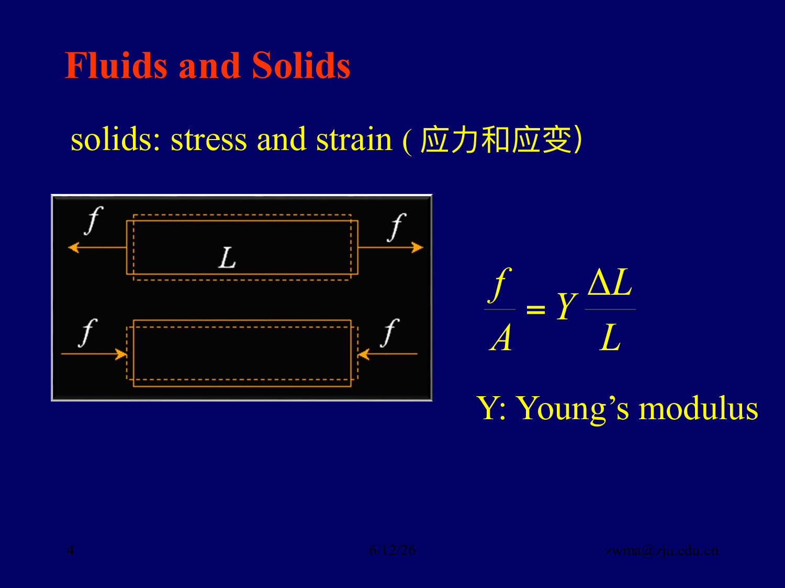
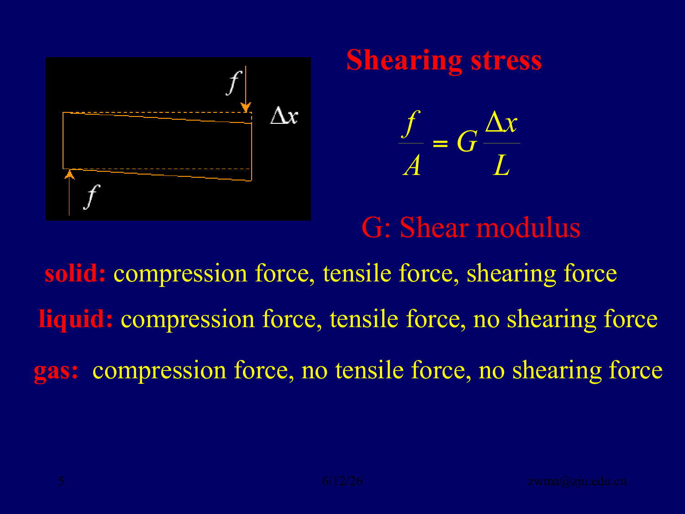

---

### 6.1.3 压力与密度

#### 6.1.3.1 压力

压力定义为单位面积上所受到的垂直作用力：

$$
P = \frac{F}{A}
$$

**单位：**
- 帕斯卡 (Pascal)：$1 \, \text{Pa} = 1 \, \text{N/m}^2$
- 标准大气压：$1 \, \text{atm} = 1.013 \times 10^5 \, \text{Pa}$
- 巴 (bar)：$1 \, \text{bar} = 10^5 \, \text{Pa}$
- 毫米汞柱 (mm of Hg)：常用于气压测量

#### 6.1.3.2 密度

密度定义为单位体积的质量：

$$
\rho = \frac{m}{V}
$$

单位：$\text{kg/m}^3$

#### 6.1.3.3 液压应力与体积模量

**体积模量 (Bulk Modulus)** $B$ 描述流体抵抗体积压缩的能力：

$$
B = -\frac{\Delta P}{\Delta V / V}
$$

其中 $\Delta P$ 为压强变化量，$\Delta V / V$ 为体积应变。负号表示压强增大时体积减小。

---

### 6.1.4 静止流体中的压力

#### 6.1.4.1 压力在各个方向相等

在静止流体的某一给定深度处，**压力在各个方向上大小相等**。如果不同方向的压力不等，流体就会流动。

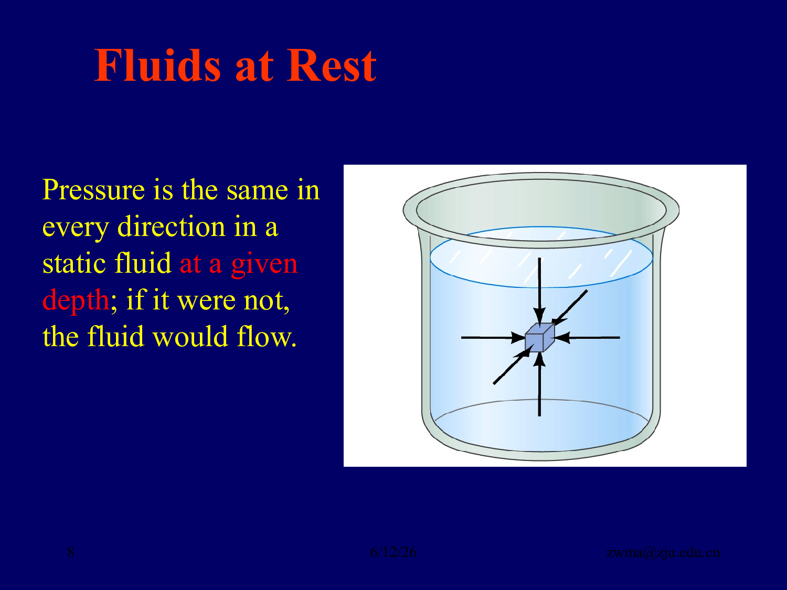

#### 6.1.4.2 液体内压力随深度的变化

在重力作用下，静止液体内部的压力随深度线性增加。

考虑液体中深度为 $y$ 处的一个微元，设液面处压力为 $P_0$，则深度处的压力为：

$$
P = P_0 + \rho g y
$$

其中：
- $P_0$ 为液面处的压力（通常为大气压）
- $\rho$ 为液体密度
- $g$ 为重力加速度
- $y$ 为距液面的深度

> **图：** 课件中展示了液面下方深度 $y$ 处取一厚度为 $\Delta y$ 的薄层微元，分析其上下表面所受压力与重力的平衡关系。

#### 6.1.4.3 大气压力随高度的变化

大气压力随高度增加而减小。同样可以用类似的方法分析：考虑大气中高度为 $y$ 处的微元。

> **图：** 课件中展示了大气中取一厚度为 $dy$ 的薄层，分析其上下表面压力与重量之间的关系。

---

### 6.1.5 帕斯卡原理

**帕斯卡原理**：施加于密闭流体的压强，将**无损失地**传递到流体的每一部分以及容器壁的每一个点。

$$
P = P_{\text{ext}} + \rho g y
$$

当外部施加的压力 $P_{\text{ext}}$ 改变时，流体内部所有点的压力都会同样改变。

> **图：** 课件中展示了两个连通容器，无论形状如何，同一水平面的压力均相等。

#### 6.1.5.1 应用：液压升降机

液压升降机是帕斯卡原理的重要应用。在小活塞上施加较小的力 $F_1$，通过液体传递压强，可以在大活塞上产生较大的力 $F_2$：

$$
P = \frac{F_1}{A_1} = \frac{F_2}{A_2}
$$

因此：

$$
F_2 = F_1 \cdot \frac{A_2}{A_1}
$$

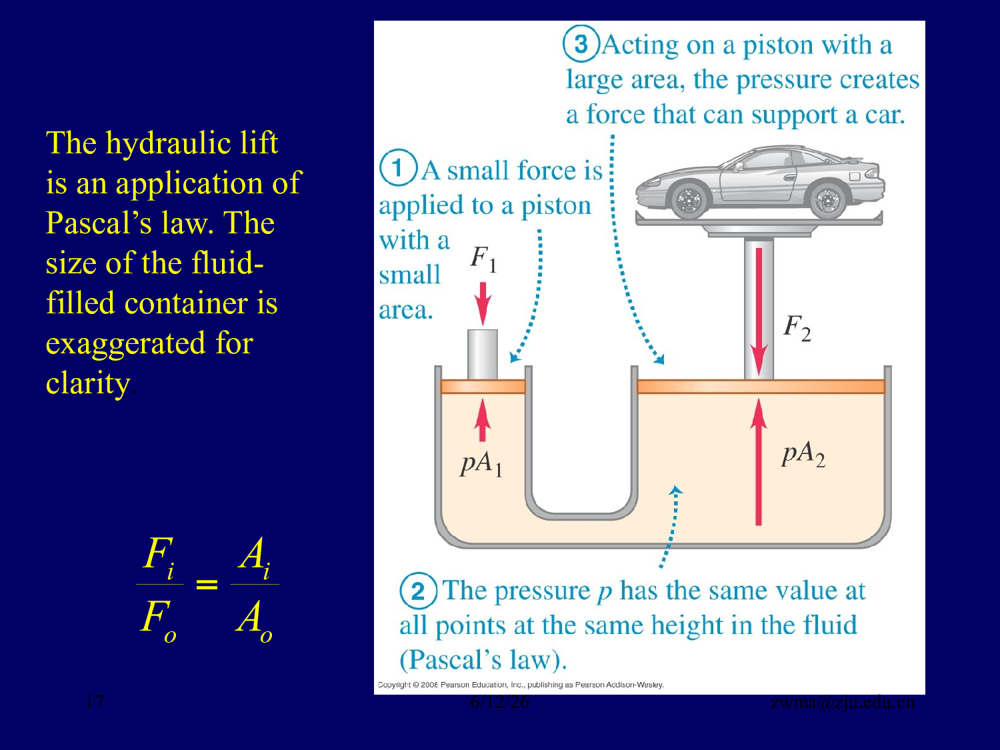

---

### 6.1.6 阿基米德原理

#### 6.1.6.1 原理表述

**阿基米德原理**：部分或全部浸没在流体中的物体，会受到一个向上的**浮力 (buoyant force)**，浮力的大小等于物体所排开的流体的重量。

$$
F_b = \rho_{\text{流体}} \cdot V_{\text{排开}} \cdot g
$$

#### 例题 6.1.1：王冠是否纯金？

**问题**：阿基米德受命判断一顶王冠是否为纯金制成。

**已知**：
- 黄金的密度应为 $19.3 \, \text{g/cm}^3$
- 铅的密度为 $11.3 \, \text{g/cm}^3$

**方法**：
1. 在空气中称量王冠的质量 $m$
2. 将王冠完全浸没在水中再次称量，得到视重 $m'$
3. 视重 $m'g$ = 实际重量 $mg$ - 浮力 $F_b$
4. 浮力 $F_b = \rho_{\text{水}} V g$，其中 $V$ 为王冠体积
5. 质量差 $(m - m')$ 对应的就是排开水的质量 $\rho_{\text{水}} V$
6. 因此王冠密度 $\rho_{\text{冠}} = \frac{m}{V} = \frac{m}{m - m'} \cdot \rho_{\text{水}}$

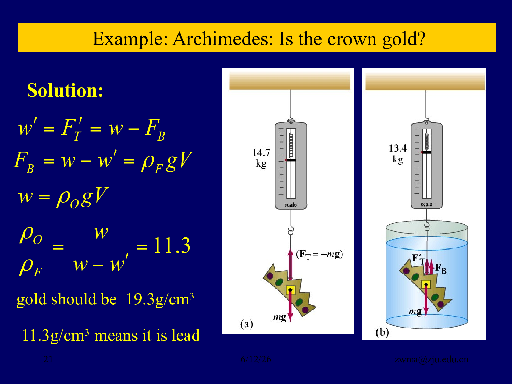

**结果**：若测得密度为 $11.3 \, \text{g/cm}^3$，则王冠为铅制而非金制。

#### 6.1.6.2 冰山

浮在水面上的冰山，其露出水面的部分仅占总体积的约 **12%**。

$$
\frac{V_{\text{露出}}}{V_{\text{总体}}} = 1 - \frac{\rho_{\text{冰}}}{\rho_{\text{水}}}
$$

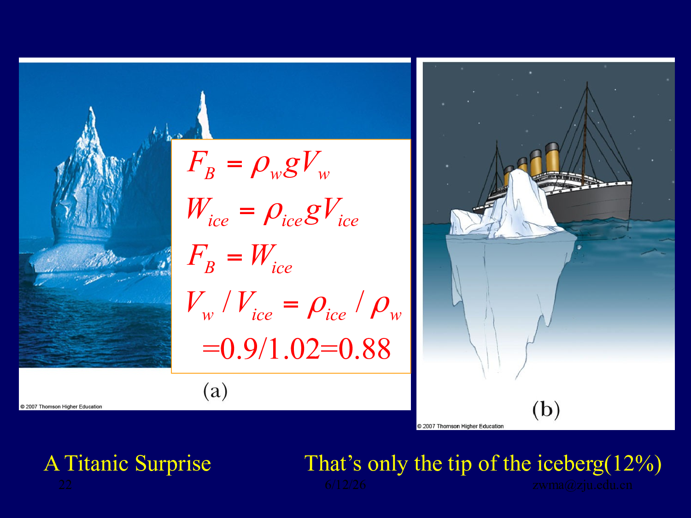

#### 6.1.6.3 浮心

浮力的作用点称为**浮心**，位于被排开流体的质心位置。

对于漂浮物体：
- 当物体倾斜时，浮心相对于重心移动
- 浮心与重心的相对位置决定了物体的平衡稳定性

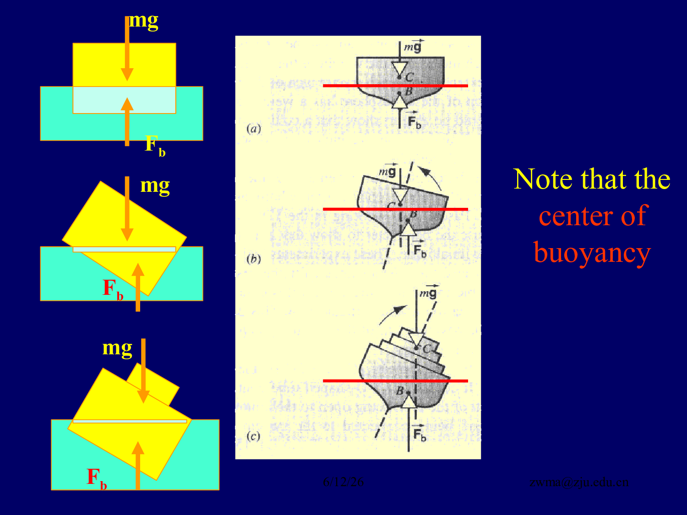

---

### 6.1.7 压力的测量

常用的压力测量仪器包括：
- **气压计 (Barometer)**：测量大气压
- **压力计 (Manometer)**：测量容器内气体或液体的压力

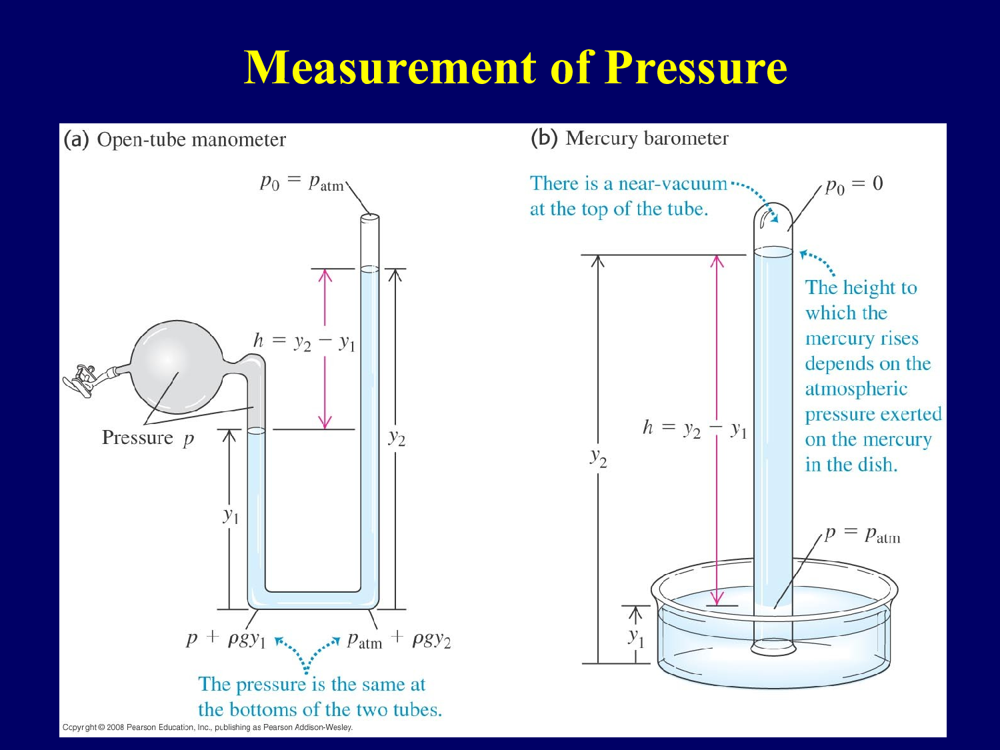

---

### 6.1.8 表面张力与毛细现象

#### 6.1.8.1 表面张力

液体表面有一种收缩趋势，这种使表面收缩的力称为**表面张力**。

**定义**：表面张力系数 $\gamma$ 为单位长度上的表面力：

$$
\gamma = \frac{F}{l}
$$

单位：$\text{N/m}$

对于一条长度为 $l$ 的线段上的表面张力：

$$
F = \gamma l
$$

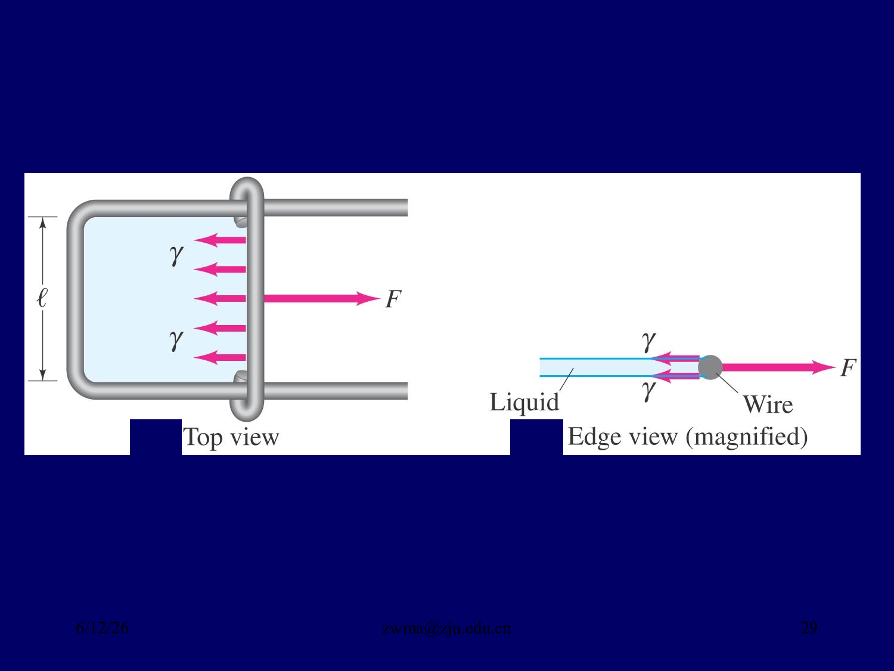

**表面张力势能 (Surface Tension Potential Energy)**：液体表面的分子具有比内部更高的势能，液体表面有收缩以减小表面积的趋势。

#### 6.1.8.2 浸润与不浸润

- **浸润 (Wetting)**：液体与固体接触时，液体沿固体表面铺展。当 $\gamma_1 < \gamma_2$（液体与固体间的界面张力小于固体与气体间的界面张力）时发生浸润。
- **不浸润 (No Wetting)**：液体在固体表面收缩成球状。

> **图：** 课件展示了两种情形：(a) 水浸润玻璃表面，水沿玻璃铺展；(b) 汞不浸润玻璃表面，汞在玻璃上收缩成珠状。

#### 6.1.8.3 表面张力的实际影响

**水黾 (Water Strider)**：由于表面张力的存在，一些密度大于水的物体（如水黾）也可以停留在水面上。

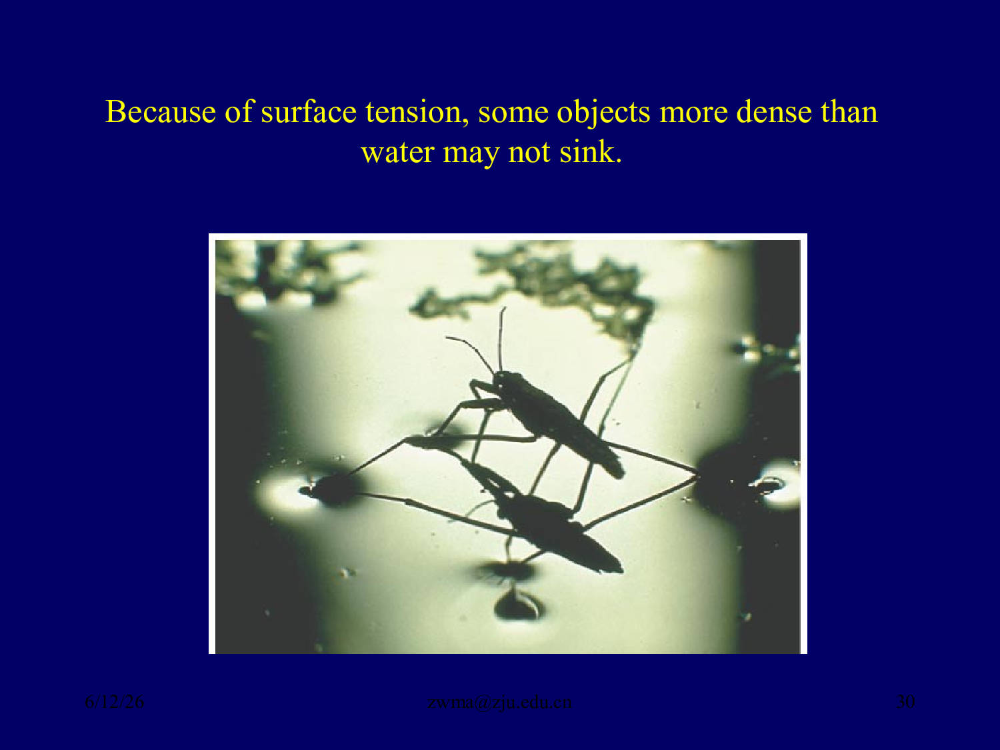

**肥皂和洗涤剂 (Soap and Detergents)**：肥皂和洗涤剂可以降低水的表面张力，使水更容易渗透到材料内部，从而提高清洁效果。

**水与玻璃、汞与玻璃的对比**：
- 水分子与玻璃的吸引力大于水分子之间的吸引力 → 水浸润玻璃
- 汞原子之间的吸引力大于汞与玻璃的吸引力 → 汞不浸润玻璃

#### 6.1.8.4 毛细现象

当将细管（毛细管）插入液体时，液体会在管中上升或下降，这种现象称为**毛细现象**。

- 对于浸润液体（如水）：液体在毛细管中**上升**（凹液面）
- 对于不浸润液体（如汞）：液体在毛细管中**下降**（凸液面）

> **图：** 课件展示了不同直径的毛细管中液面上升高度随管径减小而增加的示意图。

## 6.2 流体动力学

---

### 6.2.1 描述流体运动的两种方法

#### 6.2.1.1 拉格朗日法

- 追踪每一个流体微团（质点）的运动
- 给出每个质点随时间变化的位置和速度
- 类似于质点力学中对单个质点的描述

#### 6.2.1.2 欧拉法

- 不追踪个别质点，而是关注空间中的每个点
- 给出空间中每个位置和每个时刻流体的密度、速度等物理量
- 使用**分布函数 (Distribution Function)** 进行描述

---

### 6.2.2 流体流动的描述变量

在欧拉法中，描述流体运动的基本变量是空间坐标 $(x, y, z)$ 和时间 $t$ 的函数：

- **压力**：$p(x, y, z, t)$
- **密度**：$\rho(x, y, z, t)$
- **速度**：$\mathbf{v}(x, y, z, t)$

---

### 6.2.3 流体流动的特征分类

#### 6.2.3.1 定常流 vs 非定常流

- **定常流 (Steady Flow)**：流场中每一点的物理量（压力、密度、速度）不随时间变化，即 $\partial / \partial t = 0$
- **非定常流 (Unsteady Flow)**：流场中物理量随时间变化

#### 6.2.3.2 可压缩 vs 不可压缩

- **不可压缩流体 (Incompressible)**：密度 $\rho$ 为常数，即 $d\rho/dt = 0$
- **可压缩流体 (Compressible)**：密度会随压力和温度变化

#### 6.2.3.3 有粘 vs 无粘

- **无粘流体 (Nonviscous/Inviscid)**：忽略粘性（内摩擦），即 $\eta = 0$
- **有粘流体 (Viscous)**：存在粘性，流体层之间有内摩擦力

#### 6.2.3.4 有旋 vs 无旋

- **无旋流 (Irrotational)**：流体质点没有绕自身质心的旋转运动，即 $\nabla \times \mathbf{v} = 0$
- **有旋流 (Rotational)**：流体质点存在旋转运动

#### 6.2.3.5 理想流体

**理想流体**是理想化的模型，满足以下四个条件：
1. **定常 (Steady)**
2. **不可压缩 (Incompressible)**
3. **无粘 (Nonviscous)**
4. **无旋 (Irrotational)**

---

### 6.2.4 流线与流管

#### 6.2.4.1 流线

**流线**是在流场中画出的曲线，其切线方向与流场中该点的速度方向一致。

**流线的性质**：
- 流线密（间距小）的地方流速大
- 流线疏（间距大）的地方流速小
- 流线不相交
- 在定常流中，流线的形状不随时间变化，且流线与流体质点的运动轨迹重合

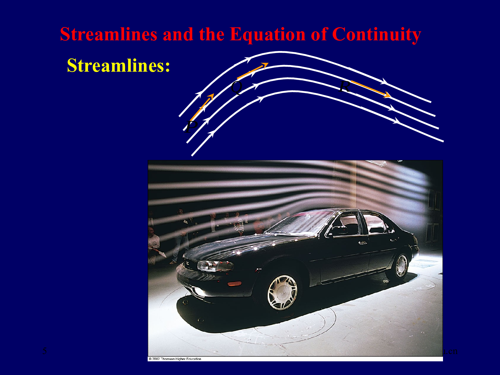

#### 6.2.4.2 流管

由一束流线围成的管状区域称为**流管**。流体不能穿越流管壁面。

---

### 6.2.5 连续性方程

#### 6.2.5.1 一般形式

在定常流动中，通过流管任意横截面的质量流量相等：

$$
\rho_1 A_1 v_1 = \rho_2 A_2 v_2
$$

其中：
- $A$ 为流管横截面积
- $v$ 为流速
- $\rho$ 为流体密度

#### 6.2.5.2 不可压缩流体

对于不可压缩流体（密度 $\rho$ 为常数），连续性方程简化为：

$$
A_1 v_1 = A_2 v_2
$$

即**体积流量 (Volume Flow Rate)** 恒定：

$$
Q = A v = \text{常数}
$$

**物理意义**：当流管横截面变小时，流速增大；截面变大时，流速减小。

> **图：** 课件展示了流管中粗细不同两处的示意图——截面 $A_1$ 处速度 $v_1$ 较小（流线较疏），截面 $A_2$（$A_2 < A_1$）处速度 $v_2$ 较大（流线较密）。

---

### 6.2.6 伯努利方程

#### 6.2.6.1 方程的推导

对于**理想流体**（定常、不可压缩、无粘、无旋），沿同一条流线有：

沿流线考虑一段流管，取两个截面1和2。在1秒内流过截面1和截面2的流体质量为 $\delta m$。

**推导思路**：根据功能原理（机械能守恒），外力对流体做的功等于流体机械能的变化。

| 截面 | 高度 | 截面积 | 流速 | 压力 |
|------|------|--------|------|------|
| 截面1 | $h_1$ | $A_1$ | $v_1$ | $P_1$ |
| 截面2 | $h_2$ | $A_2$ | $v_2$ | $P_2$ |

#### 6.2.6.2 伯努利方程的标准形式

$$
P + \frac{1}{2} \rho v^2 + \rho g h = \text{常数}
$$

即沿同一条流线：

$$
P_1 + \frac{1}{2} \rho v_1^2 + \rho g h_1 = P_2 + \frac{1}{2} \rho v_2^2 + \rho g h_2
$$

其中：
- $P$ 为流体的静压强
- $\frac{1}{2} \rho v^2$ 为**动压 (dynamic pressure)**，与流速有关
- $\rho g h$ 为**重力势能项**

> **图：** 课件展示了伯努利方程推导的流管示意图——标注了截面1处的 $A_1, v_1, \rho_1, P_1, h_1$ 和截面2处的 $A_2, v_2, \rho_2, P_2, h_2$，以及流经两个截面的质量微元 $\delta m$。

#### 6.2.6.3 物理意义

伯努利方程本质上是**能量守恒**在流体力学中的体现：在理想流体的定常流动中，沿同一条流线，流体的压力能、动能和重力势能之和保持不变。

---

### 6.2.7 伯努利方程的应用

#### 6.2.7.1 文丘里流量计

文丘里流量计是一种测量管道中流体流速和流量的装置，利用伯努利方程和连续性方程。

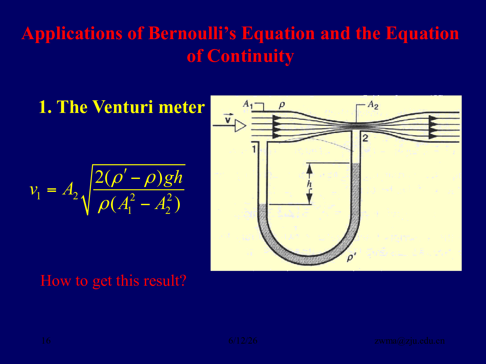

**分析**：设主管道截面为 $A_1$，喉部截面为 $A_2$（$A_2 < A_1$），两处高度相同。

由连续性方程：

$$
A_1 v_1 = A_2 v_2
$$

由伯努利方程（高度相同）：

$$
P_1 + \frac{1}{2} \rho v_1^2 = P_2 + \frac{1}{2} \rho v_2^2
$$

联立解得流速和流量。

#### 6.2.7.2 其他应用

课件中展示了多个伯努利方程的应用场景的图示：

- 飞机机翼的升力（机翼上方流线密集，流速大，压强小）
- 喷雾器的工作原理（高速气流在细管口产生低压区）
- 间歇泉 (Geyser) 的喷射现象

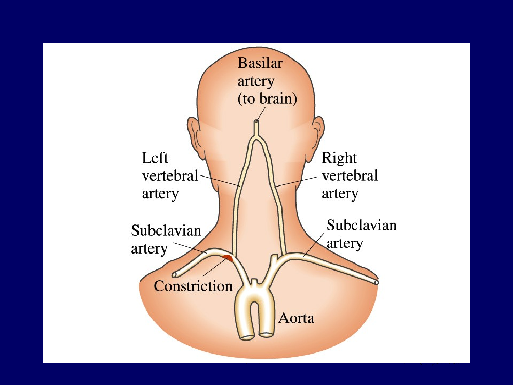
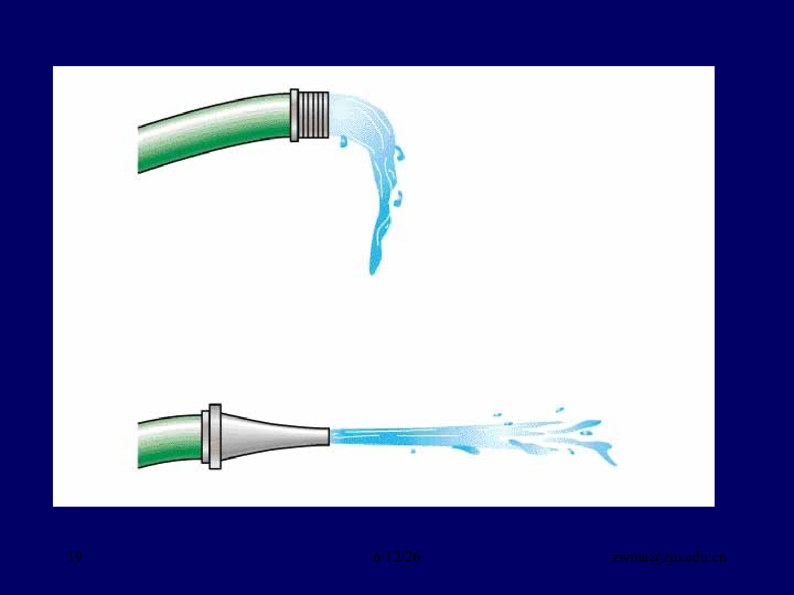
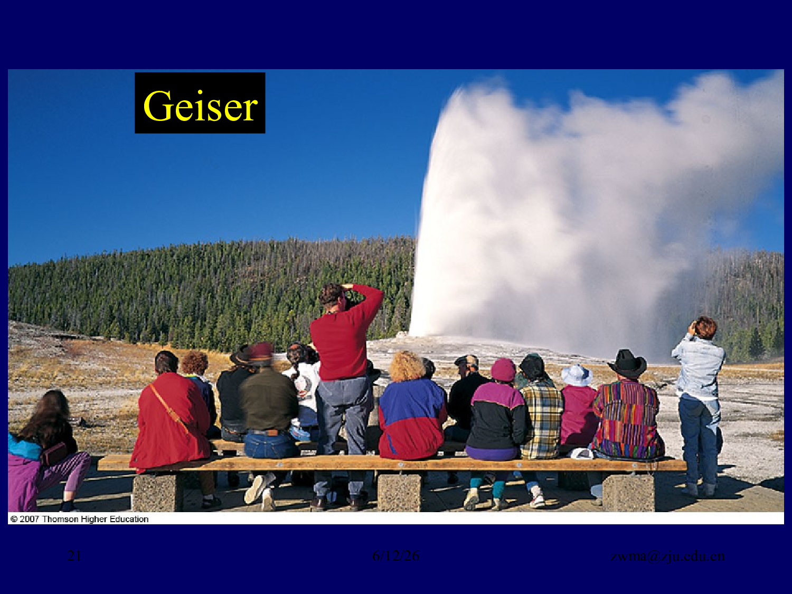

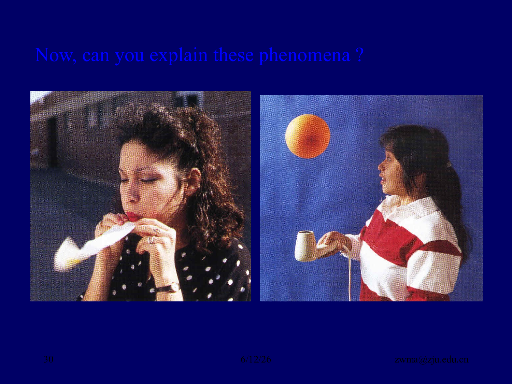

---

### 6.2.8 粘性流动

#### 6.2.8.1 牛顿粘性定律

当流体存在粘性时，流体层之间产生内摩擦力（粘滞力）：

$$
F = \eta A \frac{dv}{dz}
$$

其中：
- $\eta$ 为流体的**粘滞系数**或**动力粘度 (coefficient of viscosity)**，单位 $\text{Pa} \cdot \text{s}$
- $A$ 为流体层之间的接触面积
- $\frac{dv}{dz}$ 为垂直于流动方向上的**速度梯度**

> **图：** 课件展示了粘性流体在两个平行平板之间流动的示意图——下板固定，上板以速度 $V_0$ 运动，流体速度从下到上线性增加。

#### 6.2.8.2 圆管中的泊肃叶流动

对于粘性流体在圆管中的流动，速度沿径向呈**抛物线分布**。

取半径为 $r$ 的圆柱形流体微元，长度为 $L$：

**侧面粘滞力**：

$$
F = 2\pi r L \eta \frac{dv}{dr}
$$

**两端压力差产生的驱动力**：

$$
F_{\text{外}} = S(p_2 - p_1) = \pi r^2 \Delta p
$$

平衡时 $F_{\text{外}} = F$，因此：

$$
\frac{dv}{dr} = \frac{\Delta p}{2L\eta} r
$$

积分得速度分布：

$$
v(r) = v_0 \left(1 - \frac{r^2}{R^2}\right)
$$

其中：
- $R$ 为管道半径
- $v_0 = \frac{\Delta p R^2}{4L\eta}$ 为管轴线的最大速度

> **图：** 课件展示了圆管中粘性流动的速度分布图——速度分布呈抛物线形状，轴线处速度最大 $v_0$，管壁处速度为零。

#### 6.2.8.3 伯努利方程的适用性

伯努利方程**不适用于**粘性流动和有能量损失的流动，因为粘性会产生能量耗散。

---

### 6.2.9 湍流

#### 6.2.9.1 层流与湍流

- **层流 (Laminar Flow)**：流体层之间平滑流动，没有混合
- **湍流/紊流 (Turbulent Flow)**：流体质点的运动杂乱无章，出现涡旋和混合

> **图：** 课件展示了湍流中流体运动的示意图——流线变得混乱，产生大量涡旋。

#### 6.2.9.2 雷诺数

**雷诺数**是判断流动状态的无量纲参数：

$$
R = \frac{\rho v D}{\eta}
$$

其中：
- $\rho$ 为流体密度
- $v$ 为特征流速
- $D$ 为特征长度（圆管中的直径）
- $\eta$ 为粘滞系数

**临界雷诺数**：$R \approx 2000$（对于圆管中的流动）
- $R < 2000$：层流
- $R > 2000$：可能出现湍流

#### 6.2.9.3 临界速度

根据雷诺数可求出发生湍流的**临界速度**：

$$
v_c = \frac{R \eta}{\rho D}
$$

**示例**：家用管道中水的流动
- 取 $R \approx 2000$
- 管径 $D \approx 0.02 \, \text{m}$（2 cm）
- 水在室温下的 $\eta \approx 1.0 \times 10^{-3} \, \text{Pa} \cdot \text{s}$
- 密度 $\rho \approx 1000 \, \text{kg/m}^3$

代入计算得临界速度：

$$
v_c = \frac{2000 \times 1.0 \times 10^{-3}}{1000 \times 0.02} \approx 0.1 \, \text{m/s}
$$

即当流速超过约 $0.1 \, \text{m/s}$ 时，家用管道中的水就可能出现湍流。

> **图：** 课件展示了多种湍流现象的图片，包括烟雾上升时从层流转变为湍流、旗帜在风中飘动等。

## 习题

### 第15章（流体静力学）
教材 P348：习题 7, 8, 11, 13, 17

### 第16章（流体动力学）
教材 P367：练习题 7, 10, 17, 21, 23
教材 P369：习题 4, 11, 14

## 重要公式总结

| 公式 | 名称 | 适用条件 |
|------|------|----------|
| $P = F/A$ | 压力定义 | 一般情况 |
| $P = P_0 + \rho g y$ | 液体静压力 | 静止液体 |
| $F_b = \rho_{\text{流}} g V_{\text{排}}$ | 浮力 | 阿基米德原理 |
| $A_1 v_1 = A_2 v_2$ | 连续性方程 | 不可压缩流体 |
| $P + \frac{1}{2}\rho v^2 + \rho g h = \text{常数}$ | 伯努利方程 | 理想流体 |
| $F = \eta A \frac{dv}{dz}$ | 牛顿粘性定律 | 粘性流体 |
| $v = v_0(1 - r^2/R^2)$ | 泊肃叶流速度分布 | 圆管层流 |
| $R = \rho v D / \eta$ | 雷诺数 | 判断流态 |

## 关键概念中英文对照

| 中文 | English |
|------|---------|
| 流体静力学 | Fluid Statics |
| 流体动力学 | Fluid Dynamics |
| 应力 | Stress |
| 应变 | Strain |
| 杨氏模量 | Young's Modulus ($Y$) |
| 剪切模量 | Shear Modulus ($G$) |
| 体积模量 | Bulk Modulus ($B$) |
| 压力/压强 | Pressure |
| 密度 | Density |
| 帕斯卡原理 | Pascal's Principle |
| 阿基米德原理 | Archimedes' Principle |
| 浮力 | Buoyant Force |
| 表面张力 | Surface Tension |
| 毛细现象 | Capillarity |
| 浸润 | Wetting |
| 拉格朗日法 | Lagrange Method |
| 欧拉法 | Euler Method |
| 定常流 | Steady Flow |
| 非定常流 | Unsteady Flow |
| 不可压缩 | Incompressible |
| 理想流体 | Ideal Fluid |
| 流线 | Streamline |
| 流管 | Flow Tube |
| 连续性方程 | Equation of Continuity |
| 伯努利方程 | Bernoulli's Equation |
| 文丘里流量计 | Venturi Meter |
| 粘性 | Viscosity |
| 牛顿粘性定律 | Newton's Law of Viscosity |
| 泊肃叶流动 | Poiseuille Flow |
| 层流 | Laminar Flow |
| 湍流 | Turbulent Flow |
| 雷诺数 | Reynolds Number |
