# 07. 振动与波

## 7.1 振动

---

### 7.1.1 简谐振动
简谐振动是振动运动中最基本的形式。一个做简谐振动的物体的位移可以表示为时间的正弦或余弦函数。

#### 7.1.1.1 简谐振动的运动方程

一般形式的简谐振动运动方程：

$$
\frac{d^2x}{dt^2} + \omega^2 x = 0
$$

其中 $\omega$ 是角频率（角速度），**取决于系统本身的性质**。

#### 7.1.1.2 运动方程的解

上述微分方程的通解为：

$$
x(t) = x_m \cos(\omega t + \phi)
$$

其中：
- $x_m$ 为振幅（最大位移）
- $\omega$ 为角频率（角速度）
- $\phi$ 为初相位
- $x_m$ 和 $\phi$ **取决于初始条件**
- $\omega$ **取决于系统本身**

从解的图形来看，$x$ 随时间按余弦（或正弦）规律变化，呈现周期性往复运动。位移-时间图像是一条余弦（或正弦）曲线。

#### 7.1.1.3 速度与加速度

由位移表达式可求得速度和加速度：

$$
v(t) = \frac{dx}{dt} = -\omega x_m \sin(\omega t + \phi) = \omega x_m \cos\left(\omega t + \phi + \frac{\pi}{2}\right)
$$

$$
a(t) = \frac{d^2x}{dt^2} = -\omega^2 x_m \cos(\omega t + \phi) = -\omega^2 x(t)
$$

可见加速度与位移成正比且方向相反，这是简谐振动的基本特征。

---

### 7.1.2 简谐振动中的能量

#### 7.1.2.1 动能

$$
E_k = \frac{1}{2} m v^2 = \frac{1}{2} m \omega^2 x_m^2 \sin^2(\omega t + \phi)
$$

#### 7.1.2.2 势能

$$
E_p = \frac{1}{2} k x^2 = \frac{1}{2} m \omega^2 x_m^2 \cos^2(\omega t + \phi)
$$

#### 7.1.2.3 总机械能

$$
E = E_k + E_p = \frac{1}{2} m \omega^2 x_m^2 = \frac{1}{2} k x_m^2
$$

总机械能守恒，不随时间变化。动能和势能相互转换：当位移最大时，势能最大、动能为零；当位移为零时，动能最大、势能为零。

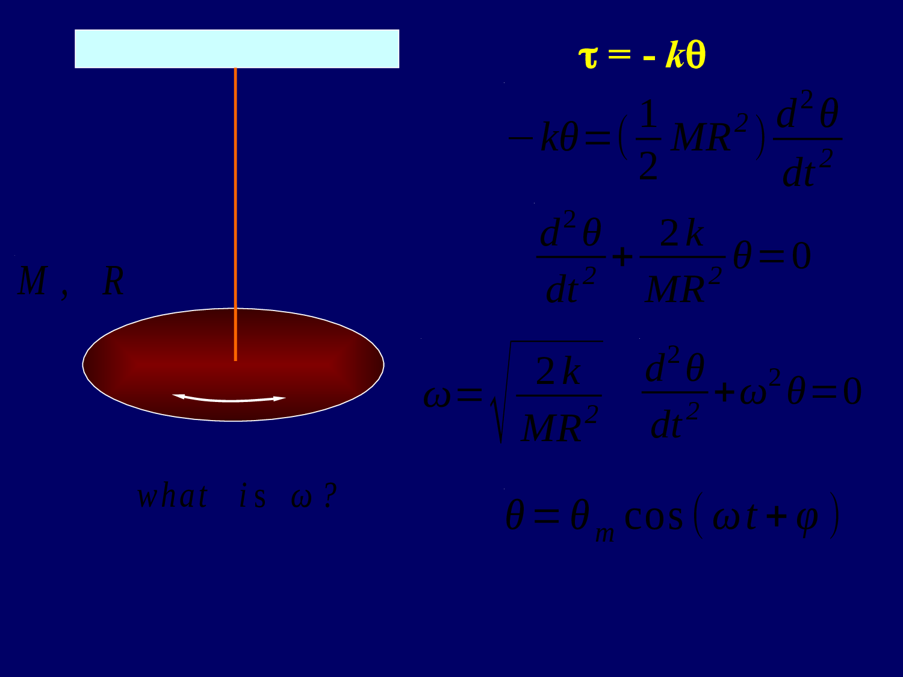

---

### 7.1.3 扭摆
扭摆的恢复力矩与角位移成正比：

$$
\tau = -k\theta
$$

其中 $k$ 为扭转常数。

---

### 7.1.4 单摆
#### 7.1.4.1 单摆的运动方程

对于长为 $l$、摆锤质量为 $m$ 的单摆，恢复力矩为：

$$
\tau = -mgl\sin\theta
$$

当 $\theta$ 很小时，$\sin\theta \approx \theta$，则：

$$
\tau \approx -mgl\theta
$$

#### 7.1.4.2 单摆的角频率与周期

由转动定律 $I\alpha = \tau$，其中 $I = ml^2$，可得：

$$
ml^2 \frac{d^2\theta}{dt^2} = -mgl\theta
$$

即：

$$
\frac{d^2\theta}{dt^2} + \frac{g}{l}\theta = 0
$$

因此角频率和周期分别为：

$$
\omega = \sqrt{\frac{g}{l}}, \quad T = 2\pi\sqrt{\frac{l}{g}}
$$

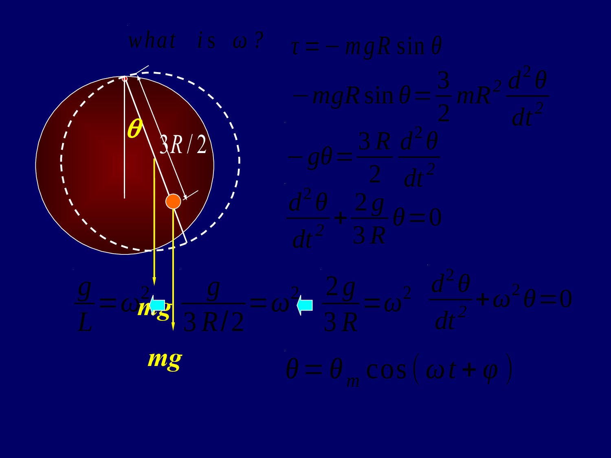

---

### 7.1.5 滚动而不滑动的振动系统

**例题**：一半径为 $r$、质量为 $m$ 的小球（或圆柱）在半径为 $R$ 的弧形轨道上做纯滚动（无滑动），且 $r \ll R$。求振动周期 $T$。

**分析方法**：
1. **受力分析法**（Force analyse）：分析重力、支持力和摩擦力的作用
2. **能量分析法**（Energy analyse）：利用机械能守恒

对于纯滚动条件，平动动能与转动动能之和为总动能：

$$
E_k = \frac{1}{2} m v^2 + \frac{1}{2} I \omega_{\text{rot}}^2
$$

利用能量守恒可推导出系统的等效角频率和周期。

---

### 7.1.6 弹簧-质量系统与滑轮组合

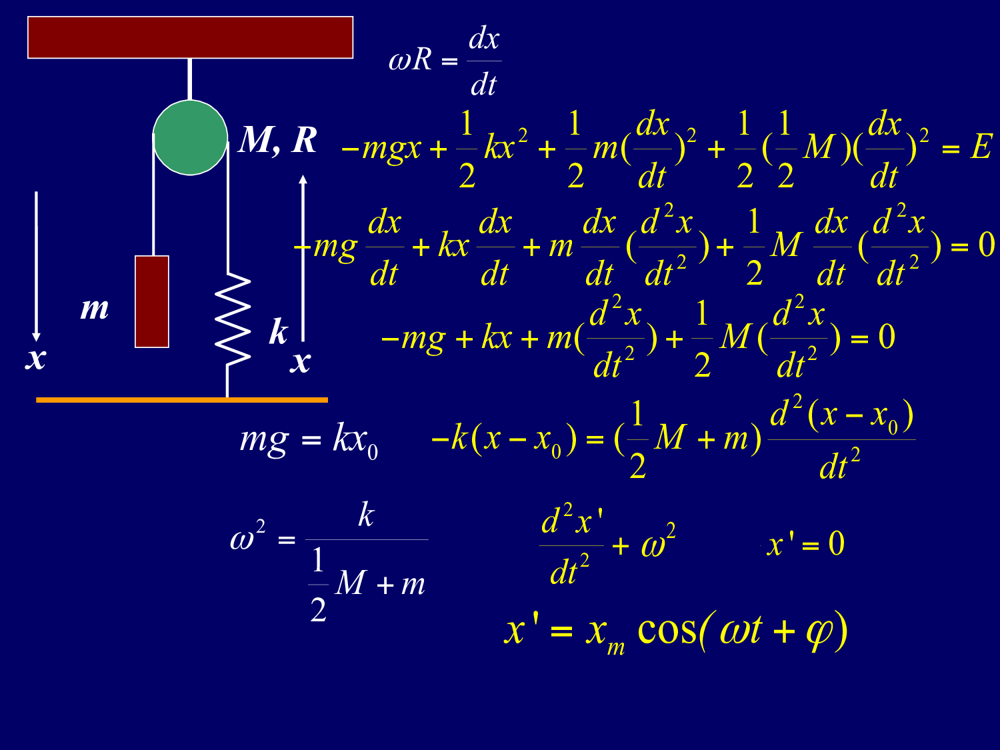

**分析方法**：
- 设 $x$ 为质量 $m$ 的位移
- 绳中张力分别为 $T_1$ 和 $T_2$
- 对质量 $m$ 应用牛顿第二定律：$mg - T_2 = m\ddot{x}$
- 对滑轮应用转动定律：$(T_2 - T_1)R = I\alpha$
- 对弹簧端应用胡克定律：$T_1 = kx$（或与位移的关系）
- 利用运动学关系：$a = \alpha R$

联立求解可得到系统的角频率 $\omega$。

---

### 7.1.7 竖直悬挂弹簧系统

**系统描述**：一质量为 $m$ 的物体悬挂在劲度系数为 $k$ 的弹簧下端。

在平衡位置，弹簧已有伸长量 $\Delta l = mg/k$。以平衡位置为原点，系统的运动方程仍为：

$$
m\frac{d^2x}{dt^2} = -kx
$$

角频率：

$$
\omega = \sqrt{\frac{k}{m}}
$$

---

### 7.1.8 简谐振动与匀速圆周运动的关系

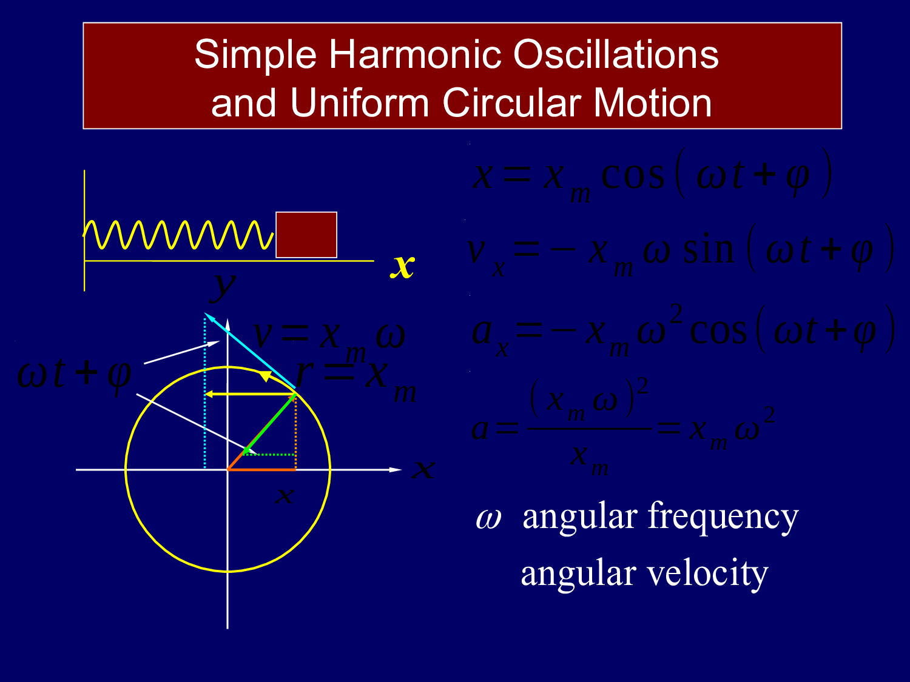

设质点以角速度 $\omega$ 沿半径为 $x_m$ 的圆周运动，其 $x$ 坐标随时间的变化为：

$$
x(t) = x_m \cos(\omega t + \phi)
$$

这与简谐振动的表达式完全相同。因此，匀速圆周运动的角速度 $\omega$ 对应于简谐振动的角频率，旋转半径对应于振幅。

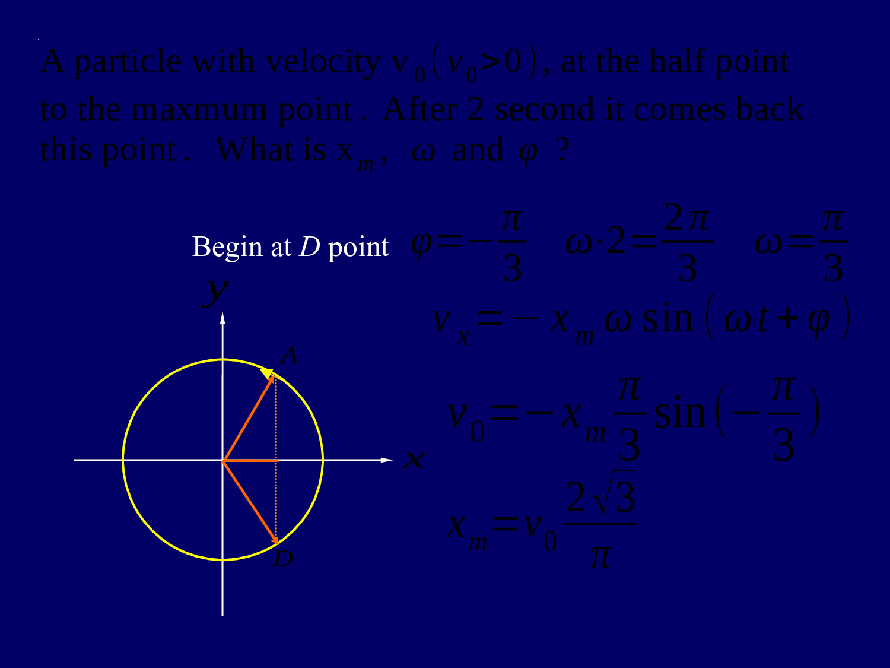

---

### 7.1.9 阻尼振动
#### 7.1.9.1 运动方程

考虑阻力与速度成正比（$F_{\text{damping}} = -b v$）的情况，运动方程为：

$$
m\frac{d^2x}{dt^2} + b\frac{dx}{dt} + kx = 0
$$

或写作：

$$
\frac{d^2x}{dt^2} + \frac{b}{m}\frac{dx}{dt} + \omega_0^2 x = 0
$$

其中 $\omega_0 = \sqrt{k/m}$ 为无阻尼时的固有角频率。

#### 7.1.9.2 通解

设试探解为：

$$
x = e^{\lambda t}
$$

代入运动方程可得特征方程：

$$
\lambda^2 + \frac{b}{m}\lambda + \omega_0^2 = 0
$$

解得两个可能的 $\lambda$ 值：

$$
\lambda = -\frac{b}{2m} \pm \sqrt{\left(\frac{b}{2m}\right)^2 - \omega_0^2}
$$

因此通解为：

$$
x(t) = C_1 e^{\lambda_1 t} + C_2 e^{\lambda_2 t}
$$

可写为阻尼项与简谐项的乘积形式：

$$
x(t) = e^{-\frac{b}{2m}t} \left[ A \cos(\omega' t) + B \sin(\omega' t) \right]
$$

其中 $\omega' = \sqrt{\omega_0^2 - (b/2m)^2}$ 为阻尼振动的角频率。

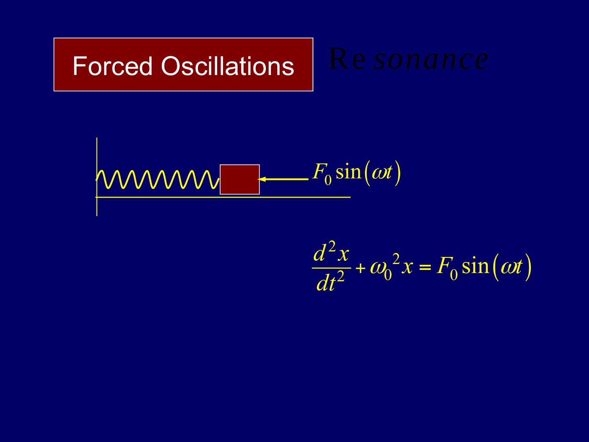

---

### 7.1.10 受迫振动
#### 7.1.10.1 运动方程

在外加周期性驱动力 $F(t) = F_0 \cos(\omega t)$ 作用下的受迫振动方程为：

$$
m\frac{d^2x}{dt^2} + b\frac{dx}{dt} + kx = F_0 \cos(\omega t)
$$

#### 7.1.10.2 稳态解

设稳态解的形式为：

$$
x(t) = A \cos(\omega t + \phi)
$$

代入运动方程，要求方程对任意时刻 $t$ 成立，则 $\cos(\omega t)$ 和 $\sin(\omega t)$ 的系数必须分别为零，由此可得：

$$
(k - m\omega^2)A = F_0 \cos\phi
$$

$$
b\omega A = F_0 \sin\phi
$$

#### 7.1.10.3 振幅

当 $A \neq 0$ 且 $\omega \neq \omega_0$ 时，振幅为：

$$
A = \frac{F_0}{\sqrt{(k - m\omega^2)^2 + (b\omega)^2}} = \frac{F_0/m}{\sqrt{(\omega_0^2 - \omega^2)^2 + (b\omega/m)^2}}
$$

#### 7.1.10.4 共振
当驱动力频率 $\omega$ 接近系统的固有频率 $\omega_0$ 时，振幅达到最大，这种现象称为**共振**。

- 无阻尼时（$b = 0$），共振振幅趋于无穷大
- 有阻尼时，共振振幅为有限值，阻尼越小振幅越大

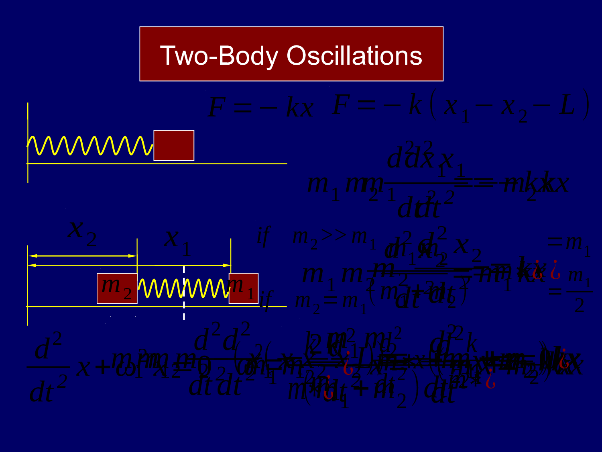

---

### 7.1.11 两体振动
两个物体通过弹簧连接构成的系统，存在多个振动模式（简正模）。系统的运动可以分解为质心运动和各物体相对质心的振动。

## 7.2 波动

---

### 7.2.1 机械波
机械波是机械振动在弹性介质中的传播。波是自然界中常见的现象，是我们环境的重要组成部分。

**波动的特征**：振动状态（相位）的传播，能量的传播，但**介质质点本身并不随波迁移**。

---

### 7.2.2 波的分类

#### 7.2.2.1 按质点振动方向分类

##### (a) 横波
**定义**：介质质点的振动方向与波的传播方向**垂直**。

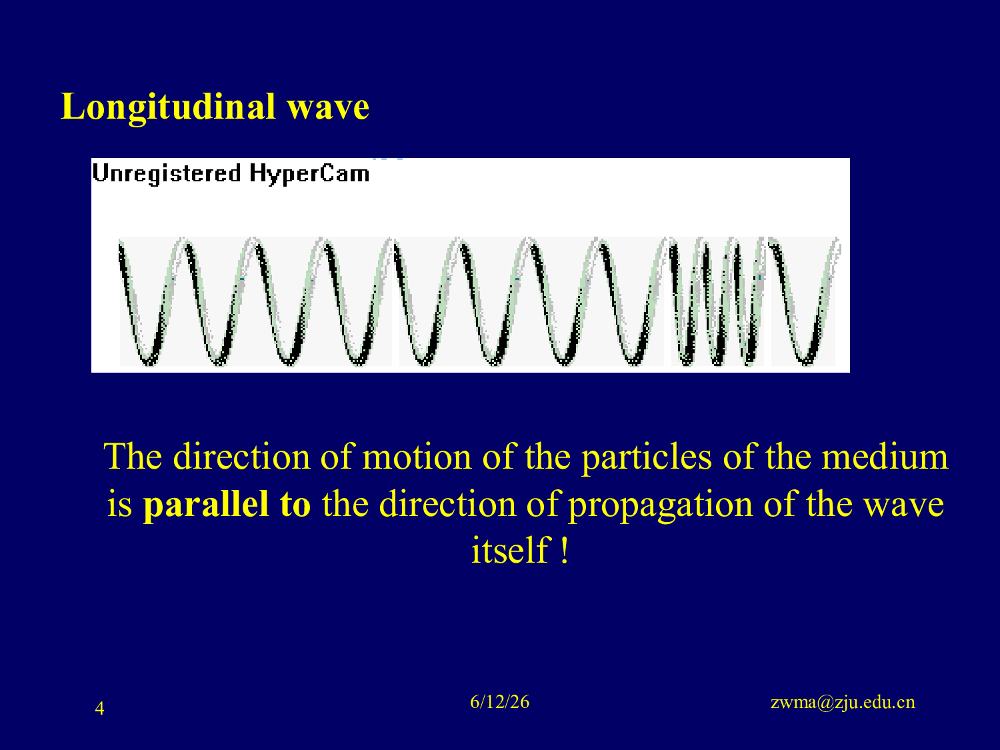

典型例子：弦上的波。

##### (b) 纵波
**定义**：介质质点的振动方向与波的传播方向**平行**。

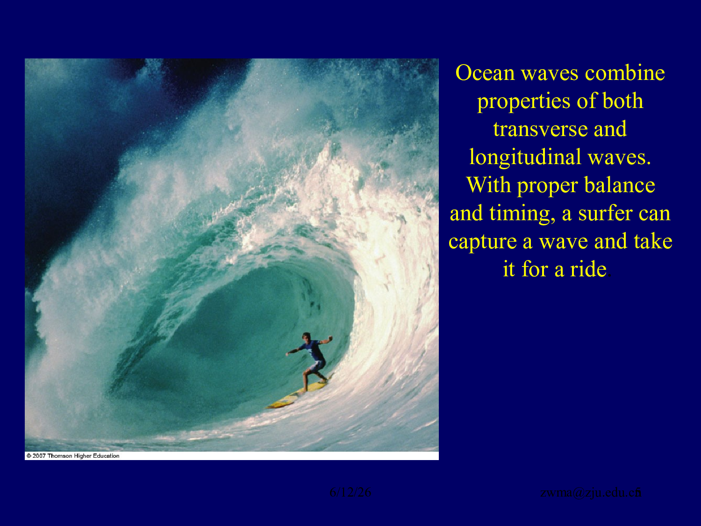

典型例子：声波在空气中的传播。

##### (c) 水波
水波既不是纯粹的横波也不是纯粹的纵波，而是兼具两者性质。

水波分为两种类型：
- **深水波 (Deep Water Wave)**：水深 $d \geq \lambda/2$
- **表面水波 (Surface Water Wave)**：水深 $d < \lambda/2$

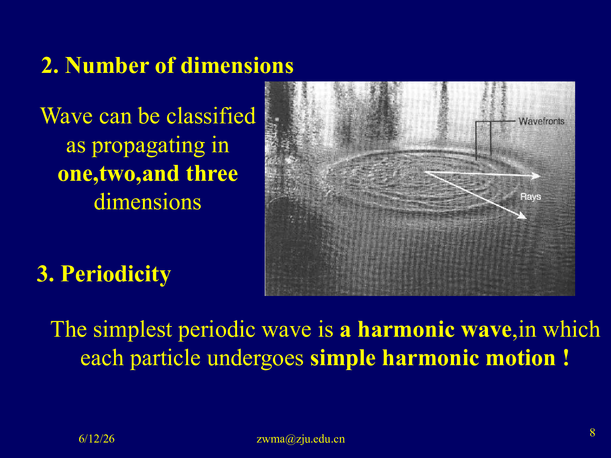

##### (d) 地震波
地震发生时，扰动以地震波的形式在地球体内传播。地震波包含纵波（P波）和横波（S波）两种成分。

#### 7.2.2.2 按传播维度分类

波可以按传播的空间维度分类：
- **一维波**：如弦上的波
- **二维波**：如水面的波
- **三维波**：如声波在空间中的传播

#### 7.2.2.3 按周期性分类

- **简谐波 (Harmonic Wave)**：最简单、最基本的周期性波，每个质点都做简谐振动

#### 7.2.2.4 按波前形状分类

- **平面波 (Plane Wave)**：波前为平面
- **球面波 (Spherical Wave)**：波前为球面

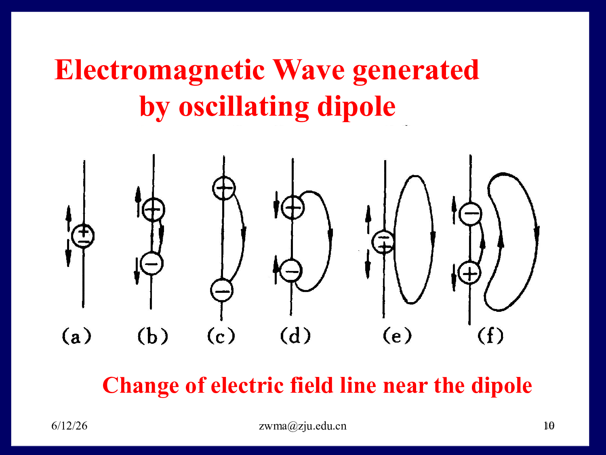

---

### 7.2.3 电磁波

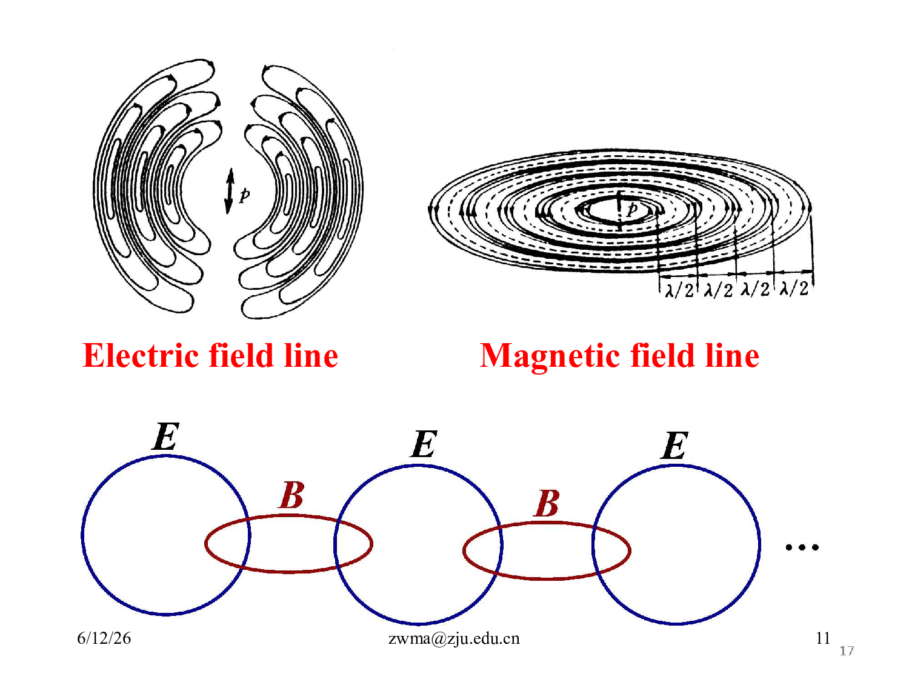

电磁波是横波，在真空中传播不需要介质。

---

### 7.2.4 行波
#### 7.2.4.1 行波的基本特征

行波的关键特征：
1. 传播**振动**（Transfer oscillation）
2. 传播**相位**（Transfer phase）
3. **不传播介质质点**（Not transfer particle）

#### 7.2.4.2 波的传播结论

1. 当波通过时，介质质点**不随波发生净位移**，它们只在平衡位置附近振动
2. 每个质点都在做相同的简谐振动，但具有**不同的初相位**（忽略能量损耗时）

#### 7.2.4.3 波函数
对于沿 $+x$ 方向传播的波，波函数的一般形式为：

$$
y(x,t) = f(x - ut)
$$

其中 $u$ 为波速。

**推导**：设 $t=0$ 时 $x=0$ 处的振动为 $y(0,t) = f(t)$，则波传到 $x$ 处需要时间 $x/u$，因此 $x$ 处的振动相对于原点处延迟了 $x/u$：

$$
y(x,t) = f\left(t - \frac{x}{u}\right)
$$

对于沿 $-x$ 方向传播的波：

$$
y(x,t) = f\left(t + \frac{x}{u}\right)
$$

#### 7.2.4.4 相位速度
波上某点 $P$ 的振动速度（注意不是波速）：

$$
v_P = \frac{\partial y}{\partial t}
$$

波的传播速度（相位速度）：

$$
u = \frac{\omega}{k} = \lambda f
$$

#### 7.2.4.5 波形的两种表示方式

1. **快照图 (Snapshot)**：$y = y(x, t_1)$，在固定时刻 $t_1$ 观察波形随位置 $x$ 的变化
   - 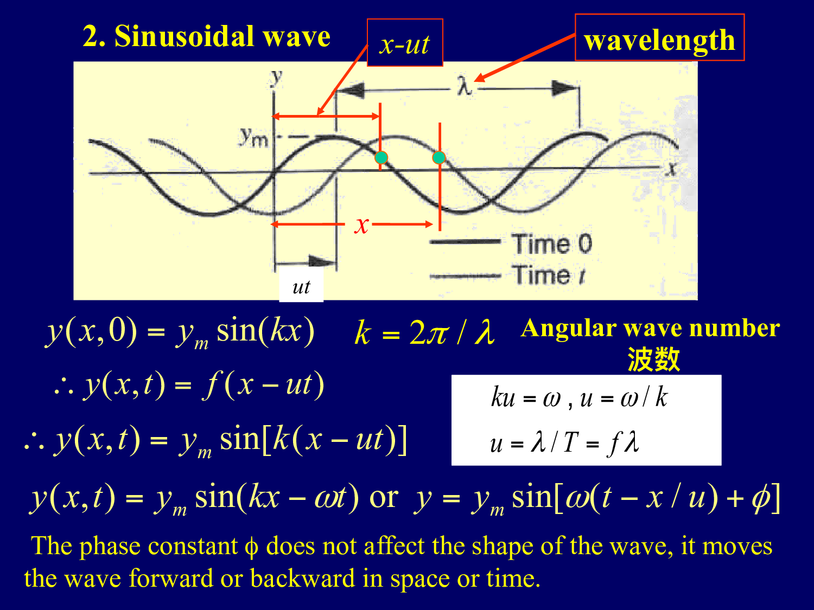

2. **时间演化图**：$y = y(x_1, t)$，在固定位置 $x_1$ 观察位移随时间 $t$ 的变化
   - 
   - 注意：波形图（快照）与振动图（时间演化）的形状不同

---

### 7.2.5 正弦波
#### 7.2.5.1 波函数

沿 $+x$ 方向传播的正弦波波函数：

$$
y(x,t) = y_m \sin(kx - \omega t + \phi)
$$

或等价形式：

$$
y(x,t) = y_m \sin\left[\omega\left(t - \frac{x}{u}\right) + \phi\right]
$$

其中：
- $y_m$ 为振幅
- $k = \frac{2\pi}{\lambda}$ 为**角波数**（波数，angular wave number）
- $\omega = \frac{2\pi}{T}$ 为角频率
- $\lambda$ 为波长
- $T$ 为周期
- $\phi$ 为初相位常数

#### 7.2.5.2 相位常数的作用

相位常数 $\phi$ 不影响波的形状，只是将波在空间上或时间上**平移**（向前或向后移动）。

#### 7.2.5.3 波的超前与滞后
对于两个沿 $+x$ 方向传播的正弦波，若二者相位常数不同：

- **超前 (Lead)**：具有较大正相位常数的波超前于具有较小正相位常数的波
- **滞后 (Lag)**：反之则为滞后

**在空间上**：若波 A 超前于波 B，则在相同时间、相同传播方向上，波 A 的波峰位置在波 B 的波峰之前（$x_A < x_B$，即 A 在 B 的右侧更远处）。

**在时间上**：若波 A 超前于波 B，则在相同位置，波 A 的波峰先于波 B 到达（$t_A < t_B$）。

对于沿 $-x$ 方向传播的波，超前/滞后的判断需相应调整。

---

### 7.2.6 群速度与色散
#### 7.2.6.1 基本概念

- **相速度 (Phase Velocity)**：$v_p = \frac{\omega}{k}$
- **群速度 (Group Speed)**：$v_g = \frac{d\omega}{dk}$
- **色散关系 (Dispersion Relation)**：$\omega = \omega(k)$

#### 7.2.6.2 非色散波与色散波

- **非色散波 (Nondispersive Wave)**：相速度与频率无关，$\omega$ 与 $k$ 成正比
  - 例：电磁波在真空中传播：$\omega = ck$，$v_p = v_g = c$
  
- **色散波 (Dispersive Wave)**：相速度随频率变化，$\omega$ 与 $k$ 不成正比
  - 例：电磁波在等离子体中传播

#### 7.2.6.3 电磁波在等离子体中的色散

色散关系：

$$
\omega^2 = \omega_p^2 + c^2 k^2
$$

其中 $\omega_p$ 为等离子体频率。

相速度：

$$
v_p = \frac{\omega}{k} = \frac{c}{\sqrt{1 - \omega_p^2/\omega^2}} > c
$$

群速度：

$$
v_g = \frac{d\omega}{dk} = c\sqrt{1 - \frac{\omega_p^2}{\omega^2}} < c
$$

该波是色散波。

> **注意**：色散 (dispersion) 不等于耗散 (dissipation)，色散不涉及能量的损失。

---

### 7.2.7 波速
#### 7.2.7.1 波速与振动速度的区别

- **波速 $u$**：波形（相位）在介质中传播的速度，是常数（对给定介质）
- **振动速度 $v$**：介质质点在平衡位置附近振动的速度，$v = \partial y / \partial t$，随时间周期性变化

#### 7.2.7.2 波的图形分析

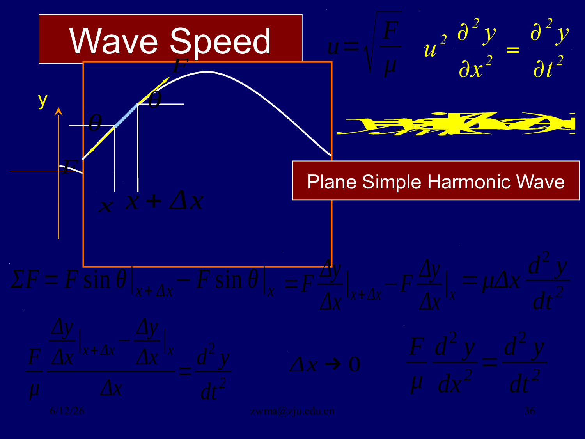

---

### 7.2.8 平面简谐波
平面简谐波的波函数标准形式：

$$
y(x,t) = y_m \cos\left[\omega\left(t - \frac{x}{u}\right) + \phi\right] = y_m \cos(\omega t - kx + \phi)
$$

该波函数同时描述了：
- 传播振动 (Transfer oscillation)
- 传播相位 (Transfer phase)
- 传播能量 (Transfer energy)

---

### 7.2.9 波的能量

#### 7.2.9.1 动能与势能

机械波传播时，介质中每个质元既有动能也有势能。对于弦上的简谐波：

- **动能**：质元振动所具有的能量
- **势能**：质元形变所具有的能量

在简谐波中，**动能和势能同步变化**（两者同时达到最大，同时为零），这与简谐振动不同（简谐振动中动能和势能相位相差 $\pi/2$）。

#### 7.2.9.2 波的能量传递

波的传播伴随着：
1. 振动的传播
2. 相位的传播
3. **能量的传播**

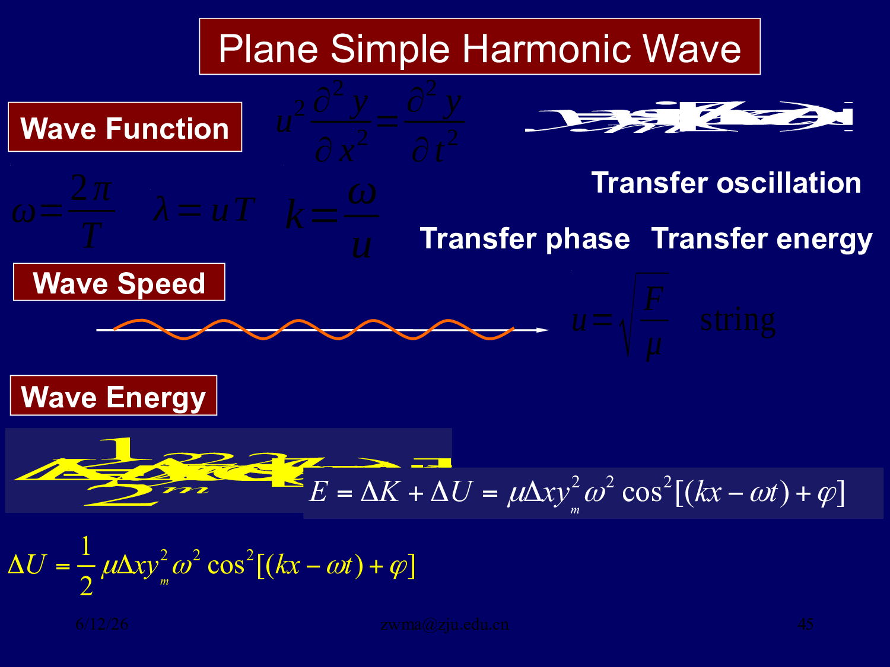

#### 7.2.9.3 平均能量、功率和强度

- **平均能流密度（波的强度）**：单位时间内通过垂直于波传播方向的单位面积的平均能量

对于平面波：

$$
I = \frac{1}{2} \rho u \omega^2 A^2
$$

其中 $\rho$ 为介质密度，$u$ 为波速，$\omega$ 为角频率，$A$ 为振幅。

**平均功率**：

$$
P = I \cdot S
$$

其中 $S$ 为垂直于波传播方向的截面积。

#### 7.2.9.4 平面波与球面波的强度

- **平面波**：振幅不变，强度不变（无吸收时）
- **球面波**：振幅与距离成反比，强度与距离平方成反比

对于球面波：

$$
I = \frac{P}{4\pi r^2}
$$

其中 $P$ 为波源的辐射功率，$r$ 为到波源的距离。

---

### 7.2.10 波的叠加与干涉

#### 7.2.10.1 叠加原理
**当两列波重叠时，任意时刻任意点的实际位移等于每列波单独存在时该点位移的矢量和。**

$$
y_{\text{total}}(x,t) = y_1(x,t) + y_2(x,t)
$$

#### 7.2.10.2 干涉
两列相干波（频率相同、振动方向相同、相位差恒定）在空间相遇时，某些区域振动加强，某些区域振动减弱的现象。

- **相长干涉 (Constructive Interference)**：两列波同相位叠加，振幅相加（正-正或负-负叠加）
  - 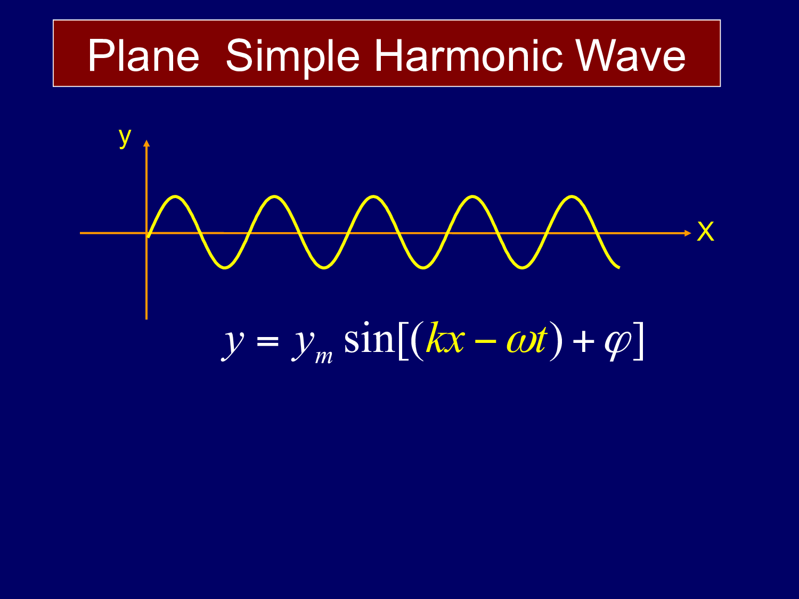
  
- **相消干涉 (Destructive Interference)**：两列波反相位叠加，振幅相减（正-负叠加）
  - 

#### 7.2.10.3 干涉条件

对于从两个相干波源 $S_1$、$S_2$ 发出的波，在空间某点 $P$ 处：

- **干涉加强（极大）**：两波到 $P$ 点的波程差等于波长的整数倍

$$
x_1 - x_2 = n\lambda \quad (n = 0, \pm1, \pm2, \cdots)
$$

- **干涉减弱（极小）**：两波到 $P$ 点的波程差等于半波长的奇数倍

$$
x_1 - x_2 = (n + \frac{1}{2})\lambda \quad (n = 0, \pm1, \pm2, \cdots)
$$

---

### 7.2.11 傅里叶定理与频谱
**傅里叶定理**：任何周期为 $T$ 的周期函数都可以展开为一系列不同频率的简谐函数的叠加：

$$
f(t) = \frac{a_0}{2} + \sum_{n=1}^{\infty} [a_n \cos(n\omega_0 t) + b_n \sin(n\omega_0 t)]
$$

其中 $\omega_0 = 2\pi/T$ 为**基频**，各项系数由傅里叶积分确定。

**傅里叶定理的含义**：任何周期波都可以分解为一系列频率为基频整数倍的简谐波（谐波）的叠加。

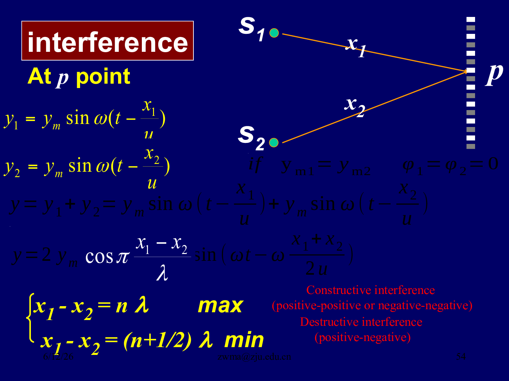

---

### 7.2.12 波的反射
#### 7.2.12.1 自由端反射（软反射）

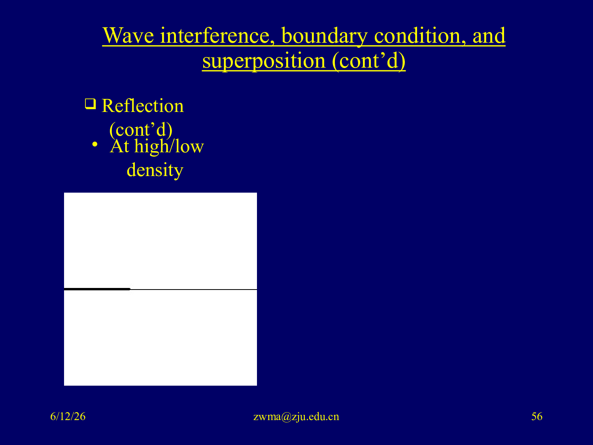

- 边界处力的垂直分量为零
- **无相位延迟 (No phase delay)**
- 反射波与入射波无半波损失

#### 7.2.12.2 固定端反射（硬反射）

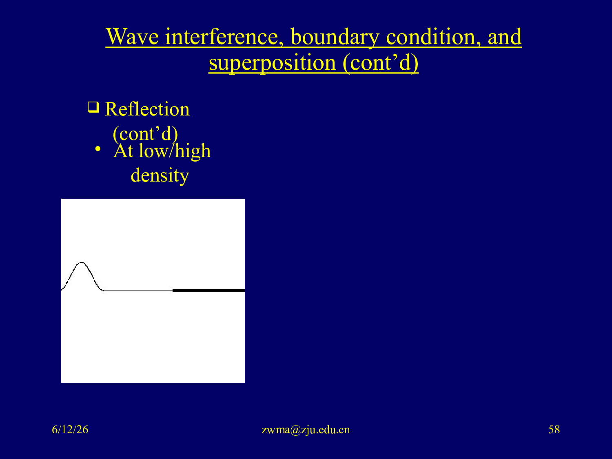

- 边界处位移为零
- **有 $\pi$ 相位延迟 (phase delay)**
- **半波损失**：反射波相位突变 $\pi$，相当于损失了半个波长

#### 7.2.12.3 密度变化处的反射

**从高密度到低密度**（类比自由端）：
- 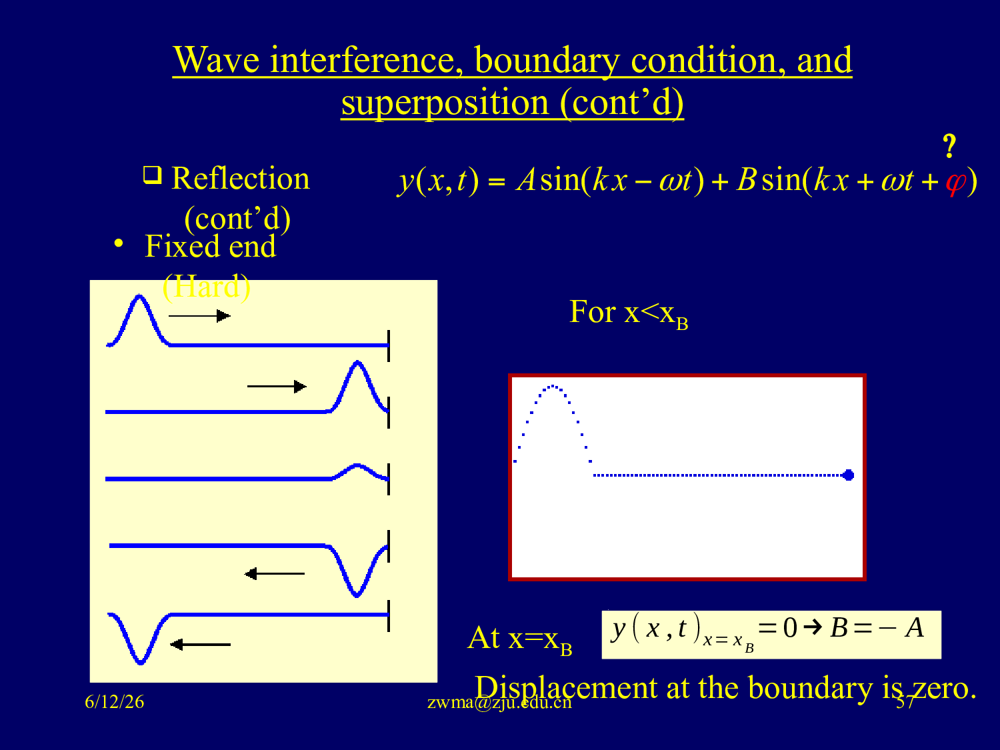

**从低密度到高密度**（类比固定端）：
- 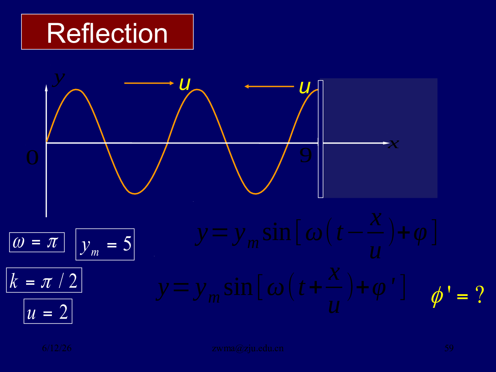

---

### 7.2.13 驻波
#### 7.2.13.1 驻波的形成

两列振幅相同、频率相同、传播方向相反的波叠加形成驻波：

$$
y_1 = y_m \sin(kx - \omega t)
$$

$$
y_2 = y_m \sin(kx + \omega t)
$$

合成波：

$$
y = y_1 + y_2 = 2y_m \sin(kx) \cos(\omega t)
$$

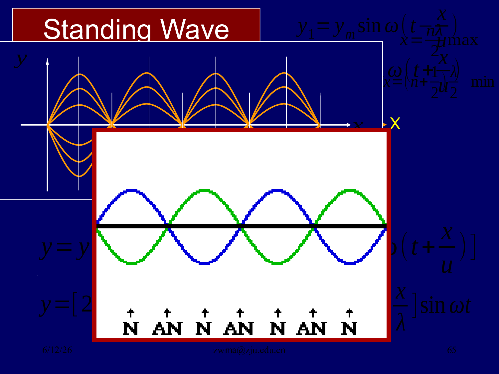

#### 7.2.13.2 驻波的特征

- **波节 (Node)**：振幅始终为零的点（$kx = n\pi$，即 $x = n\lambda/2$）
- **波腹 (Antinode)**：振幅最大的点（$kx = (n+1/2)\pi$，即 $x = (2n+1)\lambda/4$）
- 相邻波节（或相邻波腹）之间的距离为 $\lambda/2$

#### 7.2.13.3 驻波的能量

- 相邻波节和波腹之间的总能量保持恒定
- **没有能量通过波节或波腹传播**（No power transmitted through a node or an antinode）
- 能量在波节和波腹之间来回转换

---

### 7.2.14 弦的简正模
两端固定的弦可以产生驻波，其波长为：

$$
\lambda_n = \frac{2L}{n}, \quad f_n = \frac{n}{2L}\sqrt{\frac{F}{\mu}} \quad (n = 1, 2, 3, \cdots)
$$

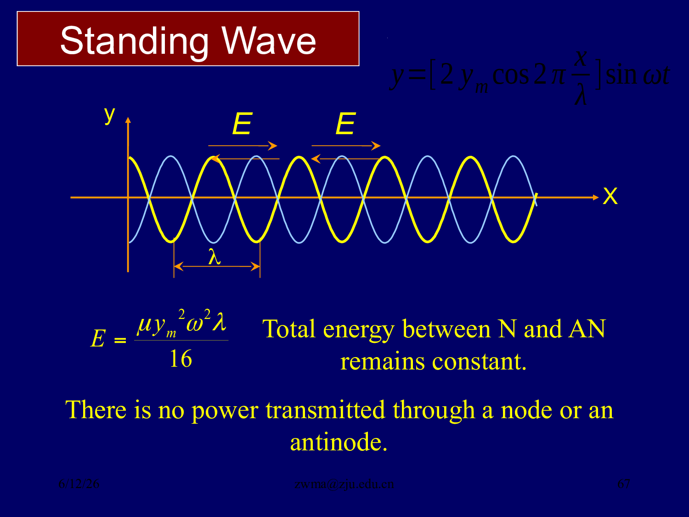
- **基频 (Fundamental)**：$n=1$，一个波腹，两端为波节
- **一次谐波 (First Harmonic)**：$n=2$，两个波腹
- **二次谐波 (Second Harmonic)**：$n=3$，三个波腹
- **三次谐波 (Third Harmonic)**：$n=4$，四个波腹

弦上有无限多个简正模（驻波模式）。

---

### 7.2.15 共振
当驱动频率与系统的某个简正频率（固有频率）相等时，系统发生共振，振幅达到最大。

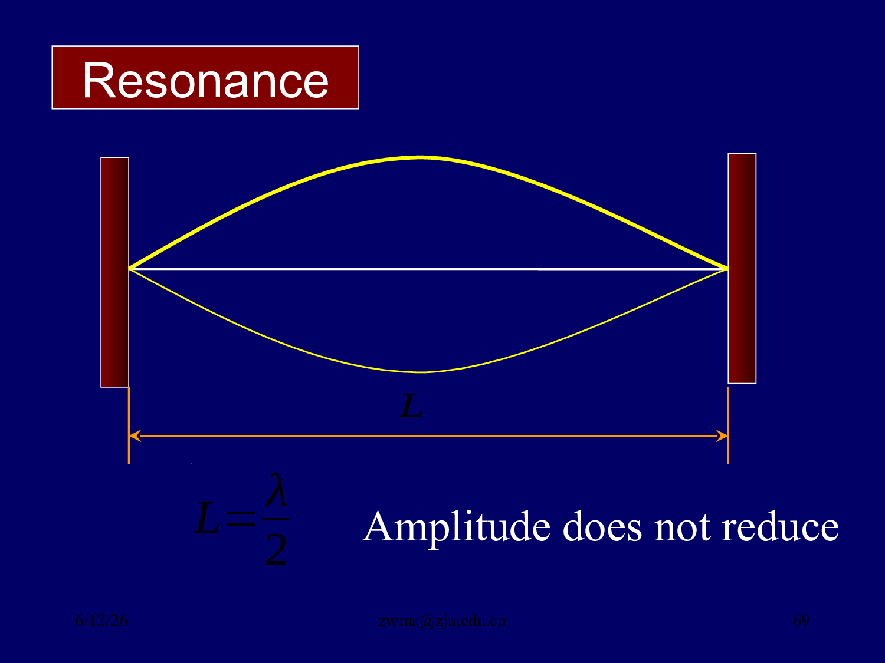

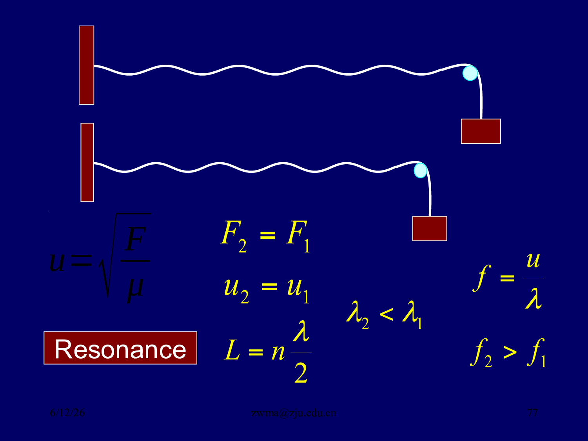

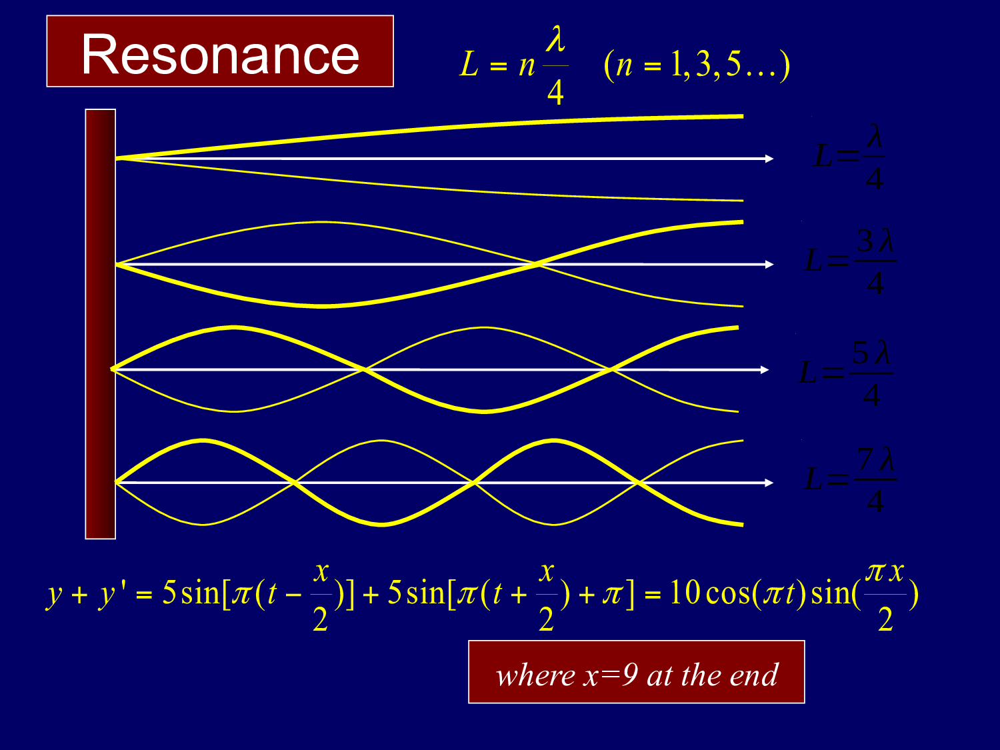

## 7.3 声波

---

### 7.3.1 声波的基本性质

#### 7.3.1.1 声波的类型

声波是**纵波**（Longitudinal wave），介质质点的振动方向与波的传播方向平行。

#### 7.3.1.2 可闻声波的频率范围

人类可闻声波的频率范围为 **20 Hz 到 20000 Hz**。

- 频率低于 20 Hz：次声波 (infrasound)
- 频率高于 20000 Hz：超声波 (ultrasound)

---

### 7.3.2 声波的波函数

#### 7.3.2.1 位移波函数

声波中质点位移的波函数：

$$
y(x,t) = y_m \sin(\omega t - kx) = y_m \sin\left[\omega\left(t - \frac{x}{u}\right)\right]
$$

其中：
- $y_m$ 为位移振幅
- $\omega$ 为角频率
- $k = \frac{\omega}{u}$ 为波数
- $u$ 为声速

#### 7.3.2.2 声压波函数

声波传播时，介质中会产生压强变化。声压（压强变化量）的波函数：

$$
\Delta p(x,t) = \Delta p_m \sin(kx - \omega t) = \Delta p_m \sin\left[\omega\left(t - \frac{x}{u}\right)\right]
$$

其中 $\Delta p_m$ 为声压振幅。

体变模量 (Bulk Modulus)：

$$
B = -\frac{\Delta P}{\Delta V / V}
$$

即：

$$
\Delta P = -B \frac{\Delta V}{V}
$$

#### 7.3.2.3 密度变化波函数

$$
\Delta\rho(x,t) = \Delta\rho_m \sin(kx - \omega t)
$$

密度变化与压强变化的关系：

$$
\Delta p = \frac{\rho}{B}\Delta\rho \quad (\text{或 } \Delta\rho = \frac{\rho}{B}\Delta p)
$$

---

### 7.3.3 声波中各物理量的关系

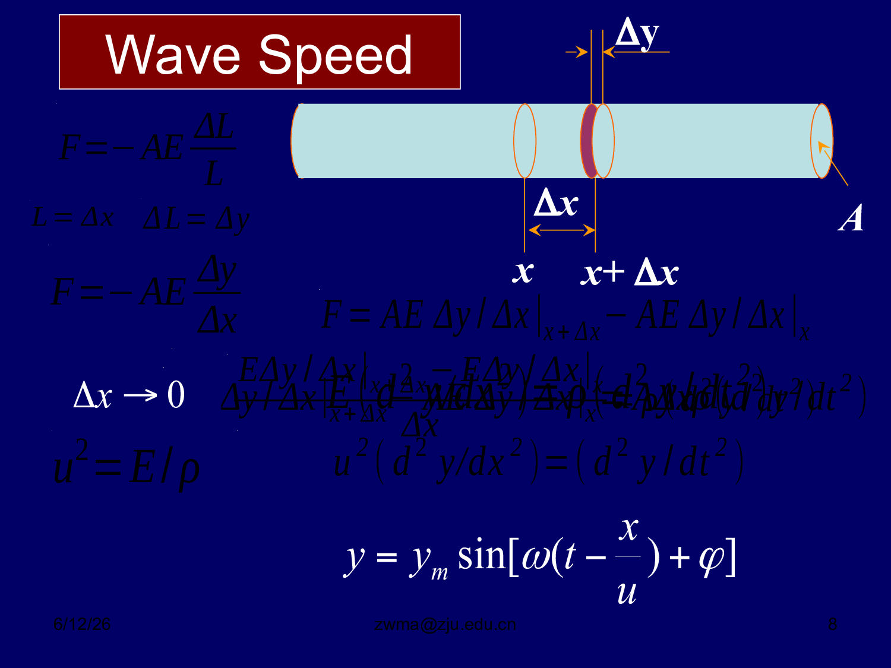

关键关系：位移最大的地方（波腹），压强和密度的变化为零（波节）；位移为零的地方（波节），压强和密度的变化最大（波腹）。

---

### 7.3.4 声速
#### 7.3.4.1 声速公式

声波在介质中的传播速度：

$$
u = \sqrt{\frac{B}{\rho}}
$$

其中：
- $B$ 为介质的体变模量 (bulk modulus)
- $\rho$ 为介质的密度

更一般的形式，使用弹性模量 $E$：

$$
u = \sqrt{\frac{E}{\rho}}
$$

**推导**：考虑一细长杆中的纵波传播，应用牛顿第二定律和胡克定律可以推导出声速公式。

---

### 7.3.5 声功率与声强

#### 7.3.5.1 平均功率

声波的平均功率（单位时间内通过某截面的平均能量）：

$$
P_{\text{avg}} = \frac{1}{2} \rho u \omega^2 y_m^2 A
$$

其中 $A$ 为截面积。

#### 7.3.5.2 声强
声强（声波的能流密度）为单位时间内通过垂直于传播方向的单位面积的能量：

$$
I = \frac{P_{\text{avg}}}{A} = \frac{1}{2} \rho u \omega^2 y_m^2 = \frac{1}{2} \frac{(\Delta p_m)^2}{\rho u}
$$

#### 7.3.5.3 声强级
声强级以对数标度表示：

$$
\beta = 10 \log_{10} \left(\frac{I}{I_0}\right) \quad (\text{单位：dB})
$$

其中参考声强 $I_0 = 10^{-12} \, \text{W/m}^2$（人耳能听到的最小声强）。

#### 例题 7.3.5：点声源的声强与声强级

**题目**：一个点声源向各方向均匀发射球面声波，辐射功率 $P = 25\,\text{W}$。求距离声源 $r = 2.5\,\text{m}$ 处的声强和声强级。

**解**：
球面波在距离 $r$ 处的声强：

$$
I = \frac{P}{4\pi r^2} = \frac{25}{4\pi \times (2.5)^2} \approx 0.318\,\text{W/m}^2
$$

声强级：

$$
\beta = 10 \log_{10} \left(\frac{0.318}{10^{-12}}\right) \approx 115\,\text{dB}
$$

---

### 7.3.6 声波的干涉

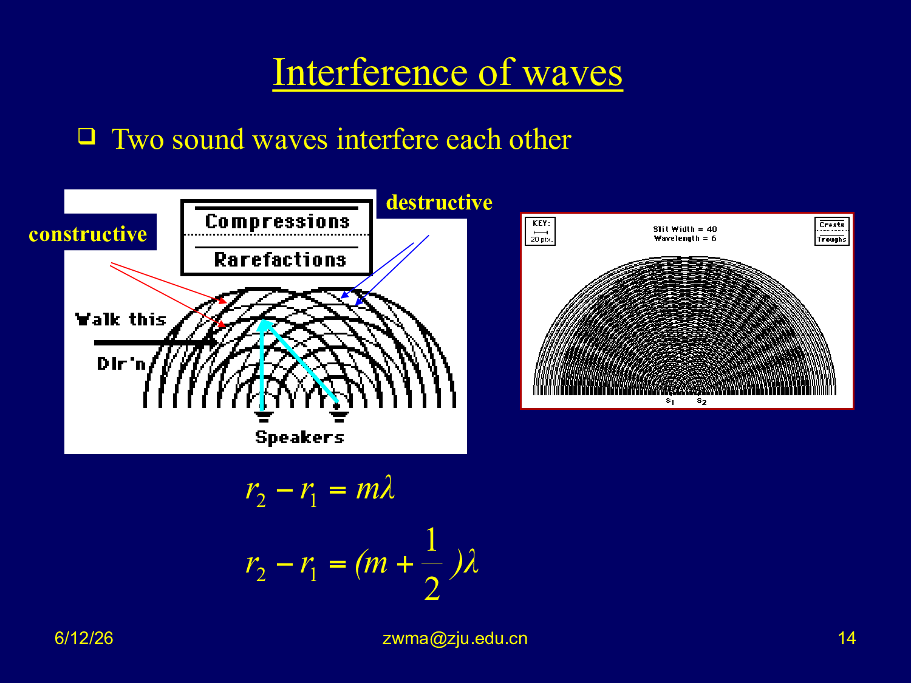

两个相干声波在空间某点 $P$ 干涉的条件：

- **干涉极大（加强）**：路程差为波长的整数倍

$$
r_1 - r_2 = n\lambda \quad (n = 0, 1, 2, \cdots)
$$

- **干涉极小（减弱）**：路程差为半波长的奇数倍

$$
r_1 - r_2 = (n + \frac{1}{2})\lambda \quad (n = 0, 1, 2, \cdots)
$$

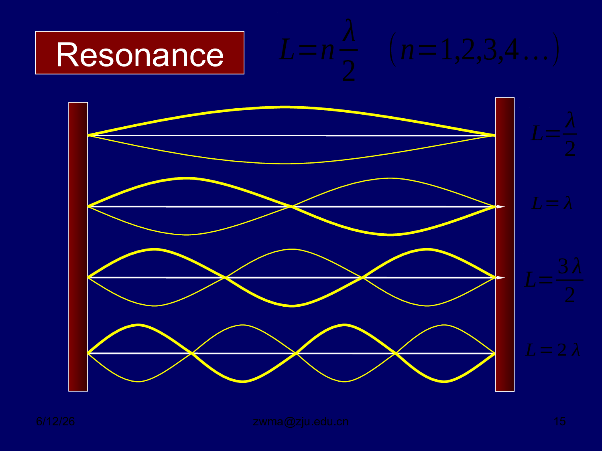

---

### 7.3.7 声波的共振与驻波

#### 7.3.7.1 声驻波

声波在有限空间中（如管乐器）可以形成驻波。

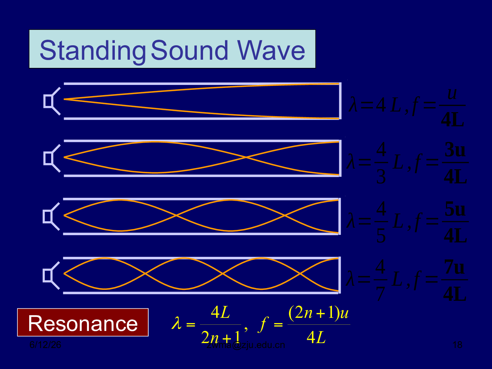

#### 7.3.7.2 两端开口的管

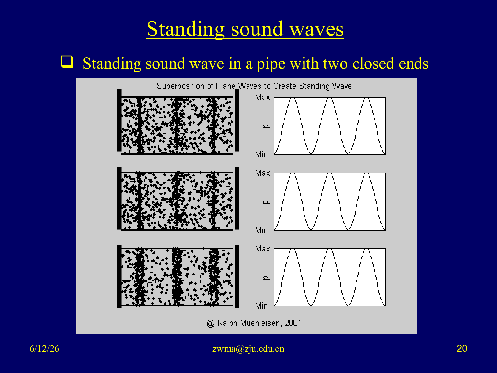

共振频率：

$$
f_n = \frac{n u}{2L} \quad (n = 1, 2, 3, \cdots)
$$

其中 $L$ 为管长，$u$ 为声速。

#### 7.3.7.3 两端封闭的管

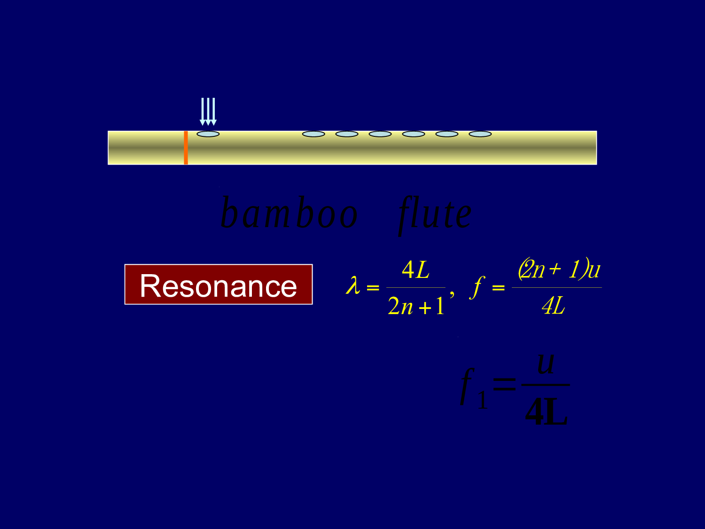

共振频率与两端开口管相同：

$$
f_n = \frac{n u}{2L} \quad (n = 1, 2, 3, \cdots)
$$

#### 7.3.7.4 一端开口一端封闭的管

一端开口（位移波腹）、一端封闭（位移波节）的管子：

共振频率：

$$
f_n = \frac{(2n-1)u}{4L} \quad (n = 1, 2, 3, \cdots)
$$

仅有奇次谐波。

---

### 7.3.8 拍频
#### 7.3.8.1 拍的现象

当两个频率略有不同的声波同时传播时，它们的干涉产生强度周期性变化的现象，称为"拍"。

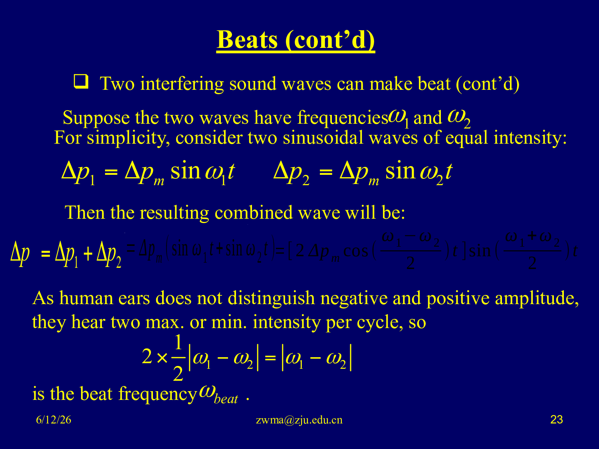

#### 7.3.8.2 拍的数学推导

设两列波的频率分别为 $\omega_1$ 和 $\omega_2$，振幅相同：

$$
\Delta p_1 = \Delta p_m \sin(\omega_1 t)
$$

$$
\Delta p_2 = \Delta p_m \sin(\omega_2 t)
$$

合成波：

$$
\Delta p = \Delta p_1 + \Delta p_2 = \Delta p_m [\sin(\omega_1 t) + \sin(\omega_2 t)]
$$

利用和差化积公式：

$$
\Delta p = 2\Delta p_m \cos\left(\frac{\omega_1 - \omega_2}{2}t\right) \sin\left(\frac{\omega_1 + \omega_2}{2}t\right)
$$

合成波的振幅受低频包络线 $2\Delta p_m \cos\left(\frac{\omega_1 - \omega_2}{2}t\right)$ 调制。

#### 7.3.8.3 拍频

由于人耳不能区分正负振幅，每个周期内听到两次最大或最小强度，因此**拍频**为：

$$
f_{\text{beat}} = |f_1 - f_2|
$$

即拍频等于两列波的频率之差。

---

### 7.3.9 多普勒效应
当声源和观察者（听者）之间存在相对运动时，观察者接收到的频率与声源发出的频率不同的现象，称为多普勒效应。

#### 7.3.9.1 观察者运动、声源静止

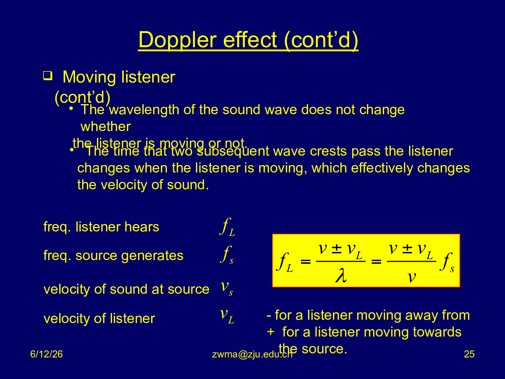

**原理**：声波的波长不变，但观察者运动导致单位时间内通过观察者的波峰数发生变化。

观察者接收到的频率：

$$
f_L = f_S \frac{u \pm v_L}{u}
$$

其中：
- $f_L$ 为观察者听到的频率
- $f_S$ 为声源发出的频率
- $u$ 为声速
- $v_L$ 为观察者的速度

**符号规则**：
- $-$ (减号)：观察者**远离**声源
- $+$ (加号)：观察者**靠近**声源

#### 7.3.9.2 声源运动、观察者静止

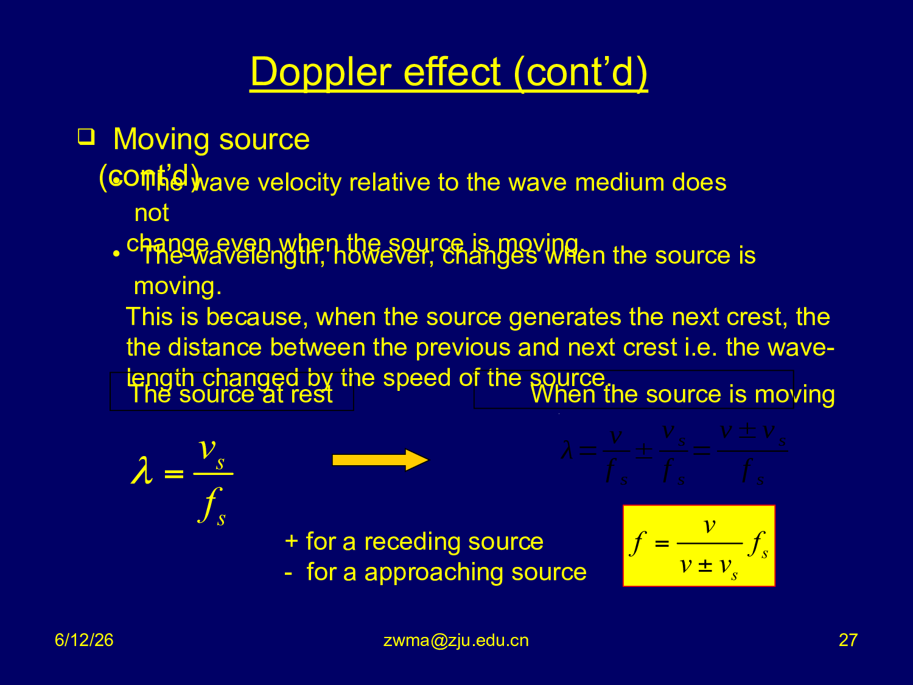

**原理**：声波在介质中的传播速度不变，但声源运动导致波长发生变化。

观察者接收到的频率：

$$
f_L = f_S \frac{u}{u \mp v_S}
$$

其中 $v_S$ 为声源的速度。

**符号规则**：
- $+$ (加号)：声源**远离**观察者（波长变长，频率降低）
- $-$ (减号)：声源**靠近**观察者（波长变短，频率升高）

#### 7.3.9.3 声源和观察者同时运动

一般情况下，观察者和声源都在运动时的多普勒效应公式：

$$
f_L = f_S \frac{u \pm v_L}{u \mp v_S}
$$

符号规则（沿着从观察者 $L$ 到声源 $S$ 的方向测量 $v_L$ 和 $v_S$ 的正方向）：
- $v_L$：$+$ 表示观察者**靠近**声源，$-$ 表示观察者**远离**声源
- $v_S$：$-$ 表示声源**靠近**观察者，$+$ 表示声源**远离**观察者

#### 例题 7.3.9：警笛

**题目**：警笛发出频率 $f_S = 300\,\text{Hz}$ 的正弦波，声速 $u = 340\,\text{m/s}$。
(a) 警笛静止在空气中时，求波长；
(b) 警笛以 $v_S = 30\,\text{m/s}$ 运动时，求警笛前方和后方的波长。

**解**：
(a) 警笛静止时：

$$
\lambda = \frac{u}{f_S} = \frac{340}{300} \approx 1.13\,\text{m}
$$

(b) 警笛运动时：
- 警笛**前方**（声源靠近观察者，波长被压缩）：

$$
\lambda_{\text{front}} = \frac{u - v_S}{f_S} = \frac{340 - 30}{300} \approx 1.03\,\text{m}
$$

- 警笛**后方**（声源远离观察者，波长被拉伸）：

$$
\lambda_{\text{behind}} = \frac{u + v_S}{f_S} = \frac{340 + 30}{300} \approx 1.23\,\text{m}
$$

---

### 7.3.10 高速运动效应与冲击波

#### 7.3.10.1 亚音速与超音速

- **亚音速 (subsonic)**：声源速度小于声速，$u_S < u$
- **超音速 (supersonic)**：声源速度大于声速，$u_S > u$

#### 7.3.10.2 冲击波
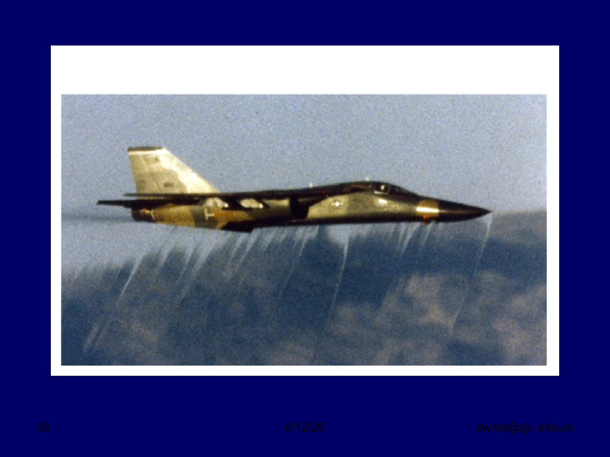

马赫锥的半顶角：

$$
\sin\theta = \frac{u}{u_S}
$$

#### 7.3.10.3 重要说明

多普勒效应公式适用的参考系必须固定于**介质**（material medium），因为声波在介质中传播，其速度是相对于介质的。

---

### 7.3.11 章节习题
#### Ch17 习题
- Exercises (P395): 25, 31, 36, 37, 38, 42, 43, 44
- Problems (P397): 11, 16

#### Ch18 习题
- Exercises (P421): 2, 4, 7, 11, 12, 27, 32
- Problems (P424): 13, 14, 15

#### Ch19 习题
- Problems (P449): 6, 10
- Problems (P450): 18, 19, 20

## 附录：公式汇总

### 简谐振动

| 物理量 | 公式 |
|--------|------|
| 运动方程 | $\frac{d^2x}{dt^2} + \omega^2 x = 0$ |
| 位移 | $x(t) = x_m \cos(\omega t + \phi)$ |
| 速度 | $v(t) = -\omega x_m \sin(\omega t + \phi)$ |
| 加速度 | $a(t) = -\omega^2 x_m \cos(\omega t + \phi) = -\omega^2 x$ |
| 动能 | $E_k = \frac{1}{2}m\omega^2 x_m^2 \sin^2(\omega t + \phi)$ |
| 势能 | $E_p = \frac{1}{2}m\omega^2 x_m^2 \cos^2(\omega t + \phi)$ |
| 总能量 | $E = \frac{1}{2}m\omega^2 x_m^2$ |
| 弹簧振子 | $\omega = \sqrt{k/m}$ |
| 单摆 | $\omega = \sqrt{g/l}$，$T = 2\pi\sqrt{l/g}$ |
| 阻尼振动 | $x(t) = e^{-\frac{b}{2m}t}[A\cos(\omega't) + B\sin(\omega't)]$ |
| 受迫振动振幅 | $A = \frac{F_0/m}{\sqrt{(\omega_0^2 - \omega^2)^2 + (b\omega/m)^2}}$ |

### 波动

| 物理量 | 公式 |
|--------|------|
| 波函数（正方向） | $y(x,t) = f(x - ut)$ |
| 简谐波波函数 | $y(x,t) = y_m \sin(kx - \omega t + \phi)$ |
| 波数 | $k = 2\pi/\lambda$ |
| 角频率 | $\omega = 2\pi/T = 2\pi f$ |
| 波速 | $u = \lambda f = \omega/k$ |
| 相速度 | $v_p = \omega/k$ |
| 群速度 | $v_g = d\omega/dk$ |
| 波强度（平面波） | $I = \frac{1}{2}\rho u \omega^2 A^2$ |
| 球面波强度 | $I = P/(4\pi r^2)$ |
| 驻波 | $y = 2y_m \sin(kx)\cos(\omega t)$ |
| 弦的简正模 | $f_n = \frac{n}{2L}\sqrt{F/\mu}$ |

### 声波

| 物理量 | 公式 |
|--------|------|
| 声速 | $u = \sqrt{B/\rho}$ |
| 位移波函数 | $y(x,t) = y_m \sin(kx - \omega t)$ |
| 声压波函数 | $\Delta p(x,t) = \Delta p_m \sin(kx - \omega t)$ |
| 体变模量 | $\Delta P = -B \Delta V/V$ |
| 声强 | $I = \frac{1}{2}\rho u \omega^2 y_m^2$ |
| 声强级 | $\beta = 10\log_{10}(I/I_0)$ dB |
| 拍频 | $f_{\text{beat}} = |f_1 - f_2|$ |
| 多普勒效应（一般） | $f_L = f_S \frac{u \pm v_L}{u \mp v_S}$ |
| 两端开口管共振 | $f_n = nu/(2L)$ |
| 一端开口管共振 | $f_n = (2n-1)u/(4L)$ |

---

*笔记完*
